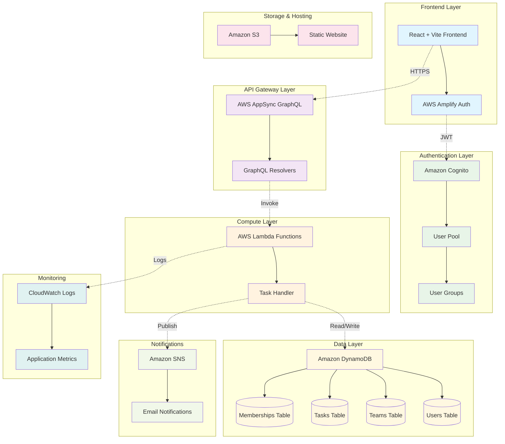
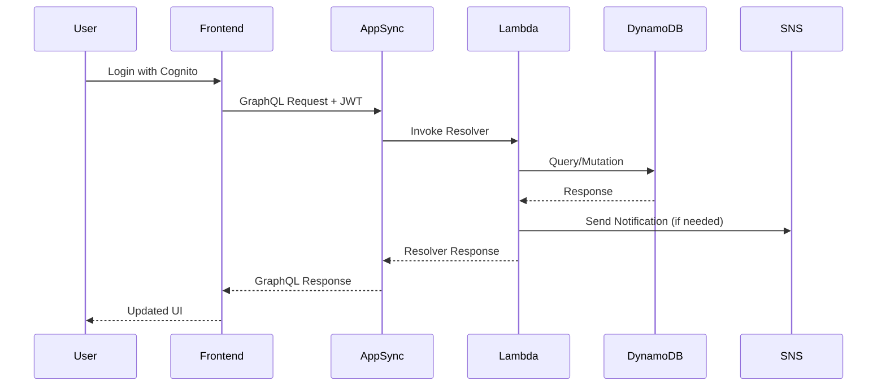

# 🚀 Task Management System

A modern, serverless task management application built with React, AWS Lambda, Dynamodb, AWS S3, and GraphQL and terraform for as IaC tool for infracture provisioning. This system enables teams to collaborate effectively by managing tasks, team members, and project workflows in a secure, scalable environment.


## 📋 Table of Contents

- [Architecture Overview](#️-architecture-overview)
- [Features](#-features)
- [Technology Stack](#️-technology-stack)
- [Quick Start](#-quick-start)
- [Project Structure](#-project-structure)
- [Component Documentation](#-component-documentation)
- [Configuration](#-configuration)
- [Deployment](#-deployment)
- [Monitoring & Logging](#-monitoring--logging)
- [Contributing](#-contributing)
- [License](#-license)

## 🏗️ Architecture Overview

### System Architecture Diagram



### Data Flow Diagram



## ✨ Features

### 🔐 Authentication & Authorization
- **Multi-factor Authentication** via Amazon Cognito
- **Role-based Access Control** (Admin/Member)
- **JWT Token Management** with automatic refresh
- **OAuth 2.0 Integration** ready

### 👥 Team Management
- **Create and manage multiple teams**
- **Invite members via email**
- **Role assignment and permissions**
- **Real-time member status**

### 📋 Task Management
- **Create, update, and delete tasks**
- **Task assignment and status tracking**
- **Priority levels and deadlines**
- **Task filtering and search**

### 🔔 Notifications
- **Email notifications** for task assignments
- **Team invitation notifications**
- **Task status update alerts**

### 📊 Real-time Updates
- **GraphQL subscriptions** for live data
- **Optimistic UI updates**
- **Offline-first architecture**

## 🛠️ Technology Stack

### Frontend
| Technology | Version | Purpose |
|------------|---------|---------|
| **React** | 18.2.0 | UI Framework |
| **Vite** | 4.5.14 | Build Tool & Dev Server |
| **AWS Amplify** | 6.0.0 | Authentication & API |
| **GraphQL** | 16.6.0 | API Query Language |
| **Tailwind CSS** | 3.3.2 | Styling Framework |
| **React Router** | 6.10.0 | Client-side Routing |

### Backend
| Technology | Version | Purpose |
|------------|---------|---------|
| **AWS Lambda** | Node.js 18.x | Serverless Compute |
| **AWS AppSync** | Latest | GraphQL API |
| **Amazon DynamoDB** | Latest | NoSQL Database |
| **Amazon Cognito** | Latest | Authentication Service |
| **Amazon SNS** | Latest | Notification Service |
| **Terraform** | 1.5.0+ | Infrastructure as Code |

### DevOps & Deployment
| Technology | Version | Purpose |
|------------|---------|---------|
| **GitHub Actions** | Latest | CI/CD Pipeline |
| **Amazon S3** | Latest | Static Website Hosting |
| **CloudWatch** | Latest | Logging & Monitoring |
| **AWS CLI** | Latest | AWS Resource Management |

## 🚀 Quick Start

### Prerequisites
- **Node.js** 18.0.0 or higher
- **AWS CLI** configured with appropriate permissions
- **Terraform** 1.5.0 or higher
- **Git** for version control

### 1. Clone the Repository
```bash
git clone https://github.com/mangucletus/aws-serverless-task-management-system.git
cd aws-serverless-task-management-system
```

### 2. Set Up AWS Credentials
```bash
aws configure
# Enter your AWS Access Key ID, Secret Access Key, and Region
```

### 3. Deploy Infrastructure
```bash
cd backend/terraform
terraform init
terraform plan
terraform apply
```

### 4. Configure Frontend
```bash
cd ../../frontend
cp .env.example .env
# Update .env with values from terraform output
```

### 5. Install Dependencies & Run
```bash
npm install
npm run dev
```

### 6. Access the Application
Open [http://localhost:5173](http://localhost:5173) in your browser.

## 📁 Project Structure

```
task-management-system/
├── 📁 .github/
│   └── 📁 workflows/
│       └── 📄 deploy.yml              # CI/CD Pipeline
├── 📁 backend/                        # Backend Infrastructure
│   ├── 📄 README.md                   # Backend Documentation
│   ├── 📁 lambda/                     # Lambda Functions
│   │   ├── 📄 task_handler.js         # Main GraphQL Resolver
│   │   ├── 📄 package.json            # Lambda Dependencies
│   │   └── 📦 task_handler.zip        # Deployment Package
│   └── 📁 terraform/                  # Infrastructure as Code
│       ├── 📄 main.tf                 # Main Terraform Configuration
│       ├── 📄 variables.tf            # Variable Definitions
│       ├── 📄 outputs.tf              # Output Values
│       └── 📄 schema.graphql          # GraphQL Schema
├── 📁 frontend/                       # React Frontend
│   ├── 📄 README.md                   # Frontend Documentation
│   ├── 📄 package.json                # Dependencies & Scripts
│   ├── 📄 vite.config.js              # Vite Configuration
│   ├── 📄 tailwind.config.js          # Tailwind CSS Config
│   ├── 📄 .env.example                # Environment Template
│   ├── 📁 src/                        # Source Code
│   │   ├── 📄 main.jsx                # Application Entry Point
│   │   ├── 📄 App.jsx                 # Root Component
│   │   ├── 📁 components/             # React Components
│   │   └── 📁 graphql/                # GraphQL Queries/Mutations
│   └── 📁 public/                     # Static Assets
├── 📁 docs/                           # Documentation
│   ├── 📄 API.md                      # API Documentation
│   ├── 📄 DEPLOYMENT.md               # Deployment Guide
│   └── 📄 ARCHITECTURE.md             # Architecture Details
├── 📄 README.md                       # This File
├── 📄 .gitignore                      # Git Ignore Rules
└── 📄 LICENSE                         # License Information
```

## 🔗 Component Documentation

- **[🔧 Backend Documentation](./backend/README.md)** - Lambda functions, DynamoDB schema, and Terraform configuration
- **[🎨 Frontend Documentation](./frontend/README.md)** - React components, routing, and state management  
- **[📡 API Documentation](./docs/API.md)** - GraphQL schema, queries, mutations, and examples
- **[🚢 Deployment Guide](./docs/DEPLOYMENT.md)** - CI/CD pipeline and deployment strategies
- **[🏗️ Architecture Guide](./docs/ARCHITECTURE.md)** - Detailed system architecture and design decisions

## 🔧 Configuration

### Environment Variables

#### Frontend (.env)
```bash
VITE_COGNITO_USER_POOL_ID=eu-west-1_ABC123DEF
VITE_COGNITO_CLIENT_ID=1a2b3c4d5e6f7g8h9i0j1k2l3m
VITE_APPSYNC_ENDPOINT=https://xyz.appsync-api.eu-west-1.amazonaws.com/graphql
VITE_REGION=eu-west-1
VITE_COGNITO_DOMAIN=task-mgmt-abc123def
```

#### Backend (Terraform Variables)
```hcl
variable "region" {
  description = "AWS region for deployment"
  type        = string
  default     = "eu-west-1"
}
```

### AWS Resource Configuration

| Resource | Configuration | Purpose |
|----------|--------------|---------|
| **Cognito User Pool** | Email verification, MFA optional | User authentication |
| **DynamoDB Tables** | On-demand billing, encryption at rest | Data storage |
| **Lambda Functions** | Node.js 18.x, 256MB memory, 30s timeout | Business logic |
| **S3 Bucket** | Static website hosting, public read access | Frontend hosting |
| **AppSync API** | Cognito User Pool auth, GraphQL endpoint | API gateway |

## 🚢 Deployment

### Automated Deployment (Recommended)

The project includes a complete CI/CD pipeline that automatically deploys your application when you push to the main branch.

#### GitHub Actions Workflow
1. **Infrastructure Deployment** - Terraform creates/updates AWS resources
2. **Credential Extraction** - Pipeline extracts configuration from Terraform outputs
3. **Frontend Build** - React application builds with dynamic configuration
4. **S3 Deployment** - Static files uploaded to S3 bucket
5. **Verification** - Health checks and deployment validation

#### Required GitHub Secrets
```bash
AWS_ACCESS_KEY_ID=your_access_key_here
AWS_SECRET_ACCESS_KEY=your_secret_key_here
```

### Manual Deployment

If you prefer manual deployment:

```bash
# 1. Deploy Infrastructure
cd backend/terraform
terraform apply

# 2. Build Frontend
cd ../../frontend
npm run build

# 3. Deploy to S3
aws s3 sync dist/ s3://your-bucket-name --delete
```

### Deployment Environments

| Environment | Branch | Auto-Deploy | URL |
|-------------|---------|-------------|-----|
| **Production** | `main` | ✅ Yes | `https://your-bucket.s3-website-eu-west-1.amazonaws.com` |
| **Staging** | `develop` | ✅ Yes | `https://staging-bucket.s3-website-eu-west-1.amazonaws.com` |
| **Development** | `feature/*` | ❌ Manual | Local development only |

## 📊 Monitoring & Logging

### CloudWatch Integration
- **Lambda Function Logs** - Centralized logging for all serverless functions
- **Application Metrics** - Custom metrics for performance monitoring
- **Error Tracking** - Automatic error detection and alerting

### Performance Metrics
- **API Response Times** - GraphQL query/mutation performance
- **Database Performance** - DynamoDB read/write latencies  
- **Frontend Performance** - Core Web Vitals and user experience metrics

### Health Checks
- **Infrastructure Health** - AWS service availability monitoring
- **Application Health** - End-to-end functionality verification
- **Security Monitoring** - Authentication and authorization audit logs

## 🔒 Security

### Authentication & Authorization
- **JWT Token Security** - Short-lived access tokens with refresh capability
- **Role-Based Access Control** - Granular permissions based on user roles
- **API Security** - GraphQL query depth limiting and rate limiting

### Data Security
- **Encryption at Rest** - All DynamoDB data encrypted
- **Encryption in Transit** - HTTPS/TLS for all API communications
- **Secret Management** - AWS Secrets Manager for sensitive configuration

### Infrastructure Security
- **IAM Least Privilege** - Minimal required permissions for all resources
- **VPC Security** - Network isolation where applicable
- **Audit Logging** - CloudTrail integration for compliance

## 🧪 Testing

### Testing Strategy
- **Unit Tests** - Component and function level testing
- **Integration Tests** - API and database interaction testing
- **End-to-End Tests** - Complete user workflow testing

### Running Tests
```bash
# Frontend Tests
cd frontend
npm run test

# Backend Tests
cd backend/lambda
npm run test

# Integration Tests
npm run test:integration
```

## 🤝 Contributing

We welcome contributions! Please see our [Contributing Guide](CONTRIBUTING.md) for details.

### Development Workflow
1. **Fork** the repository
2. **Create** a feature branch (`git checkout -b feature/amazing-feature`)
3. **Commit** your changes (`git commit -m 'Add amazing feature'`)
4. **Push** to the branch (`git push origin feature/amazing-feature`)
5. **Open** a Pull Request

### Code Standards
- **ESLint** for JavaScript/React code quality
- **Prettier** for consistent code formatting
- **Terraform fmt** for infrastructure code formatting
- **Conventional Commits** for clear commit messages

## 🆘 Troubleshooting

### Common Issues

#### Authentication Issues
```bash
# Clear browser storage and retry
localStorage.clear();
sessionStorage.clear();

# Check Cognito configuration
aws cognito-idp describe-user-pool --user-pool-id YOUR_POOL_ID
```

#### Deployment Issues
```bash
# Check Terraform state
terraform show

# Verify AWS credentials
aws sts get-caller-identity

# Check CloudWatch logs
aws logs describe-log-groups --log-group-name-prefix "/aws/lambda"
```

### Getting Help
- **📖 Documentation** - Check component-specific README files
- **🐛 Issues** - Create a GitHub issue with detailed information


## 🙏 Acknowledgments

- **AWS** for providing excellent serverless services
- **React Team** for the outstanding frontend framework
- **GraphQL Community** for the powerful query language
- **Open Source Contributors** who make projects like this possible

---

**Built with ❤️ by Cletus Nehinlalei Mangu**

