# 🚀 Task Management System

A modern, serverless task management application built with React, AWS Lambda, DynamoDB, AWS S3, GraphQL, and Terraform for Infrastructure as Code. This system enables teams to collaborate effectively by managing tasks, team members, and project workflows in a secure, scalable environment.


## 📋 Table of Contents

- [🏗️ Architecture Overview](#️-architecture-overview)
- [✨ Features](#-features)
- [🛠️ Technology Stack](#️-technology-stack)
- [🚀 Quick Start](#-quick-start)
- [📁 Project Structure](#-project-structure)
- [📚 Documentation Hub](#-documentation-hub)
- [🔧 Configuration](#-configuration)
- [🚢 Deployment](#-deployment)
- [📊 Monitoring & Logging](#-monitoring--logging)
- [🔒 Security](#-security)
- [🧪 Testing](#-testing)
- [🆘 Troubleshooting](#-troubleshooting)
- [🤝 Contributing](#-contributing)

## 🏗️ Architecture Overview

### High-Level System Architecture

```mermaid
graph TB
    subgraph "🌐 Client Layer"
        UI[🖥️ React Frontend<br/>Vite + Tailwind CSS]
        AUTH[🔐 Amplify Auth<br/>JWT Management]
        UI -.->|Authentication| AUTH
    end
    
    subgraph "🚪 API Gateway"
        APPSYNC[📡 AWS AppSync<br/>GraphQL Endpoint]
        RESOLVERS[⚙️ GraphQL Resolvers<br/>Query & Mutation Logic]
        APPSYNC --> RESOLVERS
    end
    
    subgraph "⚡ Serverless Compute"
        LAMBDA[🔧 AWS Lambda<br/>Node.js 18.x Runtime]
        HANDLER[📋 Task Handler<br/>Business Logic]
        LAMBDA --> HANDLER
    end
    
    subgraph "🔑 Authentication & Authorization"
        COGNITO[👤 Amazon Cognito<br/>User Management]
        USERPOOL[👥 User Pool<br/>Identity Store]
        GROUPS[🏷️ User Groups<br/>Role Management]
        COGNITO --> USERPOOL
        USERPOOL --> GROUPS
    end
    
    subgraph "💾 Data Persistence"
        DYNAMODB[🗃️ Amazon DynamoDB<br/>NoSQL Database]
        USERS[(👤 Users Table<br/>Profile & Settings)]
        TEAMS[(👥 Teams Table<br/>Team Metadata)]
        TASKS[(📋 Tasks Table<br/>Task Data)]
        MEMBERS[(🤝 Memberships Table<br/>User-Team Relations)]
        DYNAMODB --> USERS
        DYNAMODB --> TEAMS
        DYNAMODB --> TASKS
        DYNAMODB --> MEMBERS
    end
    
    subgraph "🗄️ Storage & Hosting"
        S3[☁️ Amazon S3<br/>Object Storage]
        WEBSITE[🌐 Static Website<br/>React Build Files]
        S3 --> WEBSITE
    end
    
    subgraph "📢 Notification System"
        SNS[📨 Amazon SNS<br/>Message Service]
        NOTIFICATIONS[✉️ Email Notifications<br/>Task & Team Updates]
        SNS --> NOTIFICATIONS
    end
    
    subgraph "📊 Observability"
        CLOUDWATCH[📈 CloudWatch<br/>Centralized Logging]
        METRICS[📊 Application Metrics<br/>Performance Monitoring]
        ALARMS[🚨 CloudWatch Alarms<br/>Alert Management]
        CLOUDWATCH --> METRICS
        CLOUDWATCH --> ALARMS
    end
    
    %% Data Flow Connections
    UI -.->|HTTPS/GraphQL| APPSYNC
    AUTH -.->|JWT Tokens| COGNITO
    RESOLVERS -.->|Function Invocation| LAMBDA
    HANDLER -.->|Read/Write Operations| DYNAMODB
    HANDLER -.->|Send Notifications| SNS
    LAMBDA -.->|Application Logs| CLOUDWATCH
    
    %% Styling
    classDef frontend fill:#e3f2fd,stroke:#1976d2,stroke-width:2px,color:#000
    classDef api fill:#f3e5f5,stroke:#7b1fa2,stroke-width:2px,color:#000
    classDef compute fill:#fff3e0,stroke:#f57c00,stroke-width:2px,color:#000
    classDef auth fill:#e8f5e8,stroke:#388e3c,stroke-width:2px,color:#000
    classDef data fill:#fff8e1,stroke:#fbc02d,stroke-width:2px,color:#000
    classDef storage fill:#fce4ec,stroke:#c2185b,stroke-width:2px,color:#000
    classDef notification fill:#f1f8e9,stroke:#689f38,stroke-width:2px,color:#000
    classDef monitoring fill:#e0f2f1,stroke:#00695c,stroke-width:2px,color:#000
    
    class UI,AUTH frontend
    class APPSYNC,RESOLVERS api
    class LAMBDA,HANDLER compute
    class COGNITO,USERPOOL,GROUPS auth
    class DYNAMODB,USERS,TEAMS,TASKS,MEMBERS data
    class S3,WEBSITE storage
    class SNS,NOTIFICATIONS notification
    class CLOUDWATCH,METRICS,ALARMS monitoring
```



### Request Flow Sequence

```mermaid
sequenceDiagram
    participant 👤 User
    participant 🖥️ Frontend
    participant 🔐 Cognito
    participant 📡 AppSync
    participant ⚡ Lambda
    participant 💾 DynamoDB
    participant 📨 SNS
    
    Note over 👤 User,📨 SNS: User Authentication Flow
    👤 User->>🖥️ Frontend: 1. Login Request
    🖥️ Frontend->>🔐 Cognito: 2. Authenticate User
    🔐 Cognito-->>🖥️ Frontend: 3. JWT Token
    
    Note over 👤 User,📨 SNS: Task Management Flow
    👤 User->>🖥️ Frontend: 4. Create/Update Task
    🖥️ Frontend->>📡 AppSync: 5. GraphQL Mutation + JWT
    📡 AppSync->>⚡ Lambda: 6. Invoke Resolver Function
    ⚡ Lambda->>💾 DynamoDB: 7. Database Operation
    💾 DynamoDB-->>⚡ Lambda: 8. Operation Result
    
    Note over ⚡ Lambda,📨 SNS: Notification Flow (Optional)
    alt Task Assignment/Update
        ⚡ Lambda->>📨 SNS: 9. Trigger Notification
        📨 SNS-->>👤 User: 10. Email Notification
    end
    
    ⚡ Lambda-->>📡 AppSync: 11. Resolver Response
    📡 AppSync-->>🖥️ Frontend: 12. GraphQL Response
    🖥️ Frontend-->>👤 User: 13. Updated UI
    
    Note over 👤 User,📨 SNS: Real-time Updates
    📡 AppSync-->>🖥️ Frontend: 14. GraphQL Subscription (Live Updates)
```



## ✨ Features

### 🔐 Authentication & Authorization
- **Multi-factor Authentication** via Amazon Cognito with SMS/Email verification
- **Role-based Access Control** (Admin/Member/Viewer permissions)
- **JWT Token Management** with automatic refresh and secure storage
- **OAuth 2.0 Integration** ready for social login providers
- **Session Management** with configurable timeout and security policies

### 👥 Team Management
- **Create and manage multiple teams** with customizable settings
- **Invite members via email** with automated onboarding workflows
- **Role assignment and permissions** with granular access control
- **Real-time member status** and activity tracking
- **Team analytics** and performance insights

### 📋 Task Management
- **Create, update, and delete tasks** with rich text descriptions
- **Task assignment and status tracking** with automated workflows
- **Priority levels and deadlines** with smart scheduling
- **Task filtering and search** with advanced query capabilities
- **Bulk operations** for efficient task management
- **Task templates** for recurring workflows

### 🔔 Notifications
- **Email notifications** for task assignments and updates
- **Team invitation notifications** with custom messaging
- **Task status update alerts** with configurable triggers
- **Digest emails** with weekly/daily summaries
- **In-app notifications** with real-time updates

### 📊 Real-time Features
- **GraphQL subscriptions** for live data synchronization
- **Optimistic UI updates** for instant user feedback
- **Offline-first architecture** with conflict resolution
- **Real-time collaboration** with concurrent editing support
- **Live cursors and presence** indicators

## 🛠️ Technology Stack

### Frontend Stack
| Technology | Version | Purpose | Documentation |
|------------|---------|---------|---------------|
| **React** | 18.2.0 | UI Framework | [React Docs](https://react.dev) |
| **Vite** | 4.5.14 | Build Tool & Dev Server | [Vite Guide](https://vitejs.dev) |
| **AWS Amplify** | 6.0.0 | Authentication & API Client | [Amplify Docs](https://docs.amplify.aws) |
| **GraphQL** | 16.6.0 | API Query Language | [GraphQL Spec](https://graphql.org) |
| **Tailwind CSS** | 3.3.2 | Utility-First Styling | [Tailwind Docs](https://tailwindcss.com) |
| **React Router** | 6.10.0 | Client-side Routing | [Router Docs](https://reactrouter.com) |

### Backend & Infrastructure
| Technology | Version | Purpose | Configuration |
|------------|---------|---------|---------------|
| **AWS Lambda** | Node.js 18.x | Serverless Compute | 256MB RAM, 30s timeout |
| **AWS AppSync** | Latest | Managed GraphQL API | Cognito authentication |
| **Amazon DynamoDB** | Latest | NoSQL Database | On-demand billing, encryption |
| **Amazon Cognito** | Latest | Identity Management | MFA enabled, email verification |
| **Amazon SNS** | Latest | Notification Service | Email transport |
| **Terraform** | 1.5.0+ | Infrastructure as Code | AWS provider ~> 5.0 |

### Development & Operations
| Technology | Version | Purpose | Integration |
|------------|---------|---------|-------------|
| **GitHub Actions** | Latest | CI/CD Pipeline | Automated deployments |
| **Amazon S3** | Latest | Static Hosting | Website hosting, CORS enabled |
| **CloudWatch** | Latest | Monitoring & Logging | Custom metrics, alarms |
| **AWS CLI** | Latest | Resource Management | Terraform backend |

## 🚀 Quick Start

### Prerequisites Checklist
- [ ] **Node.js** 18.0.0 or higher installed
- [ ] **AWS CLI** configured with appropriate IAM permissions
- [ ] **Terraform** 1.5.0 or higher installed
- [ ] **Git** for version control
- [ ] **AWS Account** with programmatic access enabled

### Step-by-Step Setup

#### 1. Repository Setup
```bash
# Clone the repository
git clone https://github.com/mangucletus/aws-serverless-task-management-system.git
cd aws-serverless-task-management-system

# Verify prerequisites
node --version    # Should be >= 18.0.0
aws --version     # Should show AWS CLI version
terraform --version  # Should be >= 1.5.0
```

#### 2. AWS Configuration
```bash
# Configure AWS credentials (if not already done)
aws configure
# Enter your AWS Access Key ID: AKIA...
# Enter your AWS Secret Access Key: [hidden]
# Default region name: eu-west-1
# Default output format: json

# Verify AWS access
aws sts get-caller-identity
```

#### 3. Infrastructure Deployment
```bash
# Navigate to Terraform directory
cd backend/terraform

# Initialize Terraform
terraform init

# Review deployment plan
terraform plan

# Deploy infrastructure (takes 5-10 minutes)
terraform apply
# Type 'yes' when prompted

# Save important outputs
terraform output > ../../frontend/.env.terraform
```

#### 4. Frontend Configuration
```bash
# Navigate to frontend directory
cd ../../frontend

# Copy environment template
cp .env.example .env

# Update .env with Terraform outputs
# (Terraform outputs are saved in .env.terraform)
# Manually copy the values or use the provided script:
# ./scripts/update-env.sh
```

#### 5. Development Server
```bash
# Install dependencies
npm install

# Start development server
npm run dev

# Application will be available at:
# http://localhost:5173
```

#### 6. Verification
- Open [http://localhost:5173](http://localhost:5173)
- Click "Create Account" to test Cognito integration
- Create a team and add some tasks
- Check email for notifications

## 📁 Project Structure

```
task-management-system/
├── 📁 .github/
│   └── 📁 workflows/
│       └── 📄 deploy.yml              # CI/CD Pipeline
├── 📁 backend/                        # Backend Infrastructure
│   ├── 📄 README.md                   # Backend Documentation
│   ├── 📁 lambda/                     # Lambda Functions
│   │   ├── 📄 task_handler.js         # Main GraphQL Resolver
│   │   ├── 📄 package.json            # Lambda Dependencies
│   │   └── 📦 task_handler.zip        # Deployment Package
│   └── 📁 terraform/                  # Infrastructure as Code
│       ├── 📄 main.tf                 # Main Terraform Configuration
│       ├── 📄 variables.tf            # Variable Definitions
│       ├── 📄 outputs.tf              # Output Values
│       └── 📄 schema.graphql          # GraphQL Schema
├── 📁 frontend/                       # React Frontend
│   ├── 📄 README.md                   # Frontend Documentation
│   ├── 📄 package.json                # Dependencies & Scripts
│   ├── 📄 vite.config.js              # Vite Configuration
│   ├── 📄 tailwind.config.js          # Tailwind CSS Config
│   ├── 📄 .env.example                # Environment Template
│   ├── 📁 src/                        # Source Code
│   │   ├── 📄 main.jsx                # Application Entry Point
│   │   ├── 📄 App.jsx                 # Root Component
│   │   ├── 📁 components/             # React Components
│   │   └── 📁 graphql/                # GraphQL Queries/Mutations
│   └── 📁 public/                     # Static Assets
├── 📁 docs/                           # Documentation
│   ├── 📄 API.md                      # API Documentation
│   ├── 📄 DEPLOYMENT.md               # Deployment Guide
│   └── 📄 ARCHITECTURE.md             # Architecture Details
├── 📄 README.md                       # This File
├── 📄 .gitignore                      # Git Ignore Rules
└── 📄 LICENSE                         # License Information

```

## 📚 Documentation Hub

Our comprehensive documentation is organized into specialized guides for different aspects of the system:

### 🔧 Core Documentation
| Document | Purpose | Target Audience |
|----------|---------|-----------------|
| **[📡 API Documentation](./docs/api-docs/README.md)** | Complete GraphQL schema, queries, mutations, and integration examples | Developers, Integration Teams |
| **[🚢 Deployment Guide](./docs/deployment-guide/README.md)** | CI/CD pipelines, manual deployment steps, and environment management | DevOps, System Administrators |
| **[🏗️ Architecture Guide](./docs/system-architecture-guide/README.md)** | Detailed system design, patterns, and technical decisions | Architects, Senior Developers |

### 🎯 Quick Navigation
- **Need to integrate with the API?** → [API Documentation](./docs/api-docs/README.md)
- **Setting up deployment?** → [Deployment Guide](./docs/deployment-guide/README.md)
- **Understanding the system?** → [Architecture Guide](./docs/system-architecture-guide/README.md)
- **Backend development?** → [Backend README](./backend/README.md)
- **Frontend development?** → [Frontend README](./frontend/README.md)

### 📋 Documentation Quick Links

#### For Developers
```markdown
Development Setup
├── Frontend Development → ./frontend/README.md
├── Backend Development → ./backend/README.md
└── API Integration → ./docs/api-docs/README.md

Testing & Quality
├── Testing Strategy → ./docs/api-docs/README.md#testing

```

#### For Operations Teams
```markdown
Deployment & Operations
├── Production Deployment → ./docs/deployment-guide/README.md
├── Monitoring Setup → ./docs/system-architecture-guide/README.md#monitoring
└── Troubleshooting → ./docs/deployment-guide/README.md#troubleshooting

Infrastructure Management
├── Terraform Configuration → ./backend/terraform/
├── AWS Resources → ./docs/system-architecture-guide/README.md
└── Security Configuration → ./docs/deployment-guide/README.md#security
```

## 🔧 Configuration

### Environment Configuration Matrix

#### Frontend Environment Variables (.env)
```bash
# Authentication Configuration
VITE_COGNITO_USER_POOL_ID=eu-west-1_XXXXXXXXX    # From Terraform output
VITE_COGNITO_CLIENT_ID=XXXXXXXXXXXXXXXXXXXXXXXXX   # From Terraform output
VITE_COGNITO_DOMAIN=your-domain.auth.eu-west-1.amazoncognito.com

# API Configuration  
VITE_APPSYNC_ENDPOINT=https://XXXXXXXXXXXXXXXXXXXXX.appsync-api.eu-west-1.amazonaws.com/graphql
VITE_APPSYNC_REGION=eu-west-1
VITE_APPSYNC_AUTHENTICATION_TYPE=AMAZON_COGNITO_USER_POOLS

# Application Configuration
VITE_APP_NAME="Task Management System"
VITE_APP_VERSION="1.0.0"
VITE_ENVIRONMENT=development  # development | staging | production
```

#### Backend Terraform Variables (terraform.tfvars)
```hcl
# Regional Configuration
aws_region = "eu-west-1"
availability_zones = ["eu-west-1a", "eu-west-1b", "eu-west-1c"]

# Environment Configuration
environment = "production"  # development | staging | production
project_name = "task-management-system"

# Application Configuration
cognito_password_policy = {
  minimum_length = 8
  require_lowercase = true
  require_uppercase = true
  require_numbers = true
  require_symbols = true
}

lambda_configuration = {
  runtime = "nodejs18.x"
  memory_size = 256
  timeout = 30
}

dynamodb_configuration = {
  billing_mode = "ON_DEMAND"
  point_in_time_recovery = true
  deletion_protection = true
}
```

### AWS Resource Configuration Summary

| Service | Configuration | Purpose | Cost Impact |
|---------|--------------|---------|-------------|
| **Cognito User Pool** | Email verification, MFA optional, password policy | User authentication & management | ~$0.0055 per MAU |
| **DynamoDB Tables** | On-demand billing, encryption at rest, backup enabled | Primary data storage | Pay per request |
| **Lambda Functions** | Node.js 18.x, 256MB memory, 30s timeout | Business logic execution | Pay per invocation |
| **S3 Bucket** | Static website hosting, versioning, CORS enabled | Frontend hosting | ~$0.023 per GB |
| **AppSync API** | Cognito auth, real-time subscriptions, caching | GraphQL API gateway | Pay per request + data transfer |
| **CloudWatch** | Log retention 30 days, custom metrics, alarms | Monitoring & alerting | Pay per log data + metrics |

## 🚢 Deployment

### 🔄 Automated Deployment (Recommended)

Our CI/CD pipeline provides fully automated deployments with comprehensive testing and rollback capabilities.

#### GitHub Actions Workflow Overview

```mermaid
graph LR
    A[📝 Code Commit] --> B[🧪 Run Tests]
    B --> C[🔍 Security Scan]
    C --> D[🏗️ Build Infrastructure]
    D --> E[⚙️ Deploy Backend]
    E --> F[🎨 Build Frontend]
    F --> G[🚀 Deploy Frontend]
    G --> H[✅ Health Checks]
    H --> I[📧 Notifications]
    
    style A fill:#e3f2fd
    style B fill:#f3e5f5
    style C fill:#fff3e0
    style D fill:#e8f5e8
    style E fill:#fff8e1
    style F fill:#fce4ec
    style G fill:#f1f8e9
    style H fill:#e0f2f1
    style I fill:#e8eaf6
```


#### Required GitHub Secrets Setup
```bash
# AWS Credentials (Required)
AWS_ACCESS_KEY_ID=AKIA...              # IAM user with deployment permissions
AWS_SECRET_ACCESS_KEY=...              # Corresponding secret key
AWS_DEFAULT_REGION=eu-west-1           # Target AWS region

# Optional Secrets
SLACK_WEBHOOK_URL=https://hooks.slack.com/...    # For deployment notifications
DATADOG_API_KEY=...                             # For monitoring integration
```

#### Deployment Environments & Strategy

| Environment | Branch Trigger | Auto-Deploy | URL Pattern | Purpose |
|-------------|----------------|-------------|-------------|---------|
| **🚀 Production** | `main` | ✅ Yes | `https://app.yourdomain.com` | Live user environment |
| **🧪 Staging** | `develop` | ✅ Yes | `https://staging.yourdomain.com` | Pre-production testing |
| **🔧 Development** | `feature/*` | ❌ Manual | Local only | Feature development |

### 🛠️ Manual Deployment Process

For environments where automated deployment isn't available:

```bash
# Step 1: Prepare Environment
export AWS_PROFILE=your-profile
export TF_VAR_environment=production

# Step 2: Deploy Infrastructure
cd backend/terraform
terraform init -backend-config="key=prod/terraform.tfstate"
terraform plan -var-file="environments/prod.tfvars"
terraform apply -var-file="environments/prod.tfvars"

# Step 3: Extract Configuration
terraform output -json > ../../frontend/.terraform-outputs.json

# Step 4: Build Frontend
cd ../../frontend
npm ci  # Clean install for production
./scripts/configure-env.sh  # Generate .env from Terraform outputs
npm run build

# Step 5: Deploy Frontend
aws s3 sync dist/ s3://$(terraform output -raw website_bucket_name) --delete
aws cloudfront create-invalidation --distribution-id $(terraform output -raw cloudfront_distribution_id) --paths "/*"

# Step 6: Verify Deployment
curl -f https://$(terraform output -raw website_url)/health || exit 1
```

### 🔄 Deployment Strategies

#### Blue-Green Deployment
- **Zero-downtime deployments** with instant rollback capability
- **Traffic switching** using AWS Route 53 weighted routing
- **Automated health checks** before traffic migration

#### Rolling Updates
- **Gradual traffic migration** for risk mitigation
- **Canary releases** for new features
- **A/B testing** capability built-in

For detailed deployment procedures, see our **[🚢 Deployment Guide](./docs/deployment-guide/README.md)**.

## 📊 Monitoring & Logging

### 📈 Observability Stack


### 🎯 Key Performance Indicators (KPIs)

#### Application Performance Metrics
| Metric | Target | Alert Threshold | Description |
|--------|--------|-----------------|-------------|
| **API Response Time** | < 200ms | > 500ms | GraphQL query/mutation latency |
| **Lambda Duration** | < 5s | > 15s | Function execution time |
| **DynamoDB Latency** | < 10ms | > 50ms | Database read/write operations |
| **Error Rate** | < 1% | > 5% | Application error percentage |
| **User Session Duration** | > 10min | < 2min | User engagement metric |

#### Infrastructure Health Metrics
| Metric | Target | Alert Threshold | Description |
|--------|--------|-----------------|-------------|
| **Lambda Concurrency** | < 80% | > 90% | Function scaling utilization |
| **DynamoDB Throttling** | 0 events | > 10 events/min | Database capacity limits |
| **S3 Request Rate** | Stable | > 1000 req/min spike | Frontend asset delivery |
| **Cognito Auth Success** | > 99% | < 95% | Authentication reliability |
| **AppSync Connection Rate** | Stable | > 500 connections/min | Real-time subscription load |

### 📋 Monitoring Dashboard Configuration

#### Executive Dashboard
- **📊 Business Metrics**: Active users, task completion rates, team growth
- **🚦 System Health**: Overall availability, error rates, performance trends
- **💰 Cost Optimization**: AWS spend breakdown, resource utilization

#### Technical Dashboard
- **⚡ Performance**: Response times, throughput, latency percentiles
- **🔍 Error Tracking**: Error rates, exception details, affected users
- **📈 Scaling Metrics**: Auto-scaling events, resource utilization

For comprehensive monitoring setup, see our **[🏗️ Architecture Guide](./docs/system-architecture-guide/README.md#monitoring)**.

## 🔒 Security

### 🛡️ Security Architecture

```mermaid
graph TB
    subgraph "🌐 Client Security"
        HTTPS[🔐 HTTPS/TLS 1.3]
        CSP[🛡️ Content Security Policy]
        CORS[🔄 CORS Configuration]
    end
    
    subgraph "🔑 Authentication Layer"
        MFA[📱 Multi-Factor Auth]
        JWT[🎫 JWT Tokens]
        REFRESH[🔄 Token Refresh]
        COGNITO_SEC[👤 Cognito Security]
    end
    
    subgraph "🚪 API Security"
        RATE_LIMIT[⏱️ Rate Limiting]
        QUERY_DEPTH[📏 Query Depth Limiting]
        AUTH_MIDDLEWARE[🔍 Authorization Middleware]
        INPUT_VALIDATION[✅ Input Validation]
    end
    
    subgraph "💾 Data Security"
        ENCRYPTION_REST[🔒 Encryption at Rest]
        ENCRYPTION_TRANSIT[🚚 Encryption in Transit]
        IAM_POLICIES[👮 IAM Least Privilege]
        BACKUP_ENCRYPTION[💾 Encrypted Backups]
    end
    
    subgraph "🔍 Monitoring & Compliance"
        AUDIT_LOGS[📋 Audit Logging]
        CLOUDTRAIL[🛤️ CloudTrail]
        SECURITY_MONITORING[👁️ Security Monitoring]
        COMPLIANCE[📜 Compliance Checks]
    end
    
    HTTPS --> MFA
    CSP --> JWT
    CORS --> REFRESH
    
    MFA --> RATE_LIMIT
    JWT --> QUERY_DEPTH
    REFRESH --> AUTH_MIDDLEWARE
    COGNITO_SEC --> INPUT_VALIDATION
    
    RATE_LIMIT --> ENCRYPTION_REST
    QUERY_DEPTH --> ENCRYPTION_TRANSIT
    AUTH_MIDDLEWARE --> IAM_POLICIES
    INPUT_VALIDATION --> BACKUP_ENCRYPTION
    
    ENCRYPTION_REST --> AUDIT_LOGS
    ENCRYPTION_TRANSIT --> CLOUDTRAIL
    IAM_POLICIES --> SECURITY_MONITORING
    BACKUP_ENCRYPTION --> COMPLIANCE
    
    style HTTPS fill:#e8f5e8
    style CSP fill:#e8f5e8
    style CORS fill:#e8f5e8
    style MFA fill:#fff3e0
    style JWT fill:#fff3e0
    style REFRESH fill:#fff3e0
    style COGNITO_SEC fill:#fff3e0
    style RATE_LIMIT fill:#f3e5f5
    style QUERY_DEPTH fill:#f3e5f5
    style AUTH_MIDDLEWARE fill:#f3e5f5
    style INPUT_VALIDATION fill:#f3e5f5
    style ENCRYPTION_REST fill:#e3f2fd
    style ENCRYPTION_TRANSIT fill:#e3f2fd
    style IAM_POLICIES fill:#e3f2fd
    style BACKUP_ENCRYPTION fill:#e3f2fd
    style AUDIT_LOGS fill:#fce4ec
    style CLOUDTRAIL fill:#fce4ec
    style SECURITY_MONITORING fill:#fce4ec
    style COMPLIANCE fill:#fce4ec
```



### 🔐 Security Implementation Details

#### Authentication & Authorization
- **🎫 JWT Token Security**: Short-lived access tokens (15 min) with secure refresh mechanism
- **🔑 Multi-Factor Authentication**: SMS/Email verification with TOTP support
- **👮 Role-Based Access Control**: Granular permissions (Admin/Member/Viewer)
- **🚪 Session Management**: Secure session handling with automatic timeout
- **🔄 OAuth 2.0 Ready**: Integration points for social login providers

#### Data Protection
- **🔒 Encryption at Rest**: AES-256 encryption for all DynamoDB data
- **🚚 Encryption in Transit**: TLS 1.3 for all API communications
- **🔐 Secret Management**: AWS Secrets Manager for sensitive configuration
- **💾 Backup Security**: Encrypted snapshots with access controls
- **🗑️ Data Retention**: Configurable retention policies with secure deletion

#### Infrastructure Security
- **👮 IAM Least Privilege**: Minimal required permissions for all resources
- **🌐 Network Security**: VPC isolation where applicable
- **🔍 Audit Logging**: CloudTrail integration for compliance
- **🚨 Security Monitoring**: Real-time threat detection
- **📋 Vulnerability Scanning**: Automated security assessments

For detailed security configurations, see our **[🏗️ Architecture Guide](./docs/system-architecture-guide/README.md#security)**.

## 🧪 Testing

### 🎯 Testing Strategy & Coverage

```mermaid
graph TB
    subgraph "🧪 Testing Pyramid"
        E2E[🎭 End-to-End Tests<br/>User Workflows]
        INTEGRATION[🔗 Integration Tests<br/>API & Database]
        UNIT[⚙️ Unit Tests<br/>Components & Functions]
    end
    
    subgraph "🔍 Quality Assurance"
        PERF[⚡ Performance Testing]
        SECURITY[🔒 Security Testing]
        ACCESS[♿ Accessibility Testing]
    end
    
    subgraph "🛠️ Development Tools"
        LINT[📋 ESLint/Prettier]
        TYPE[📝 TypeScript Checking]
        COVERAGE[📊 Coverage Reports]
    end
    
    UNIT --> INTEGRATION
    INTEGRATION --> E2E
    
    E2E --> PERF
    E2E --> SECURITY
    E2E --> ACCESS
    
    UNIT --> LINT
    INTEGRATION --> TYPE
    E2E --> COVERAGE
    
    style E2E fill:#e8f5e8
    style INTEGRATION fill:#fff3e0
    style UNIT fill:#e3f2fd
    style PERF fill:#f3e5f5
    style SECURITY fill:#fce4ec
    style ACCESS fill:#f1f8e9
    style LINT fill:#e0f2f1
    style TYPE fill:#e8eaf6
    style COVERAGE fill:#fff8e1
```



### 🚀 Running Tests

#### Frontend Testing
```bash
# Navigate to frontend directory
cd frontend

# Run all tests
npm run test

# Run tests with coverage
npm run test:coverage

# Run specific test suites
npm run test:unit        # Unit tests only
npm run test:integration # Integration tests only
npm run test:e2e         # End-to-end tests

# Watch mode for development
npm run test:watch
```

#### Backend Testing
```bash
# Navigate to backend directory
cd backend/lambda

# Install test dependencies
npm install

# Run unit tests
npm run test

# Run integration tests (requires AWS credentials)
npm run test:integration

# Generate coverage report
npm run test:coverage
```

#### Infrastructure Testing
```bash
# Navigate to terraform directory
cd backend/terraform

# Validate Terraform configuration
terraform validate

# Check formatting
terraform fmt -check

# Security scanning with tfsec
tfsec .

# Plan validation
terraform plan -var-file="environments/test.tfvars"
```

## 🆘 Troubleshooting

### 🔧 Common Issues & Solutions

#### Authentication Problems

**🚨 Issue**: Login fails with "User not confirmed" error
```bash
# Solution: Confirm user via AWS CLI
aws cognito-idp admin-confirm-sign-up \
  --user-pool-id YOUR_USER_POOL_ID \
  --username user@example.com
```

**🚨 Issue**: JWT token expired errors
```javascript
// Solution: Check token refresh configuration
// In frontend/src/utils/auth.js
const checkTokenExpiry = () => {
  const token = Auth.currentSession();
  if (token.isValid()) {
    return token;
  } else {
    return Auth.currentSession(); // Triggers refresh
  }
};
```

#### Deployment Issues

**🚨 Issue**: Terraform apply fails with permissions error
```bash
# Solution: Verify IAM permissions
aws sts get-caller-identity
aws iam simulate-principal-policy \
  --policy-source-arn arn:aws:iam::ACCOUNT:user/USERNAME \
  --action-names s3:CreateBucket dynamodb:CreateTable \
  --resource-arns "*"
```

**🚨 Issue**: Lambda function timeout
```bash
# Solution: Check CloudWatch logs
aws logs describe-log-groups --log-group-name-prefix "/aws/lambda"
aws logs get-log-events \
  --log-group-name "/aws/lambda/task-handler" \
  --log-stream-name "LATEST"
```

#### Performance Issues

**🚨 Issue**: Slow GraphQL queries
```javascript
// Solution: Add query optimization
const optimizedQuery = gql`
  query GetTasks($limit: Int, $nextToken: String) {
    listTasks(limit: $limit, nextToken: $nextToken) {
      items {
        id
        title
        status
        # Only fetch required fields
      }
      nextToken
    }
  }
`;
```

**🚨 Issue**: High DynamoDB costs
```bash
# Solution: Monitor and optimize
aws dynamodb describe-table --table-name Tasks
aws dynamodb scan --table-name Tasks --select COUNT
# Consider switching to provisioned billing if usage is predictable
```

### 🚀 Development Workflow

1. **🍴 Fork the Repository**
   ```bash
   # Fork on GitHub, then clone your fork
   git clone https://github.com/YOUR_USERNAME/aws-serverless-task-management-system.git
   cd aws-serverless-task-management-system
   ```

2. **🌟 Create a Feature Branch**
   ```bash
   git checkout -b feature/amazing-new-feature
   # or
   git checkout -b bugfix/fix-critical-issue
   ```

3. **💻 Make Your Changes**
   - Follow our code standards (ESLint/Prettier)
   - Add tests for new functionality
   - Update documentation as needed

4. **✅ Test Your Changes**
   ```bash
   # Run the full test suite
   npm run test:all
   
   # Check code quality
   npm run lint
   npm run format
   ```

5. **📝 Commit with Conventional Commits**
   ```bash
   git commit -m "feat: add real-time task collaboration"
   git commit -m "fix: resolve authentication token refresh issue"
   git commit -m "docs: update API documentation for new endpoints"
   ```

6. **🚀 Push and Create Pull Request**
   ```bash
   git push origin feature/amazing-new-feature
   # Create pull request on GitHub
   ```

### 📋 Code Standards

#### Frontend Standards
- **React**: Functional components with hooks
- **ESLint**: Airbnb configuration with custom rules
- **Prettier**: Consistent code formatting
- **Tailwind CSS**: Utility-first styling approach

#### Backend Standards
- **Node.js**: ES6+ features, async/await
- **Error Handling**: Comprehensive error catching and logging
- **Security**: Input validation and sanitization
- **Performance**: Efficient database queries and caching

#### Documentation Standards
- **README**: Clear setup and usage instructions
- **Code Comments**: JSDoc for functions and components
- **API Docs**: Complete GraphQL schema documentation
- **Architecture**: Decision records for major changes

---

**🚀 Built with ❤️ by [Cletus Nehinlalei Mangu](https://github.com/mangucletus)**

*Ready to revolutionize your team's task management? [Get started now](#-quick-start) or [explore the architecture](./docs/system-architecture-guide/README.md)!*