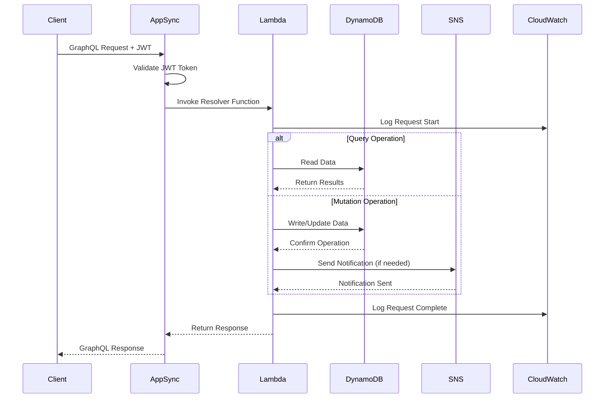
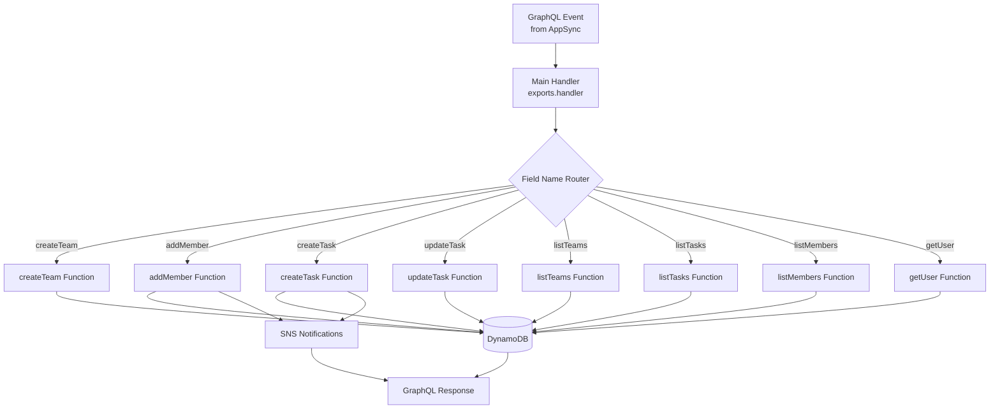
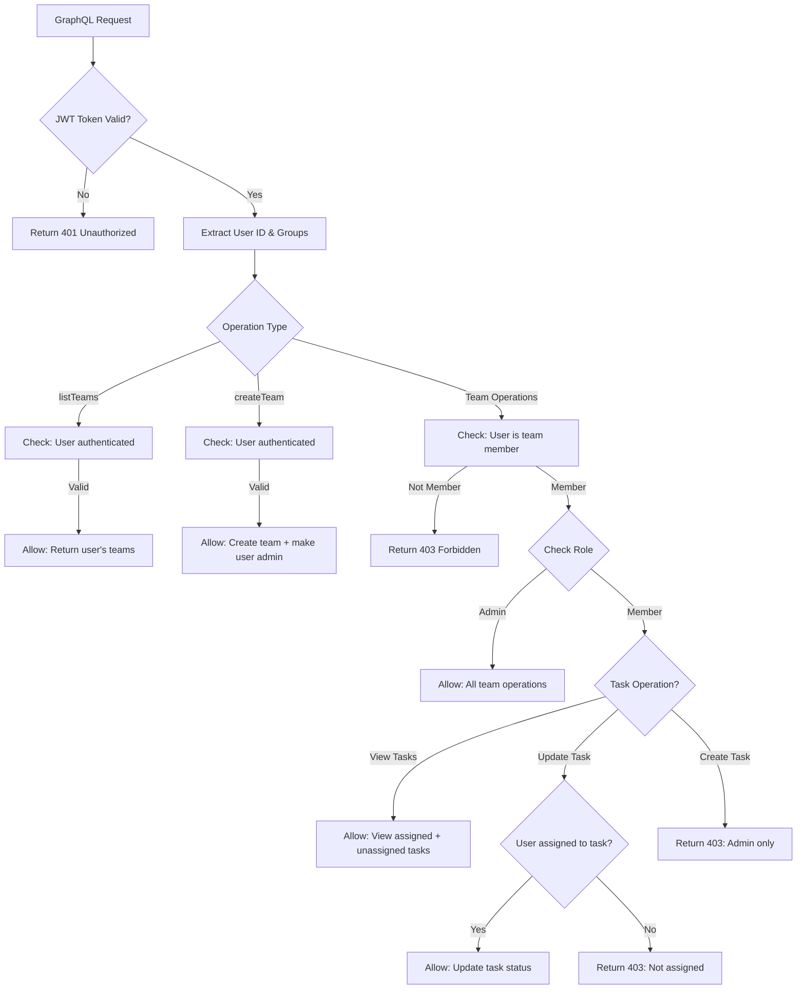
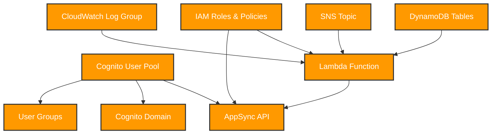

# 🔧 Task Management System - Backend

The backend infrastructure for the Task Management System, built with AWS serverless technologies and managed through Infrastructure as Code (IaC) using Terraform.


## 📋 Table of Contents

- [Architecture Overview](#️-architecture-overview)
- [Database Schema](#️-database-schema)
- [Lambda Functions](#-lambda-functions)
- [GraphQL API](#-graphql-api)
- [Infrastructure as Code](#️-infrastructure-as-code)
- [Deployment Guide](#-deployment-guide)
- [Monitoring & Logging](#-monitoring--logging)
- [Testing](#-testing)
- [Configuration](#-configuration)

## Architecture Overview

### Backend Architecture Diagram

```mermaid
graph TB
    subgraph "API Layer"
        APPSYNC[AWS AppSync<br/>GraphQL API]
        SCHEMA[GraphQL Schema<br/>Type Definitions]
        RESOLVERS[Field Resolvers<br/>Query/Mutation/Subscription]
    end
    
    subgraph "Compute Layer"
        LAMBDA[AWS Lambda<br/>task_handler.js]
        HANDLER{Request Handler}
        FUNCTIONS[Business Logic Functions]
    end
    
    subgraph "Authentication"
        COGNITO[Amazon Cognito<br/>User Pool]
        GROUPS[User Groups<br/>Admin | Member]
        JWT[JWT Tokens<br/>Authorization]
    end
    
    subgraph "Data Layer"
        DYNAMODB[Amazon DynamoDB<br/>NoSQL Database]
        
        subgraph "Tables"
            USERS[(Users Table<br/>PK: userId)]
            TEAMS[(Teams Table<br/>PK: teamId)]
            TASKS[(Tasks Table<br/>PK: teamId, SK: taskId)]
            MEMBERS[(Memberships Table<br/>PK: teamId, SK: userId)]
        end
        
        subgraph "Indexes"
            GSI[Global Secondary Index<br/>userId-index]
        end
    end
    
    subgraph "Notifications"
        SNS[Amazon SNS<br/>Simple Notification Service]
        EMAIL[Email Notifications<br/>Task Assignments]
    end
    
    subgraph "Monitoring"
        CLOUDWATCH[CloudWatch Logs<br/>Application Logging]
        METRICS[Custom Metrics<br/>Performance Tracking]
    end
    
    APPSYNC --> SCHEMA
    APPSYNC --> RESOLVERS
    RESOLVERS --> LAMBDA
    LAMBDA --> HANDLER
    HANDLER --> FUNCTIONS
    FUNCTIONS --> DYNAMODB
    FUNCTIONS --> SNS
    LAMBDA --> CLOUDWATCH
    COGNITO --> JWT
    JWT --> APPSYNC
    DYNAMODB --> USERS
    DYNAMODB --> TEAMS
    DYNAMODB --> TASKS
    DYNAMODB --> MEMBERS
    MEMBERS --> GSI
    SNS --> EMAIL
    
    classDef api fill:#e1f5fe
    classDef compute fill:#fff3e0
    classDef auth fill:#e8f5e8
    classDef data fill:#fff8e1
    classDef notification fill:#f1f8e9
    classDef monitoring fill:#e0f2f1
    
    class APPSYNC,SCHEMA,RESOLVERS api
    class LAMBDA,HANDLER,FUNCTIONS compute
    class COGNITO,GROUPS,JWT auth
    class DYNAMODB,USERS,TEAMS,TASKS,MEMBERS,GSI data
    class SNS,EMAIL notification
    class CLOUDWATCH,METRICS monitoring
```

### Request Flow Architecture



## 🗄️ Database Schema

### DynamoDB Table Design

#### Users Table
```javascript
{
  "TableName": "Users",
  "KeySchema": [
    { "AttributeName": "userId", "KeyType": "HASH" }
  ],
  "AttributeDefinitions": [
    { "AttributeName": "userId", "AttributeType": "S" }
  ]
}
```

**Sample Record:**
```json
{
  "userId": "user@example.com",
  "name": "John Doe",
  "email": "user@example.com",
  "createdAt": "2024-01-15T10:30:00Z",
  "lastLogin": "2024-01-20T14:22:00Z"
}
```

#### Teams Table
```javascript
{
  "TableName": "Teams",
  "KeySchema": [
    { "AttributeName": "teamId", "KeyType": "HASH" }
  ],
  "AttributeDefinitions": [
    { "AttributeName": "teamId", "AttributeType": "S" }
  ]
}
```

**Sample Record:**
```json
{
  "teamId": "team-uuid-123",
  "name": "Development Team",
  "adminId": "admin@example.com", 
  "createdAt": "2024-01-15T10:30:00Z",
  "description": "Main development team for the project"
}
```

#### Tasks Table
```javascript
{
  "TableName": "Tasks",
  "KeySchema": [
    { "AttributeName": "teamId", "KeyType": "HASH" },
    { "AttributeName": "taskId", "KeyType": "RANGE" }
  ],
  "AttributeDefinitions": [
    { "AttributeName": "teamId", "AttributeType": "S" },
    { "AttributeName": "taskId", "AttributeType": "S" }
  ]
}
```

**Sample Record:**
```json
{
  "teamId": "team-uuid-123",
  "taskId": "task-uuid-456",
  "title": "Implement user authentication",
  "description": "Add login/logout functionality using Cognito",
  "assignedTo": "developer@example.com",
  "status": "In Progress",
  "priority": "High",
  "deadline": "2024-02-01T00:00:00Z",
  "createdBy": "admin@example.com",
  "createdAt": "2024-01-15T10:30:00Z",
  "updatedAt": "2024-01-18T16:45:00Z"
}
```

#### Memberships Table
```javascript
{
  "TableName": "Memberships",
  "KeySchema": [
    { "AttributeName": "teamId", "KeyType": "HASH" },
    { "AttributeName": "userId", "KeyType": "RANGE" }
  ],
  "AttributeDefinitions": [
    { "AttributeName": "teamId", "AttributeType": "S" },
    { "AttributeName": "userId", "AttributeType": "S" }
  ],
  "GlobalSecondaryIndexes": [
    {
      "IndexName": "userId-index",
      "KeySchema": [
        { "AttributeName": "userId", "KeyType": "HASH" }
      ],
      "ProjectionType": "ALL"
    }
  ]
}
```

**Sample Record:**
```json
{
  "teamId": "team-uuid-123",
  "userId": "member@example.com",
  "role": "member",
  "joinedAt": "2024-01-16T09:15:00Z",
  "addedBy": "admin@example.com"
}
```

### Data Access Patterns

| Pattern | Table/Index | Key Condition | Use Case |
|---------|-------------|---------------|----------|
| Get User Teams | Memberships + GSI | `userId = :userId` | Dashboard team list |
| Get Team Members | Memberships | `teamId = :teamId` | Team management |
| Get Team Tasks | Tasks | `teamId = :teamId` | Task list view |
| Get User Details | Users | `userId = :userId` | Profile information |
| Get Team Info | Teams | `teamId = :teamId` | Team details |

## ⚡ Lambda Functions

### Main Handler Function: `task_handler.js`

The core Lambda function that processes all GraphQL operations through a single entry point.

#### Function Architecture



#### Core Functions

##### 1. createTeam Function
```javascript
async function createTeam(args, userId, userGroups) {
  // Input validation
  if (!args.name || args.name.trim().length === 0) {
    throw new Error('Team name is required');
  }
  
  // Generate unique team ID
  const teamId = generateUUID();
  
  // Create team and membership atomically
  const transactParams = {
    TransactItems: [
      {
        Put: {
          TableName: process.env.DYNAMODB_TEAMS_TABLE,
          Item: { teamId, name: args.name.trim(), adminId: userId, createdAt: new Date().toISOString() }
        }
      },
      {
        Put: {
          TableName: process.env.DYNAMODB_MEMBERSHIPS_TABLE,
          Item: { teamId, userId, role: 'admin', joinedAt: new Date().toISOString() }
        }
      }
    ]
  };
  
  await dynamodb.transactWrite(transactParams).promise();
  return { teamId, name: args.name.trim(), adminId: userId };
}
```

##### 2. createTask Function
```javascript
async function createTask(args, userId, userGroups) {
  // Validate user permissions
  const membership = await dynamodb.get({
    TableName: process.env.DYNAMODB_MEMBERSHIPS_TABLE,
    Key: { teamId: args.teamId, userId }
  }).promise();
  
  if (!membership.Item || membership.Item.role !== 'admin') {
    throw new Error('Only team admins can create tasks');
  }
  
  // Create task
  const taskId = generateUUID();
  const task = {
    teamId: args.teamId,
    taskId,
    title: args.title,
    description: args.description,
    assignedTo: args.assignedTo || null,
    status: 'Not Started',
    deadline: args.deadline || null,
    createdBy: userId,
    createdAt: new Date().toISOString()
  };
  
  await dynamodb.put({
    TableName: process.env.DYNAMODB_TASKS_TABLE,
    Item: task
  }).promise();
  
  // Send notification if assigned
  if (args.assignedTo) {
    await sns.publish({
      TopicArn: process.env.SNS_TOPIC_ARN,
      Message: `New task assigned: ${args.title}`,
      Subject: 'Task Assignment Notification'
    }).promise();
  }
  
  return task;
}
```

### Function Configuration

| Setting | Value | Purpose |
|---------|-------|---------|
| **Runtime** | Node.js 18.x | JavaScript execution environment |
| **Memory** | 256 MB | Sufficient for database operations |
| **Timeout** | 30 seconds | Allow for complex queries |
| **Environment Variables** | DynamoDB table names, SNS topic ARN | Runtime configuration |

### Error Handling Strategy

```javascript
// Global error handler with structured logging
exports.handler = async (event) => {
  console.log('Event received:', JSON.stringify(event, null, 2));
  
  try {
    const result = await processRequest(event);
    console.log('Request successful:', { fieldName: event.fieldName, userId: event.identity.sub });
    return result;
  } catch (error) {
    console.error('Request failed:', {
      fieldName: event.fieldName,
      userId: event.identity?.sub,
      error: error.message,
      stack: error.stack
    });
    throw new Error(`${event.fieldName} failed: ${error.message}`);
  }
};
```

## 🔗 GraphQL API

### Schema Definition

The GraphQL schema defines the API contract between frontend and backend:

```graphql
type Query {
  listTeams: [Team]
  listTasks(teamId: ID!): [Task]
  listMembers(teamId: ID!): [Member]
  getUser(userId: ID!): User
}

type Mutation {
  createTeam(name: String!): Team
  addMember(teamId: ID!, email: String!): Member
  createTask(teamId: ID!, title: String!, description: String!, assignedTo: ID, deadline: String): Task
  updateTask(teamId: ID!, taskId: ID!, status: String!): Task
}

type Team {
  teamId: ID!
  name: String!
  adminId: String!
  createdAt: String
}

type Task {
  teamId: ID!
  taskId: ID!
  title: String!
  description: String!
  assignedTo: String
  status: String!
  deadline: String
  createdBy: String
  createdAt: String
  updatedAt: String
  updatedBy: String
}

type Member {
  teamId: ID!
  userId: String!
  role: String!
  joinedAt: String
}

type User {
  userId: String!
  email: String
  name: String
}
```

### AppSync Resolver Mapping

| GraphQL Field | Lambda Function | Authorization | Description |
|---------------|-----------------|---------------|-------------|
| `listTeams` | `listTeams()` | User Pool | Get teams for authenticated user |
| `listTasks` | `listTasks()` | User Pool + Team Member | Get tasks for specific team |
| `listMembers` | `listMembers()` | User Pool + Team Member | Get members of specific team |
| `getUser` | `getUser()` | User Pool | Get user profile information |
| `createTeam` | `createTeam()` | User Pool | Create new team (any user) |
| `addMember` | `addMember()` | User Pool + Team Admin | Add member to team |
| `createTask` | `createTask()` | User Pool + Team Admin | Create new task |
| `updateTask` | `updateTask()` | User Pool + (Task Assignee OR Team Admin) | Update task status |

### Authorization Rules



## 🏗️ Infrastructure as Code

### Terraform Configuration Structure

```
backend/terraform/
├── main.tf              # Main infrastructure configuration
├── variables.tf         # Input variables
├── outputs.tf          # Output values for CI/CD
├── schema.graphql      # GraphQL schema definition
└── terraform.tfvars   # Variable values (not in version control)
```

### Key Resources

#### 1. Cognito User Pool
```hcl
resource "aws_cognito_user_pool" "pool" {
  name = "task-management-pool"
  auto_verified_attributes = ["email"]
  
  alias_attributes = ["email"]
  
  password_policy {
    minimum_length    = 8
    require_lowercase = true
    require_numbers   = true
    require_symbols   = false
    require_uppercase = true
  }
  
  verification_message_template {
    default_email_option = "CONFIRM_WITH_CODE"
    email_subject        = "Task Management - Verify your email"
    email_message        = "Your verification code is {####}"
  }
}
```

#### 2. DynamoDB Tables
```hcl
resource "aws_dynamodb_table" "tasks" {
  name           = "Tasks"
  billing_mode   = "PAY_PER_REQUEST"
  hash_key       = "teamId"
  range_key      = "taskId"
  
  attribute {
    name = "teamId"
    type = "S"
  }
  attribute {
    name = "taskId"
    type = "S"
  }
  
  tags = {
    Name = "TaskManagement-Tasks"
  }
}
```

#### 3. Lambda Function
```hcl
resource "aws_lambda_function" "task_handler" {
  filename         = "task_handler.zip"
  function_name    = "TaskHandler"
  role            = aws_iam_role.lambda_role.arn
  handler         = "task_handler.handler"
  runtime         = "nodejs18.x"
  timeout         = 30
  memory_size     = 256
  
  environment {
    variables = {
      DYNAMODB_USERS_TABLE       = aws_dynamodb_table.users.name
      DYNAMODB_TEAMS_TABLE       = aws_dynamodb_table.teams.name
      DYNAMODB_MEMBERSHIPS_TABLE = aws_dynamodb_table.memberships.name
      DYNAMODB_TASKS_TABLE       = aws_dynamodb_table.tasks.name
      SNS_TOPIC_ARN             = aws_sns_topic.task_notifications.arn
      AWS_REGION                 = var.region
    }
  }
}
```

#### 4. AppSync API
```hcl
resource "aws_appsync_graphql_api" "api" {
  name                = "task-management-api"
  authentication_type = "AMAZON_COGNITO_USER_POOLS"
  
  user_pool_config {
    user_pool_id   = aws_cognito_user_pool.pool.id
    aws_region     = var.region
    default_action = "ALLOW"
  }
  
  schema = file("${path.module}/schema.graphql")
}
```

### Resource Dependencies



## 🚀 Deployment Guide

### Prerequisites

1. **AWS CLI** configured with appropriate permissions
2. **Terraform** 1.5.0 or higher installed
3. **Node.js** 18.x for Lambda function dependencies
4. **IAM permissions** for creating AWS resources

### Manual Deployment Steps

#### 1. Prepare Lambda Function
```bash
cd backend/lambda

# Install dependencies
npm install

# Create deployment package
zip -r task_handler.zip . -x "*.git*" "node_modules/.cache/*"
```

#### 2. Initialize Terraform
```bash
cd ../terraform

# Initialize Terraform
terraform init

# Validate configuration
terraform validate

# Plan deployment
terraform plan -out=tfplan
```

#### 3. Deploy Infrastructure
```bash
# Apply Terraform configuration
terraform apply tfplan

# Note the outputs for frontend configuration
terraform output
```

#### 4. Verify Deployment
```bash
# Check AppSync API
aws appsync list-graphql-apis

# Check Lambda function
aws lambda list-functions --query 'Functions[?FunctionName==`TaskHandler`]'

# Check DynamoDB tables
aws dynamodb list-tables --query 'TableNames[?contains(@, `Task`)]'
```

### Automated Deployment (CI/CD)

The deployment is automated through GitHub Actions:

```yaml
# .github/workflows/deploy.yml
- name: Terraform Apply
  run: cd backend/terraform && terraform apply -auto-approve
  env:
    AWS_ACCESS_KEY_ID: ${{ secrets.AWS_ACCESS_KEY_ID }}
    AWS_SECRET_ACCESS_KEY: ${{ secrets.AWS_SECRET_ACCESS_KEY }}
```

### Environment-Specific Configurations

| Environment | Terraform Workspace | Configuration |
|-------------|---------------------|---------------|
| **Development** | `default` | Single region, minimal resources |
| **Staging** | `staging` | Production-like setup, limited capacity |
| **Production** | `prod` | Multi-AZ, backup enabled, monitoring |

## 📊 Monitoring & Logging

### CloudWatch Integration

#### Log Groups
- `/aws/lambda/TaskHandler` - Lambda function logs
- `/aws/appsync/apis/[API-ID]` - AppSync request logs

#### Custom Metrics
```javascript
// Example custom metric in Lambda
const AWS = require('aws-sdk');
const cloudwatch = new AWS.CloudWatch();

async function publishMetric(metricName, value, unit = 'Count') {
  await cloudwatch.putMetricData({
    Namespace: 'TaskManagement/Backend',
    MetricData: [{
      MetricName: metricName,
      Value: value,
      Unit: unit,
      Timestamp: new Date()
    }]
  }).promise();
}

// Usage in functions
await publishMetric('TasksCreated', 1);
await publishMetric('ResponseTime', duration, 'Milliseconds');
```

#### Alarms Configuration
```hcl
resource "aws_cloudwatch_metric_alarm" "lambda_errors" {
  alarm_name          = "task-handler-errors"
  comparison_operator = "GreaterThanThreshold"
  evaluation_periods  = "2"
  metric_name         = "Errors"
  namespace           = "AWS/Lambda"
  period              = "300"
  statistic           = "Sum"
  threshold           = "5"
  alarm_description   = "This metric monitors lambda errors"

  dimensions = {
    FunctionName = aws_lambda_function.task_handler.function_name
  }
}
```

### Performance Monitoring

#### Key Metrics to Track
- **Lambda Duration** - Function execution time
- **DynamoDB Throttling** - Read/write capacity exceeded
- **API Gateway 4xx/5xx** - Client and server errors
- **Cognito Authentication** - Login success/failure rates

#### Logging Strategy
```javascript
// Structured logging format
const logger = {
  info: (message, context = {}) => {
    console.log(JSON.stringify({
      level: 'INFO',
      message,
      timestamp: new Date().toISOString(),
      ...context
    }));
  },
  
  error: (message, error, context = {}) => {
    console.error(JSON.stringify({
      level: 'ERROR',
      message,
      error: error.message,
      stack: error.stack,
      timestamp: new Date().toISOString(),
      ...context
    }));
  }
};

// Usage in Lambda functions
logger.info('Task created successfully', { taskId, userId });
logger.error('Database operation failed', error, { operation: 'createTask', taskId });
```

## 🧪 Testing

### Unit Testing

#### Test Structure
```
backend/lambda/
├── task_handler.js
├── __tests__/
│   ├── unit/
│   │   ├── createTeam.test.js
│   │   ├── createTask.test.js
│   │   └── updateTask.test.js
│   └── integration/
│       ├── dynamodb.test.js
│       └── appsync.test.js
└── package.json
```

#### Example Unit Test
```javascript
// __tests__/unit/createTeam.test.js
const { createTeam } = require('../../task_handler');

// Mock AWS SDK
jest.mock('aws-sdk', () => ({
  DynamoDB: {
    DocumentClient: jest.fn(() => ({
      transactWrite: jest.fn(() => ({
        promise: jest.fn(() => Promise.resolve())
      }))
    }))
  }
}));

describe('createTeam', () => {
  test('should create team successfully', async () => {
    const args = { name: 'Test Team' };
    const userId = 'test@example.com';
    const userGroups = [];

    const result = await createTeam(args, userId, userGroups);

    expect(result).toHaveProperty('teamId');
    expect(result.name).toBe('Test Team');
    expect(result.adminId).toBe(userId);
  });

  test('should throw error for empty team name', async () => {
    const args = { name: '' };
    const userId = 'test@example.com';

    await expect(createTeam(args, userId, [])).rejects.toThrow('Team name is required');
  });
});
```

### Integration Testing

#### DynamoDB Integration Test
```javascript
// __tests__/integration/dynamodb.test.js
const AWS = require('aws-sdk');
const { handler } = require('../../task_handler');

// Use LocalStack or DynamoDB Local for testing
const dynamodb = new AWS.DynamoDB.DocumentClient({
  endpoint: 'http://localhost:8000',
  region: 'local'
});

describe('DynamoDB Integration', () => {
  beforeAll(async () => {
    // Set up test tables
    await createTestTables();
  });

  afterAll(async () => {
    // Clean up test tables
    await deleteTestTables();
  });

  test('should create and retrieve team', async () => {
    const createEvent = {
      fieldName: 'createTeam',
      arguments: { name: 'Integration Test Team' },
      identity: { sub: 'test@example.com' }
    };

    const createResult = await handler(createEvent);
    expect(createResult).toHaveProperty('teamId');

    const listEvent = {
      fieldName: 'listTeams',
      identity: { sub: 'test@example.com' }
    };

    const listResult = await handler(listEvent);
    expect(listResult).toHaveLength(1);
    expect(listResult[0].name).toBe('Integration Test Team');
  });
});
```

### Load Testing

#### Artillery Configuration
```yaml
# artillery-load-test.yml
config:
  target: 'https://your-appsync-endpoint.amazonaws.com/graphql'
  phases:
    - duration: 60
      arrivalRate: 10
      name: "Warm up"
    - duration: 300
      arrivalRate: 50
      name: "Load test"
  headers:
    Authorization: "Bearer {{ jwt_token }}"
    Content-Type: "application/json"

scenarios:
  - name: "List Teams"
    weight: 40
    requests:
      - post:
          url: "/"
          json:
            query: "query { listTeams { teamId name adminId } }"

  - name: "Create Task"
    weight: 30
    requests:
      - post:
          url: "/"
          json:
            query: |
              mutation {
                createTask(
                  teamId: "{{ teamId }}"
                  title: "Load test task"
                  description: "Created during load testing"
                ) {
                  taskId
                  title
                  status
                }
              }
```

## 🔧 Configuration

### Environment Variables

#### Lambda Function Environment Variables
```bash
# DynamoDB Table Names
DYNAMODB_USERS_TABLE=Users
DYNAMODB_TEAMS_TABLE=Teams
DYNAMODB_MEMBERSHIPS_TABLE=Memberships
DYNAMODB_TASKS_TABLE=Tasks

# SNS Configuration
SNS_TOPIC_ARN=arn:aws:sns:eu-west-1:123456789012:task-notifications

# AWS Region
AWS_REGION=eu-west-1
```

#### Terraform Variables
```hcl
# variables.tf
variable "region" {
  description = "AWS region for deployment"
  type        = string
  default     = "eu-west-1"
}

variable "environment" {
  description = "Environment name (dev, staging, prod)"
  type        = string
  default     = "dev"
}

variable "lambda_memory_size" {
  description = "Memory size for Lambda function"
  type        = number
  default     = 256
}

variable "lambda_timeout" {
  description = "Timeout for Lambda function in seconds"
  type        = number
  default     = 30
}
```

### Security Configuration

#### IAM Policies
```json
{
  "Version": "2012-10-17",
  "Statement": [
    {
      "Effect": "Allow",
      "Action": [
        "dynamodb:PutItem",
        "dynamodb:GetItem",
        "dynamodb:UpdateItem",
        "dynamodb:DeleteItem",
        "dynamodb:Query",
        "dynamodb:Scan",
        "dynamodb:TransactWrite"
      ],
      "Resource": [
        "arn:aws:dynamodb:*:*:table/Users",
        "arn:aws:dynamodb:*:*:table/Teams",
        "arn:aws:dynamodb:*:*:table/Tasks",
        "arn:aws:dynamodb:*:*:table/Memberships",
        "arn:aws:dynamodb:*:*:table/Memberships/index/*"
      ]
    },
    {
      "Effect": "Allow",
      "Action": [
        "sns:Publish"
      ],
      "Resource": "arn:aws:sns:*:*:task-notifications"
    }
  ]
}
```

#### Cognito Configuration
```hcl
resource "aws_cognito_user_pool" "pool" {
  # ... other configuration ...
  
  account_recovery_setting {
    recovery_mechanism {
      name     = "verified_email"
      priority = 1
    }
  }
  
  user_pool_add_ons {
    advanced_security_mode = "ENFORCED"
  }
  
  device_configuration {
    challenge_required_on_new_device      = true
    device_only_remembered_on_user_prompt = true
  }
}
```

### Performance Tuning

#### DynamoDB Optimization
- **On-Demand Billing** - Automatically scales with traffic
- **Global Secondary Indexes** - Optimized for access patterns
- **Projection Types** - ALL projection for flexibility vs. cost optimization

#### Lambda Optimization
- **Memory Configuration** - 256MB for balance of cost and performance
- **Connection Reuse** - Reuse DynamoDB connections across invocations
- **Cold Start Mitigation** - Provisioned concurrency for production

---

**🔙 [Back to Main Documentation](../README.md)**