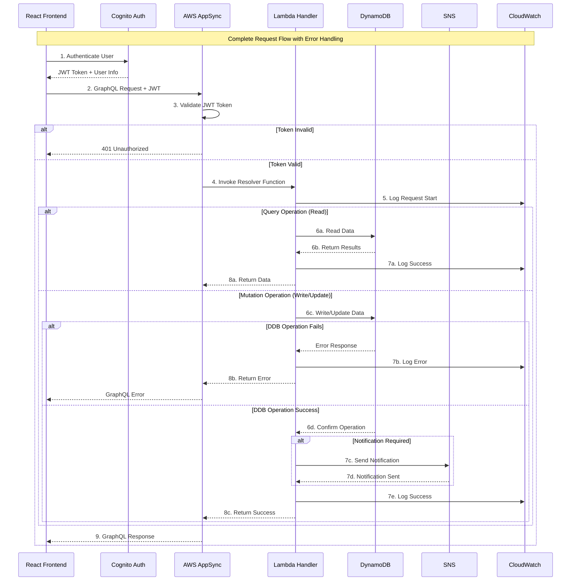
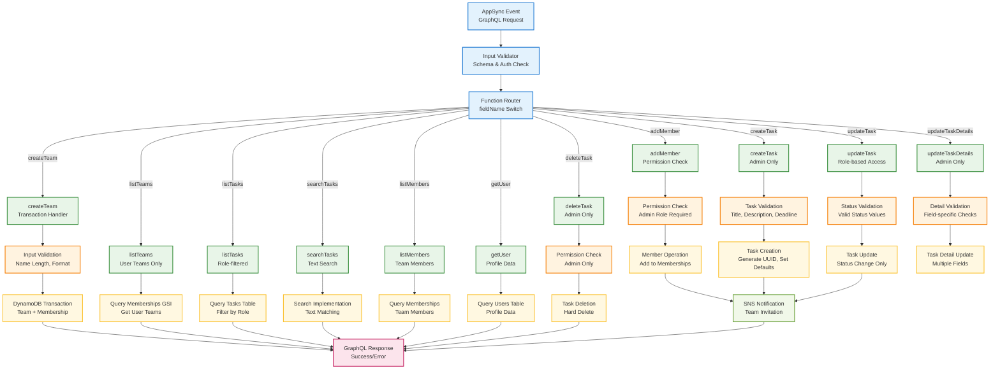
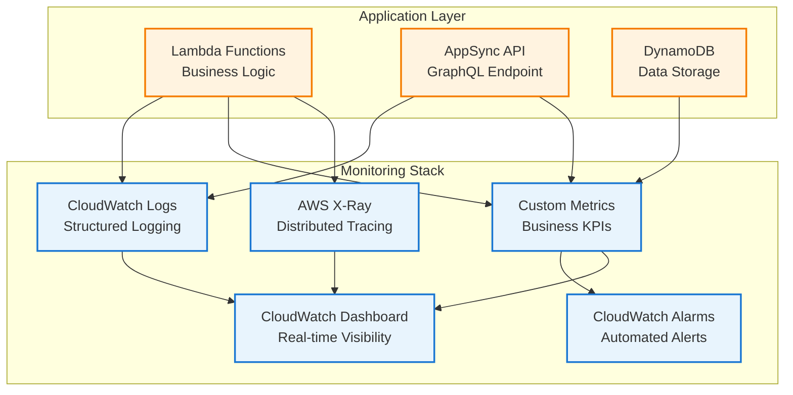

# 🔧 Task Management System - Complete Backend Documentation

The backend infrastructure for the Task Management System, built with AWS serverless technologies and managed through Infrastructure as Code (IaC) using Terraform.


## 📋 Table of Contents

- [Critical Issues Fixed](#-critical-issues-fixed)
- [Architecture Overview](#️-architecture-overview)
- [Database Schema](#️-database-schema)
- [Lambda Functions](#-lambda-functions)
- [GraphQL API](#-graphql-api)
- [Infrastructure as Code](#️-infrastructure-as-code)
- [Deployment Guide](#-deployment-guide)
- [Monitoring & Logging](#-monitoring--logging)
- [Testing](#-testing)
- [Configuration](#-configuration)
- [Troubleshooting](#️-troubleshooting)

## Architecture Overview

### Complete Backend Architecture

```mermaid
graph TB
    subgraph "Client Layer"
        WEB[React Frontend<br/>Amplify UI]
        MOBILE[Mobile Apps<br/>React Native]
    end
    
    subgraph "API Gateway Layer"
        APPSYNC[AWS AppSync<br/>GraphQL API]
        SCHEMA[GraphQL Schema<br/>Type Definitions]
        RESOLVERS[Field Resolvers<br/>Direct Lambda Integration]
    end
    
    subgraph "Compute Layer"
        LAMBDA[AWS Lambda<br/>task_handler.js]
        HANDLER{Main Handler<br/>Request Router}
        
        subgraph "Business Logic Functions"
            CREATETEAM[createTeam]
            ADDMEMBER[addMember]
            CREATETASK[createTask]
            UPDATETASK[updateTask]
            LISTTASKS[listTasks]
            SEARCHTASKS[searchTasks]
            LISTTEAMS[listTeams]
            LISTMEMBERS[listMembers]
            GETUSER[getUser]
            DELETETASK[deleteTask]
            UPDATEDETAILS[updateTaskDetails]
        end
    end
    
    subgraph "Authentication & Authorization"
        COGNITO[Amazon Cognito<br/>User Pool]
        GROUPS[User Groups<br/>Admin | Member]
        JWT[JWT Tokens<br/>Authorization]
        USERPOOL[User Pool Client]
        DOMAIN[Cognito Domain]
    end
    
    subgraph "Data Layer"
        DYNAMODB[Amazon DynamoDB<br/>NoSQL Database]
        
        subgraph "Tables"
            USERS[(Users Table<br/>PK: userId)]
            TEAMS[(Teams Table<br/>PK: teamId)]
            TASKS[(Tasks Table<br/>PK: teamId, SK: taskId)]
            MEMBERS[(Memberships Table<br/>PK: teamId, SK: userId)]
        end
        
        subgraph "Indexes"
            GSI[Global Secondary Index<br/>userId-index on Memberships]
        end
    end
    
    subgraph "Notifications"
        SNS[Amazon SNS<br/>Task Notifications]
        EMAIL[Email Notifications<br/>Task Assignments & Updates]
        LAMBDA_NOTIF[Notification Lambda<br/>Email Processing]
    end
    
    subgraph "Storage & Hosting"
        S3[Amazon S3<br/>Frontend Hosting]
        CLOUDFRONT[CloudFront CDN<br/>Global Distribution]
    end
    
    subgraph "Monitoring & Logging"
        CLOUDWATCH[CloudWatch Logs<br/>Application Logging]
        METRICS[Custom Metrics<br/>Performance Tracking]
        ALARMS[CloudWatch Alarms<br/>Error Monitoring]
        XRAY[AWS X-Ray<br/>Request Tracing]
    end
    
    %% Connections
    WEB --> APPSYNC
    MOBILE --> APPSYNC
    APPSYNC --> SCHEMA
    APPSYNC --> RESOLVERS
    RESOLVERS --> LAMBDA
    LAMBDA --> HANDLER
    HANDLER --> CREATETEAM
    HANDLER --> ADDMEMBER
    HANDLER --> CREATETASK
    HANDLER --> UPDATETASK
    HANDLER --> LISTTASKS
    HANDLER --> SEARCHTASKS
    HANDLER --> LISTTEAMS
    HANDLER --> LISTMEMBERS
    HANDLER --> GETUSER
    HANDLER --> DELETETASK
    HANDLER --> UPDATEDETAILS
    
    CREATETEAM --> DYNAMODB
    ADDMEMBER --> DYNAMODB
    CREATETASK --> DYNAMODB
    UPDATETASK --> DYNAMODB
    LISTTASKS --> DYNAMODB
    SEARCHTASKS --> DYNAMODB
    LISTTEAMS --> DYNAMODB
    LISTMEMBERS --> DYNAMODB
    GETUSER --> DYNAMODB
    DELETETASK --> DYNAMODB
    UPDATEDETAILS --> DYNAMODB
    
    DYNAMODB --> USERS
    DYNAMODB --> TEAMS
    DYNAMODB --> TASKS
    DYNAMODB --> MEMBERS
    MEMBERS --> GSI
    
    ADDMEMBER --> SNS
    CREATETASK --> SNS
    UPDATETASK --> SNS
    SNS --> EMAIL
    SNS --> LAMBDA_NOTIF
    
    COGNITO --> JWT
    COGNITO --> GROUPS
    COGNITO --> USERPOOL
    COGNITO --> DOMAIN
    JWT --> APPSYNC
    
    LAMBDA --> CLOUDWATCH
    LAMBDA --> METRICS
    LAMBDA --> XRAY
    METRICS --> ALARMS
    
    S3 --> CLOUDFRONT
    CLOUDFRONT --> WEB
    
    classDef client fill:#e8f4fd,stroke:#1976d2,stroke-width:2px
    classDef api fill:#e1f5fe,stroke:#0277bd,stroke-width:2px
    classDef compute fill:#fff3e0,stroke:#f57c00,stroke-width:2px
    classDef auth fill:#e8f5e8,stroke:#388e3c,stroke-width:2px
    classDef data fill:#fff8e1,stroke:#fbc02d,stroke-width:2px
    classDef notification fill:#f1f8e9,stroke:#689f38,stroke-width:2px
    classDef storage fill:#fce4ec,stroke:#c2185b,stroke-width:2px
    classDef monitoring fill:#e0f2f1,stroke:#00796b,stroke-width:2px
    
    class WEB,MOBILE client
    class APPSYNC,SCHEMA,RESOLVERS api
    class LAMBDA,HANDLER,CREATETEAM,ADDMEMBER,CREATETASK,UPDATETASK,LISTTASKS,SEARCHTASKS,LISTTEAMS,LISTMEMBERS,GETUSER,DELETETASK,UPDATEDETAILS compute
    class COGNITO,GROUPS,JWT,USERPOOL,DOMAIN auth
    class DYNAMODB,USERS,TEAMS,TASKS,MEMBERS,GSI data
    class SNS,EMAIL,LAMBDA_NOTIF notification
    class S3,CLOUDFRONT storage
    class CLOUDWATCH,METRICS,ALARMS,XRAY monitoring
```

### Critical Request Flow with Error Handling



## 🗄️ Database Schema

### Complete DynamoDB Table Design

#### 1. Users Table
```javascript
{
  "TableName": "Users",
  "BillingMode": "PAY_PER_REQUEST",
  "KeySchema": [
    { "AttributeName": "userId", "KeyType": "HASH" }
  ],
  "AttributeDefinitions": [
    { "AttributeName": "userId", "AttributeType": "S" }
  ],
  "Tags": [
    { "Key": "Name", "Value": "TaskManagement-Users" },
    { "Key": "Environment", "Value": "Production" }
  ]
}
```

**Sample Record with All Fields**:
```json
{
  "userId": "user@example.com",
  "name": "John Doe",
  "email": "user@example.com",
  "createdAt": "2024-01-15T10:30:00Z",
  "lastLogin": "2024-01-20T14:22:00Z",
  "profileImage": "https://example.com/profile.jpg",
  "preferences": {
    "notifications": true,
    "theme": "light"
  }
}
```

#### 2. Teams Table
```javascript
{
  "TableName": "Teams",
  "BillingMode": "PAY_PER_REQUEST",
  "KeySchema": [
    { "AttributeName": "teamId", "KeyType": "HASH" }
  ],
  "AttributeDefinitions": [
    { "AttributeName": "teamId", "AttributeType": "S" }
  ],
  "Tags": [
    { "Key": "Name", "Value": "TaskManagement-Teams" }
  ]
}
```

**Sample Record**:
```json
{
  "teamId": "team-uuid-123",
  "name": "Development Team",
  "adminId": "admin@example.com",
  "createdAt": "2024-01-15T10:30:00Z",
  "description": "Main development team for the project",
  "settings": {
    "isPublic": false,
    "allowGuestAccess": false
  },
  "memberCount": 5,
  "taskCount": 23
}
```

#### 3. Tasks Table (Composite Key)
```javascript
{
  "TableName": "Tasks",
  "BillingMode": "PAY_PER_REQUEST",
  "KeySchema": [
    { "AttributeName": "teamId", "KeyType": "HASH" },
    { "AttributeName": "taskId", "KeyType": "RANGE" }
  ],
  "AttributeDefinitions": [
    { "AttributeName": "teamId", "AttributeType": "S" },
    { "AttributeName": "taskId", "AttributeType": "S" }
  ],
  "Tags": [
    { "Key": "Name", "Value": "TaskManagement-Tasks" }
  ]
}
```

**Sample Record with All Possible Fields**:
```json
{
  "teamId": "team-uuid-123",
  "taskId": "task-uuid-456",
  "title": "Implement user authentication",
  "description": "Add login/logout functionality using Cognito with proper error handling",
  "assignedTo": "developer@example.com",
  "status": "In Progress",
  "priority": "High",
  "deadline": "2024-02-01T00:00:00Z",
  "createdBy": "admin@example.com",
  "createdAt": "2024-01-15T10:30:00Z",
  "updatedAt": "2024-01-18T16:45:00Z",
  "updatedBy": "developer@example.com",
  "estimatedHours": 8,
  "actualHours": 5.5,
  "tags": ["authentication", "security", "frontend"],
  "attachments": [
    {
      "name": "requirements.pdf",
      "url": "https://s3.amazonaws.com/bucket/requirements.pdf"
    }
  ],
  "comments": [
    {
      "userId": "admin@example.com",
      "comment": "Please ensure password complexity validation",
      "timestamp": "2024-01-16T14:30:00Z"
    }
  ]
}
```

#### 4. Memberships Table (Composite Key + GSI)
```javascript
{
  "TableName": "Memberships",
  "BillingMode": "PAY_PER_REQUEST",
  "KeySchema": [
    { "AttributeName": "teamId", "KeyType": "HASH" },
    { "AttributeName": "userId", "KeyType": "RANGE" }
  ],
  "AttributeDefinitions": [
    { "AttributeName": "teamId", "AttributeType": "S" },
    { "AttributeName": "userId", "AttributeType": "S" }
  ],
  "GlobalSecondaryIndexes": [
    {
      "IndexName": "userId-index",
      "KeySchema": [
        { "AttributeName": "userId", "KeyType": "HASH" }
      ],
      "ProjectionType": "ALL"
    }
  ],
  "Tags": [
    { "Key": "Name", "Value": "TaskManagement-Memberships" }
  ]
}
```

**Sample Record**:
```json
{
  "teamId": "team-uuid-123",
  "userId": "member@example.com",
  "role": "member",
  "joinedAt": "2024-01-16T09:15:00Z",
  "addedBy": "admin@example.com",
  "status": "active",
  "permissions": ["read_tasks", "update_own_tasks"],
  "lastActivity": "2024-01-20T16:30:00Z"
}
```

### Data Access Patterns & Performance

| Operation | Table/Index Used | Key Condition | Secondary Filters | Performance |
|-----------|------------------|---------------|-------------------|-------------|
| **Get User Teams** | Memberships + GSI | `userId = :userId` | `status = active` | O(1) + scan |
| **Get Team Members** | Memberships | `teamId = :teamId` | `role, status` | O(1) |
| **Get Team Tasks** | Tasks | `teamId = :teamId` | `status, priority` | O(1) + filter |
| **Get User Profile** | Users | `userId = :userId` | - | O(1) |
| **Get Team Details** | Teams | `teamId = :teamId` | - | O(1) |
| **Search Tasks** | Tasks | `teamId = :teamId` | Text search in app | O(1) + filter |

### DynamoDB Optimization Strategies

```javascript
// Example: Optimized batch operations for better performance
const batchGetTeamData = async (teamId, userId) => {
  const batchParams = {
    RequestItems: {
      [process.env.DYNAMODB_TEAMS_TABLE]: {
        Keys: [{ teamId }]
      },
      [process.env.DYNAMODB_MEMBERSHIPS_TABLE]: {
        Keys: [{ teamId, userId }]
      }
    }
  };
  
  const result = await dynamodb.batchGet(batchParams).promise();
  
  return {
    team: result.Responses[process.env.DYNAMODB_TEAMS_TABLE][0],
    membership: result.Responses[process.env.DYNAMODB_MEMBERSHIPS_TABLE][0]
  };
};
```

## ⚡ Lambda Functions

### Main Handler Architecture



### Core Lambda Functions Implementation

#### 1. Enhanced Error Handling & Validation

```javascript
// Enhanced error classes with specific error codes
class ValidationError extends Error {
  constructor(message, field = null, code = 'VALIDATION_ERROR') {
    super(message);
    this.name = 'ValidationError';
    this.errorType = 'ValidationError';
    this.field = field;
    this.code = code;
  }
}

class AuthorizationError extends Error {
  constructor(message, requiredRole = null, code = 'AUTHORIZATION_ERROR') {
    super(message);
    this.name = 'AuthorizationError';
    this.errorType = 'AuthorizationError';
    this.requiredRole = requiredRole;
    this.code = code;
  }
}

class NotFoundError extends Error {
  constructor(resource, id = null, code = 'NOT_FOUND') {
    super(`${resource} not found${id ? ` with ID: ${id}` : ''}`);
    this.name = 'NotFoundError';
    this.errorType = 'NotFoundError';
    this.resource = resource;
    this.resourceId = id;
    this.code = code;
  }
}

// Enhanced validation helpers
const validators = {
  required: (value, fieldName) => {
    if (!value || (typeof value === 'string' && value.trim().length === 0)) {
      throw new ValidationError(`${fieldName} is required and cannot be empty`, fieldName);
    }
  },
  
  email: (email) => {
    const emailRegex = /^[^\s@]+@[^\s@]+\.[^\s@]+$/;
    if (!emailRegex.test(email)) {
      throw new ValidationError('Invalid email format', 'email');
    }
  },
  
  length: (value, fieldName, minLength, maxLength) => {
    if (value && typeof value === 'string') {
      const trimmed = value.trim();
      if (trimmed.length < minLength || trimmed.length > maxLength) {
        throw new ValidationError(
          `${fieldName} must be between ${minLength} and ${maxLength} characters`,
          fieldName
        );
      }
    }
  },
  
  status: (status) => {
    const validStatuses = ['Not Started', 'In Progress', 'Completed'];
    if (!validStatuses.includes(status)) {
      throw new ValidationError(
        `Invalid status. Must be one of: ${validStatuses.join(', ')}`,
        'status'
      );
    }
  },
  
  priority: (priority) => {
    const validPriorities = ['Low', 'Medium', 'High'];
    if (priority && !validPriorities.includes(priority)) {
      throw new ValidationError(
        `Invalid priority. Must be one of: ${validPriorities.join(', ')}`,
        'priority'
      );
    }
  },
  
  deadline: (deadline) => {
    if (deadline) {
      const deadlineDate = new Date(deadline);
      if (isNaN(deadlineDate.getTime())) {
        throw new ValidationError('Invalid deadline format. Use ISO date format', 'deadline');
      }
      if (deadlineDate < new Date()) {
        throw new ValidationError('Deadline cannot be in the past', 'deadline');
      }
    }
  }
};
```

#### 2. Enhanced Main Handler with Complete Error Handling

```javascript
exports.handler = async (event) => {
  const startTime = Date.now();
  const requestId = event.requestId || 'unknown';
  
  // Enhanced logging with correlation ID
  console.log('Lambda invocation started:', {
    timestamp: new Date().toISOString(),
    requestId,
    event: JSON.stringify(event, null, 2),
    coldStart: !global.isWarm
  });
  
  global.isWarm = true; // Mark for cold start tracking
  
  const { fieldName, arguments: args, identity } = event;
  
  try {
    // Validate event structure
    if (!fieldName) {
      throw new ValidationError('Missing fieldName in event');
    }
    
    if (!identity || !identity.sub) {
      throw new AuthorizationError('Authentication required - missing user identity');
    }
    
    const userId = identity.sub;
    const userGroups = identity['cognito:groups'] || [];
    
    // Route to appropriate handler
    const result = await routeRequest(fieldName, args, userId, userGroups);
    
    // Success logging with metrics
    const duration = Date.now() - startTime;
    console.log('Request completed successfully:', {
      fieldName,
      userId,
      duration,
      resultType: typeof result,
      resultCount: Array.isArray(result) ? result.length : 'N/A',
      requestId
    });
    
    // Publish custom metric for monitoring
    await publishMetric('RequestSuccess', 1, 'Count', { operation: fieldName });
    await publishMetric('RequestDuration', duration, 'Milliseconds', { operation: fieldName });
    
    return result;
    
  } catch (error) {
    const duration = Date.now() - startTime;
    
    // Enhanced error logging
    console.error('Request failed:', {
      fieldName,
      userId: identity?.sub,
      error: {
        message: error.message,
        type: error.errorType || error.name,
        code: error.code,
        field: error.field,
        stack: error.stack
      },
      duration,
      requestId
    });
    
    // Publish error metrics
    await publishMetric('RequestError', 1, 'Count', { 
      operation: fieldName,
      errorType: error.errorType || error.name 
    });
    
    // Return properly formatted error for AppSync
    throw {
      errorType: error.errorType || 'InternalError',
      errorMessage: error.message,
      data: {
        field: error.field,
        code: error.code,
        requestId
      }
    };
  }
};

// Request router with enhanced function mapping
async function routeRequest(fieldName, args, userId, userGroups) {
  const handlers = {
    // Team operations
    createTeam: () => createTeam(args, userId, userGroups),
    
    // Member operations
    addMember: () => addMember(args, userId, userGroups),
    listMembers: () => listMembers(args, userId, userGroups),
    
    // Task operations
    createTask: () => createTask(args, userId, userGroups),
    updateTask: () => updateTask(args, userId, userGroups),
    updateTaskDetails: () => updateTaskDetails(args, userId, userGroups),
    deleteTask: () => deleteTask(args, userId, userGroups),
    listTasks: () => listTasks(args, userId, userGroups),
    searchTasks: () => searchTasks(args, userId, userGroups),
    
    // Query operations
    listTeams: () => listTeams(userId),
    getUser: () => getUser(args, userId)
  };
  
  const handler = handlers[fieldName];
  if (!handler) {
    throw new ValidationError(`Unknown GraphQL field: ${fieldName}`);
  }
  
  return await handler();
}
```

#### 3. Enhanced createTask Function with Complete Validation

```javascript
async function createTask(args, userId, userGroups) {
  console.log('[CREATE_TASK] Starting task creation:', { args, userId });
  
  // Comprehensive input validation
  validators.required(args?.teamId, 'Team ID');
  validators.required(args?.title, 'Task title');
  validators.required(args?.description, 'Task description');
  validators.length(args.title, 'Task title', 1, 200);
  validators.length(args.description, 'Task description', 1, 1000);
  validators.priority(args.priority);
  validators.deadline(args.deadline);
  
  try {
    // Verify user permissions with enhanced role checking
    const membership = await dynamodb.get({
      TableName: process.env.DYNAMODB_MEMBERSHIPS_TABLE,
      Key: { teamId: args.teamId, userId }
    }).promise();
    
    if (!membership.Item) {
      throw new AuthorizationError('You must be a team member to create tasks', 'member');
    }
    
    if (membership.Item.role !== 'admin') {
      throw new AuthorizationError('Only team admins can create tasks', 'admin');
    }
    
    // Verify assignee is team member if specified
    if (args.assignedTo) {
      const assigneeCheck = await dynamodb.get({
        TableName: process.env.DYNAMODB_MEMBERSHIPS_TABLE,
        Key: { teamId: args.teamId, userId: args.assignedTo }
      }).promise();
      
      if (!assigneeCheck.Item) {
        throw new ValidationError('Cannot assign task to user who is not a team member', 'assignedTo');
      }
    }
    
    // Get team information for notification context
    const teamInfo = await dynamodb.get({
      TableName: process.env.DYNAMODB_TEAMS_TABLE,
      Key: { teamId: args.teamId }
    }).promise();
    
    if (!teamInfo.Item) {
      throw new NotFoundError('Team', args.teamId);
    }
    
    // Create task with all required fields
    const taskId = uuidv4();
    const timestamp = new Date().toISOString();
    
    const task = {
      teamId: args.teamId,
      taskId,
      title: args.title.trim(),
      description: args.description.trim(),
      assignedTo: args.assignedTo || null,
      status: 'Not Started',
      priority: args.priority || 'Medium',
      deadline: args.deadline || null,
      createdBy: userId,
      createdAt: timestamp,
      estimatedHours: args.estimatedHours || null,
      tags: args.tags || []
    };
    
    // Atomic task creation
    await dynamodb.put({
      TableName: process.env.DYNAMODB_TASKS_TABLE,
      Item: task,
      ConditionExpression: 'attribute_not_exists(taskId)'
    }).promise();
    
    // Send comprehensive notification if task is assigned
    if (args.assignedTo && args.assignedTo !== userId) {
      await sendNotification(
        'New Task Assignment',
        `You have been assigned a new task: "${args.title}" in team "${teamInfo.Item.name}". Priority: ${task.priority}${task.deadline ? `, Due: ${new Date(task.deadline).toLocaleDateString()}` : ''}`,
        args.assignedTo,
        {
          taskId,
          taskTitle: args.title,
          teamId: args.teamId,
          teamName: teamInfo.Item.name,
          priority: task.priority,
          deadline: task.deadline,
          createdBy: userId,
          action: 'task_assigned'
        }
      );
    }
    
    // Log success with comprehensive context
    console.log('[CREATE_TASK] Task created successfully:', { 
      taskId, 
      title: task.title,
      assignedTo: task.assignedTo,
      priority: task.priority,
      teamName: teamInfo.Item.name
    });
    
    return task;
    
  } catch (error) {
    if (error instanceof ValidationError || error instanceof AuthorizationError || error instanceof NotFoundError) {
      throw error;
    }
    
    if (error.code === 'ConditionalCheckFailedException') {
      throw new ValidationError('Task creation failed - duplicate task ID detected');
    }
    
    console.error('[CREATE_TASK] Unexpected error:', error);
    throw new Error(`Failed to create task: ${error.message}`);
  }
}
```

#### 4. Enhanced updateTask Function with Role-Based Access

```javascript
async function updateTask(args, userId, userGroups) {
  console.log('[UPDATE_TASK] Starting task update:', { args, userId });
  
  // Input validation
  validators.required(args?.teamId, 'Team ID');
  validators.required(args?.taskId, 'Task ID');
  validators.required(args?.status, 'Task status');
  validators.status(args.status);
  
  try {
    // Get current task with error handling
    const taskResult = await dynamodb.get({
      TableName: process.env.DYNAMODB_TASKS_TABLE,
      Key: { teamId: args.teamId, taskId: args.taskId }
    }).promise();
    
    if (!taskResult.Item) {
      throw new NotFoundError('Task', args.taskId);
    }
    
    const task = taskResult.Item;
    const oldStatus = task.status;
    
    // Enhanced permission checking
    const membership = await dynamodb.get({
      TableName: process.env.DYNAMODB_MEMBERSHIPS_TABLE,
      Key: { teamId: args.teamId, userId }
    }).promise();
    
    if (!membership.Item) {
      throw new AuthorizationError('You must be a team member to update tasks', 'member');
    }
    
    // Role-based access control
    const isAdmin = membership.Item.role === 'admin';
    const isAssignee = task.assignedTo === userId;
    const canUpdate = isAdmin || isAssignee;
    
    if (!canUpdate) {
      throw new AuthorizationError(
        'You can only update tasks assigned to you or if you are a team admin',
        isAssignee ? 'assignee' : 'admin'
      );
    }
    
    // Skip update if status unchanged
    if (task.status === args.status) {
      console.log('[UPDATE_TASK] Status unchanged, returning current task');
      return task;
    }
    
    // Prepare update with optimistic locking
    const timestamp = new Date().toISOString();
    const updateParams = {
      TableName: process.env.DYNAMODB_TASKS_TABLE,
      Key: { teamId: args.teamId, taskId: args.taskId },
      UpdateExpression: 'SET #status = :status, updatedAt = :updatedAt, updatedBy = :updatedBy',
      ConditionExpression: '#status = :oldStatus', // Optimistic locking
      ExpressionAttributeNames: { '#status': 'status' },
      ExpressionAttributeValues: { 
        ':status': args.status,
        ':oldStatus': oldStatus,
        ':updatedAt': timestamp,
        ':updatedBy': userId
      },
      ReturnValues: 'ALL_NEW'
    };
    
    const result = await dynamodb.update(updateParams).promise();
    
    // Get team information for comprehensive notifications
    const teamInfo = await dynamodb.get({
      TableName: process.env.DYNAMODB_TEAMS_TABLE,
      Key: { teamId: args.teamId }
    }).promise();
    
    // Send notifications to relevant parties
    const notificationTargets = new Set();
    
    // Notify task creator
    if (task.createdBy && task.createdBy !== userId) {
      notificationTargets.add(task.createdBy);
    }
    
    // Notify assignee if different from updater
    if (task.assignedTo && task.assignedTo !== userId) {
      notificationTargets.add(task.assignedTo);
    }
    
    // Send notifications
    for (const target of notificationTargets) {
      await sendNotification(
        'Task Status Updated',
        `Task "${task.title}" status changed from "${oldStatus}" to "${args.status}" by ${userId}`,
        target,
        {
          taskId: args.taskId,
          taskTitle: task.title,
          oldStatus,
          newStatus: args.status,
          updatedBy: userId,
          teamId: args.teamId,
          teamName: teamInfo.Item?.name,
          action: 'task_status_updated'
        }
      );
    }
    
    console.log('[UPDATE_TASK] Task updated successfully:', { 
      taskId: args.taskId, 
      oldStatus,
      newStatus: args.status,
      updatedBy: userId
    });
    
    return result.Attributes;
    
  } catch (error) {
    if (error instanceof ValidationError || error instanceof AuthorizationError || error instanceof NotFoundError) {
      throw error;
    }
    
    if (error.code === 'ConditionalCheckFailedException') {
      throw new ValidationError('Task update failed - task was modified by another user. Please refresh and try again.');
    }
    
    console.error('[UPDATE_TASK] Unexpected error:', error);
    throw new Error(`Failed to update task: ${error.message}`);
  }
}
```

#### 5. Enhanced Search Implementation

```javascript
async function searchTasks(args, userId, userGroups) {
  console.log('[SEARCH_TASKS] Starting task search:', { teamId: args.teamId, searchTerm: args.searchTerm, userId });
  
  validators.required(args?.teamId, 'Team ID');
  validators.required(args?.searchTerm, 'Search term');
  
  // Validate search term length
  if (args.searchTerm.trim().length < 2) {
    throw new ValidationError('Search term must be at least 2 characters long', 'searchTerm');
  }
  
  try {
    // Verify user membership
    const membership = await dynamodb.get({
      TableName: process.env.DYNAMODB_MEMBERSHIPS_TABLE,
      Key: { teamId: args.teamId, userId }
    }).promise();
    
    if (!membership.Item) {
      throw new AuthorizationError('You are not a member of this team');
    }
    
    // Get all tasks for the team
    const tasks = await dynamodb.query({
      TableName: process.env.DYNAMODB_TASKS_TABLE,
      KeyConditionExpression: 'teamId = :teamId',
      ExpressionAttributeValues: { ':teamId': args.teamId }
    }).promise();
    
    const searchTerm = args.searchTerm.toLowerCase();
    
    // Enhanced search algorithm with scoring
    const searchResults = tasks.Items
      .map(task => {
        // Apply role-based filtering first
        if (membership.Item.role !== 'admin') {
          if (task.assignedTo !== userId && task.assignedTo !== null) {
            return null; // Filter out tasks not assigned to user
          }
        }
        
        // Calculate search relevance score
        let score = 0;
        const titleMatch = task.title.toLowerCase().includes(searchTerm);
        const descriptionMatch = task.description.toLowerCase().includes(searchTerm);
        const assigneeMatch = task.assignedTo && task.assignedTo.toLowerCase().includes(searchTerm);
        const statusMatch = task.status.toLowerCase().includes(searchTerm);
        const priorityMatch = task.priority && task.priority.toLowerCase().includes(searchTerm);
        const tagMatch = task.tags && task.tags.some(tag => tag.toLowerCase().includes(searchTerm));
        
        // Scoring algorithm (title matches get highest priority)
        if (titleMatch) score += 10;
        if (descriptionMatch) score += 5;
        if (assigneeMatch) score += 3;
        if (statusMatch) score += 2;
        if (priorityMatch) score += 2;
        if (tagMatch) score += 4;
        
        // Check for exact matches (bonus points)
        if (task.title.toLowerCase() === searchTerm) score += 20;
        if (task.description.toLowerCase().includes(searchTerm)) score += 1;
        
        return score > 0 ? { ...task, searchScore: score } : null;
      })
      .filter(task => task !== null)
      .sort((a, b) => {
        // Sort by relevance score first, then by creation date
        if (b.searchScore !== a.searchScore) {
          return b.searchScore - a.searchScore;
        }
        return new Date(b.createdAt) - new Date(a.createdAt);
      })
      .map(task => {
        // Remove search score from final results
        const { searchScore, ...taskWithoutScore } = task;
        return taskWithoutScore;
      });
    
    console.log('[SEARCH_TASKS] Search completed:', { 
      teamId: args.teamId,
      searchTerm: args.searchTerm,
      totalTasks: tasks.Items.length,
      matchingTasks: searchResults.length,
      userRole: membership.Item.role 
    });
    
    return searchResults;
    
  } catch (error) {
    if (error instanceof ValidationError || error instanceof AuthorizationError) {
      throw error;
    }
    console.error('[SEARCH_TASKS] Error:', error);
    throw new Error(`Failed to search tasks: ${error.message}`);
  }
}
```

### Lambda Performance Optimization

#### Connection Pool Management
```javascript
// Optimize DynamoDB connections for better performance
const AWS = require('aws-sdk');

// Configure DynamoDB client with connection pooling
const dynamodb = new AWS.DynamoDB.DocumentClient({
  region: process.env.AWS_REGION || 'eu-west-1',
  maxRetries: 3,
  retryDelayOptions: {
    customBackoff: function(retryCount) {
      return Math.pow(2, retryCount) * 100; // Exponential backoff
    }
  },
  httpOptions: {
    connectTimeout: 3000,
    timeout: 10000,
    agent: new (require('https')).Agent({
      keepAlive: true,
      maxSockets: 50,
      maxFreeSockets: 10,
      timeout: 60000,
      freeSocketTimeout: 30000
    })
  }
});

// Metrics publishing helper
async function publishMetric(metricName, value, unit = 'Count', dimensions = {}) {
  if (!process.env.CLOUDWATCH_ENABLED) return;
  
  try {
    const cloudwatch = new AWS.CloudWatch({
      region: process.env.AWS_REGION || 'eu-west-1'
    });
    
    await cloudwatch.putMetricData({
      Namespace: 'TaskManagement/Backend',
      MetricData: [{
        MetricName: metricName,
        Value: value,
        Unit: unit,
        Dimensions: Object.entries(dimensions).map(([key, value]) => ({
          Name: key,
          Value: value
        })),
        Timestamp: new Date()
      }]
    }).promise();
  } catch (error) {
    console.warn('Failed to publish metric:', error.message);
  }
}
```

## 🔗 GraphQL API

### Complete Schema Definition with All Types

```graphql
# Complete GraphQL Schema with all required fields
type User {
  userId: ID!
  email: String!
  name: String
  createdAt: String!
  lastLogin: String
  profileImage: String
  preferences: UserPreferences
}

type UserPreferences {
  notifications: Boolean
  theme: String
  language: String
}

type Team {
  teamId: ID!
  name: String!
  adminId: ID!
  createdAt: String!
  userRole: String
  description: String
  memberCount: Int
  taskCount: Int
  settings: TeamSettings
}

type TeamSettings {
  isPublic: Boolean
  allowGuestAccess: Boolean
}

type Membership {
  teamId: ID!
  userId: ID!
  role: String!
  joinedAt: String!
  addedBy: String
  status: String
  permissions: [String]
  lastActivity: String
}

type Task {
  teamId: ID!
  taskId: ID!
  title: String!
  description: String!
  assignedTo: ID
  status: String!
  priority: String
  deadline: String
  createdBy: String!
  createdAt: String!
  updatedAt: String
  updatedBy: String
  estimatedHours: Float
  actualHours: Float
  tags: [String]
  attachments: [TaskAttachment]
  comments: [TaskComment]
}

type TaskAttachment {
  name: String!
  url: String!
  uploadedBy: String
  uploadedAt: String
}

type TaskComment {
  userId: String!
  comment: String!
  timestamp: String!
}

# Query operations
type Query {
  # Team queries
  listTeams: [Team]
  getTeam(teamId: ID!): Team
  
  # Task queries  
  listTasks(teamId: ID!): [Task]
  getTask(teamId: ID!, taskId: ID!): Task
  searchTasks(teamId: ID!, searchTerm: String!): [Task]
  getTasksByStatus(teamId: ID!, status: String!): [Task]
  getTasksByPriority(teamId: ID!, priority: String!): [Task]
  getOverdueTasks(teamId: ID!): [Task]
  
  # Member queries
  listMembers(teamId: ID!): [Membership]
  getMember(teamId: ID!, userId: ID!): Membership
  
  # User queries
  getUser(userId: ID!): User
  getCurrentUser: User
}

# Mutation operations
type Mutation {
  # Team mutations
  createTeam(name: String!, description: String): Team
  updateTeam(teamId: ID!, name: String, description: String): Team
  deleteTeam(teamId: ID!): Boolean
  
  # Member mutations
  addMember(teamId: ID!, email: String!, role: String): Membership
  updateMemberRole(teamId: ID!, userId: ID!, role: String!): Membership
  removeMember(teamId: ID!, userId: ID!): Boolean
  
  # Task mutations
  createTask(
    teamId: ID!
    title: String!
    description: String!
    assignedTo: ID
    deadline: String
    priority: String
    estimatedHours: Float
    tags: [String]
  ): Task
  
  updateTask(teamId: ID!, taskId: ID!, status: String!): Task
  
  updateTaskDetails(
    teamId: ID!
    taskId: ID!
    title: String
    description: String
    assignedTo: ID
    deadline: String
    priority: String
    estimatedHours: Float
    actualHours: Float
    tags: [String]
  ): Task
  
  deleteTask(teamId: ID!, taskId: ID!): Boolean
  
  addTaskComment(teamId: ID!, taskId: ID!, comment: String!): Task
  
  # User mutations
  updateUserProfile(name: String, profileImage: String): User
  updateUserPreferences(preferences: UserPreferencesInput!): User
}

# Input types for complex mutations
input UserPreferencesInput {
  notifications: Boolean
  theme: String
  language: String
}

# Subscription operations for real-time updates
type Subscription {
  taskUpdated(teamId: ID!): Task
  @aws_subscribe(mutations: ["updateTask", "updateTaskDetails"])
  
  taskCreated(teamId: ID!): Task
  @aws_subscribe(mutations: ["createTask"])
  
  memberAdded(teamId: ID!): Membership
  @aws_subscribe(mutations: ["addMember"])
}

schema {
  query: Query
  mutation: Mutation
  subscription: Subscription
}
```

### Advanced AppSync Resolver Configuration

#### Resolver Mapping with Error Handling

```javascript
// Enhanced AppSync resolver configuration in Terraform
resource "aws_appsync_resolver" "create_task" {
  api_id      = aws_appsync_graphql_api.api.id
  field       = "createTask"
  type        = "Mutation"
  data_source = aws_appsync_datasource.lambda.name
  
  # Enhanced error handling in VTL
  request_template = <<EOF
{
  "version": "2018-05-29",
  "operation": "Invoke",
  "payload": {
    "fieldName": "createTask",
    "arguments": $util.toJson($context.arguments),
    "identity": $util.toJson($context.identity),
    "source": $util.toJson($context.source),
    "request": $util.toJson($context.request),
    "info": {
      "fieldName": "$context.info.fieldName",
      "parentTypeName": "$context.info.parentTypeName",
      "variables": $util.toJson($context.info.variables)
    }
  }
}
EOF

  response_template = <<EOF
#if($context.error)
  $util.error($context.error.message, $context.error.type, $context.result)
#end
#if($context.result && $context.result.errorType)
  $util.error($context.result.errorMessage, $context.result.errorType, $context.result.data)
#end
$util.toJson($context.result)
EOF
}
```

### Authorization Matrix

| Operation | Anonymous | User | Team Member | Team Admin | Resource Owner |
|-----------|-----------|------|-------------|------------|----------------|
| **Teams** |
| listTeams | ❌ | ✅ | ✅ | ✅ | ✅ |
| createTeam | ❌ | ✅ | ✅ | ✅ | ✅ |
| updateTeam | ❌ | ❌ | ❌ | ✅ | ✅ |
| deleteTeam | ❌ | ❌ | ❌ | ✅ | ✅ |
| **Members** |
| listMembers | ❌ | ❌ | ✅ | ✅ | ✅ |
| addMember | ❌ | ❌ | ❌ | ✅ | ✅ |
| removeMember | ❌ | ❌ | ❌ | ✅ | ✅ |
| **Tasks** |
| listTasks | ❌ | ❌ | ✅* | ✅ | ✅ |
| createTask | ❌ | ❌ | ❌ | ✅ | ✅ |
| updateTask | ❌ | ❌ | ✅** | ✅ | ✅ |
| deleteTask | ❌ | ❌ | ❌ | ✅ | ✅ |

*\* Members can only see tasks assigned to them or unassigned tasks*  
*\*\* Members can only update status of tasks assigned to them*

## 🏗️ Infrastructure as Code

### Complete Terraform Configuration

#### Enhanced Main Configuration with Security

```hcl
# Configure AWS provider with enhanced settings
terraform {
  required_version = ">= 1.5.0"
  
  required_providers {
    aws = {
      source  = "hashicorp/aws"
      version = "~> 5.0"
    }
    archive = {
      source  = "hashicorp/archive"  
      version = "~> 2.0"
    }
    random = {
      source  = "hashicorp/random"
      version = "~> 3.0"
    }
  }
  
  # Configure remote state backend
  backend "s3" {
    bucket         = "task-management-terraform-state"
    key            = "terraform.tfstate"
    region         = "eu-west-1"
    encrypt        = true
    dynamodb_table = "terraform-lock"
  }
}

# Configure provider with default tags
provider "aws" {
  region = var.region
  
  default_tags {
    tags = {
      Project     = "TaskManagement"
      Environment = var.environment
      ManagedBy   = "Terraform"
      CreatedBy   = "TaskManagementSystem"
    }
  }
}

# Random string for unique resource naming
resource "random_string" "resource_suffix" {
  length  = 8
  special = false
  upper   = false
}

# Data source for current AWS account
data "aws_caller_identity" "current" {}
data "aws_region" "current" {}
```

#### Enhanced Cognito Configuration with Security Features

```hcl
# Cognito User Pool with advanced security
resource "aws_cognito_user_pool" "pool" {
  name = "task-management-pool-${var.environment}"
  
  # User attributes
  auto_verified_attributes = ["email"]
  alias_attributes         = ["email", "preferred_username"]
  username_attributes      = ["email"]
  
  # Advanced password policy
  password_policy {
    minimum_length                   = 12
    require_lowercase                = true
    require_numbers                  = true
    require_symbols                  = true
    require_uppercase                = true
    temporary_password_validity_days = 7
  }
  
  # Account recovery settings
  account_recovery_setting {
    recovery_mechanism {
      name     = "verified_email"
      priority = 1
    }
    recovery_mechanism {
      name     = "verified_phone_number"
      priority = 2
    }
  }
  
  # Advanced security features
  user_pool_add_ons {
    advanced_security_mode = "ENFORCED"
  }
  
  # Device configuration
  device_configuration {
    challenge_required_on_new_device      = true
    device_only_remembered_on_user_prompt = true
  }
  
  # Email verification template
  verification_message_template {
    default_email_option  = "CONFIRM_WITH_CODE"
    email_subject         = "Task Management - Verify your email"
    email_message         = "Welcome to Task Management System! Your verification code is {####}"
    email_subject_by_link = "Task Management - Verify your email"
    email_message_by_link = "Welcome to Task Management System! Please click the link below to verify your email address. {##Verify Email##}"
  }
  
  # User invitation template
  invite_message_template {
    email_subject = "You've been invited to Task Management System"
    email_message = "Hello {username}, you have been invited to join Task Management System. Your temporary password is {####}"
    sms_message   = "Hello {username}, your Task Management System temporary password is {####}"
  }
  
  # Lambda triggers for advanced functionality
  lambda_config {
    pre_sign_up                    = aws_lambda_function.cognito_pre_signup.arn
    post_confirmation              = aws_lambda_function.cognito_post_confirmation.arn
    pre_authentication             = aws_lambda_function.cognito_pre_auth.arn
    post_authentication            = aws_lambda_function.cognito_post_auth.arn
    custom_message                 = aws_lambda_function.cognito_custom_message.arn
  }
  
  # Schema attributes
  schema {
    attribute_data_type      = "String"
    developer_only_attribute = false
    mutable                  = true
    name                     = "email"
    required                 = true

    string_attribute_constraints {
      min_length = 1
      max_length = 256
    }
  }
  
  schema {
    attribute_data_type      = "String"
    developer_only_attribute = false
    mutable                  = true
    name                     = "name"
    required                 = false

    string_attribute_constraints {
      min_length = 1
      max_length = 256
    }
  }
  
  # Custom attributes
  schema {
    attribute_data_type      = "String"
    developer_only_attribute = false
    mutable                  = true
    name                     = "department"
    required                 = false

    string_attribute_constraints {
      min_length = 1
      max_length = 256
    }
  }
}

# User Pool Client with enhanced configuration
resource "aws_cognito_user_pool_client" "client" {
  name         = "task-management-client-${var.environment}"
  user_pool_id = aws_cognito_user_pool.pool.id
  
  # OAuth settings
  callback_urls = concat(
    var.environment == "production" ? [
      "https://${aws_cloudfront_distribution.frontend.domain_name}",
      "https://${aws_cloudfront_distribution.frontend.domain_name}/"
    ] : [],
    [
      "http://localhost:5173",
      "http://localhost:5173/",
      "https://${aws_s3_bucket.frontend.bucket}.s3-website-${var.region}.amazonaws.com",
      "https://${aws_s3_bucket.frontend.bucket}.s3-website-${var.region}.amazonaws.com/"
    ]
  )
  
  logout_urls = concat(
    var.environment == "production" ? [
      "https://${aws_cloudfront_distribution.frontend.domain_name}",
      "https://${aws_cloudfront_distribution.frontend.domain_name}/"
    ] : [],
    [
      "http://localhost:5173",
      "http://localhost:5173/",
      "https://${aws_s3_bucket.frontend.bucket}.s3-website-${var.region}.amazonaws.com",
      "https://${aws_s3_bucket.frontend.bucket}.s3-website-${var.region}.amazonaws.com/"
    ]
  )
  
  allowed_oauth_flows                  = ["code"]
  allowed_oauth_flows_user_pool_client = true
  allowed_oauth_scopes                 = ["email", "openid", "profile"]
  supported_identity_providers         = ["COGNITO"]
  
  # Enhanced authentication flows
  explicit_auth_flows = [
    "ALLOW_USER_PASSWORD_AUTH",
    "ALLOW_USER_SRP_AUTH", 
    "ALLOW_REFRESH_TOKEN_AUTH",
    "ALLOW_CUSTOM_AUTH"
  ]
  
  # Token validity periods
  access_token_validity  = 1   # 1 hour
  id_token_validity     = 1   # 1 hour  
  refresh_token_validity = 30 # 30 days
  
  token_validity_units {
    access_token  = "hours"
    id_token      = "hours"
    refresh_token = "days"
  }
  
  # Prevent user existence errors
  prevent_user_existence_errors = "ENABLED"
  
  # Enable SRP (Secure Remote Password) protocol
  enable_token_revocation = true
  
  # Read and write attributes
  read_attributes  = ["email", "name", "email_verified", "phone_number", "phone_number_verified"]
  write_attributes = ["email", "name", "phone_number"]
}
```

#### Production-Ready DynamoDB Configuration

```hcl
# Enhanced DynamoDB table for Teams
resource "aws_dynamodb_table" "teams" {
  name           = "${var.environment}-Teams"
  billing_mode   = var.environment == "production" ? "PROVISIONED" : "PAY_PER_REQUEST"
  hash_key       = "teamId"
  
  # Provisioned throughput for production
  read_capacity  = var.environment == "production" ? 20 : null
  write_capacity = var.environment == "production" ? 20 : null
  
  attribute {
    name = "teamId"
    type = "S"
  }
  
  # Global Secondary Index for admin queries
  global_secondary_index {
    name               = "adminId-index"
    hash_key           = "adminId"
    projection_type    = "ALL"
    read_capacity      = var.environment == "production" ? 5 : null
    write_capacity     = var.environment == "production" ? 5 : null
  }
  
  # Enable encryption at rest
  server_side_encryption {
    enabled     = true
    kms_key_id  = aws_kms_key.dynamodb.arn
  }
  
  # Enable point-in-time recovery for production
  point_in_time_recovery {
    enabled = var.environment == "production" ? true : false
  }
  
  # Enable deletion protection for production
  deletion_protection_enabled = var.environment == "production" ? true : false
  
  # Auto-scaling for production
  dynamic "replica" {
    for_each = var.environment == "production" ? ["us-east-1"] : []
    content {
      region_name = replica.value
    }
  }
  
  tags = {
    Name = "${var.environment}-TaskManagement-Teams"
  }
}

# Enhanced DynamoDB table for Tasks with advanced features
resource "aws_dynamodb_table" "tasks" {
  name           = "${var.environment}-Tasks"
  billing_mode   = var.environment == "production" ? "PROVISIONED" : "PAY_PER_REQUEST"
  hash_key       = "teamId"
  range_key      = "taskId"
  
  read_capacity  = var.environment == "production" ? 25 : null
  write_capacity = var.environment == "production" ? 25 : null
  
  attribute {
    name = "teamId"
    type = "S"
  }
  
  attribute {
    name = "taskId"
    type = "S"
  }
  
  attribute {
    name = "assignedTo"
    type = "S"
  }
  
  attribute {
    name = "status"
    type = "S"
  }
  
  attribute {
    name = "createdAt"
    type = "S"
  }
  
  # GSI for assigned tasks lookup
  global_secondary_index {
    name               = "assignedTo-index"
    hash_key           = "assignedTo"
    range_key          = "createdAt"
    projection_type    = "ALL"
    read_capacity      = var.environment == "production" ? 10 : null
    write_capacity     = var.environment == "production" ? 10 : null
  }
  
  # GSI for status-based queries
  global_secondary_index {
    name               = "teamId-status-index"
    hash_key           = "teamId"
    range_key          = "status"
    projection_type    = "ALL"
    read_capacity      = var.environment == "production" ? 5 : null
    write_capacity     = var.environment == "production" ? 5 : null
  }
  
  # TTL for completed tasks (optional cleanup)
  ttl {
    attribute_name = "ttl"
    enabled        = true
  }
  
  server_side_encryption {
    enabled     = true
    kms_key_id  = aws_kms_key.dynamodb.arn
  }
  
  point_in_time_recovery {
    enabled = var.environment == "production"
  }
  
  deletion_protection_enabled = var.environment == "production"
  
  tags = {
    Name = "${var.environment}-TaskManagement-Tasks"
  }
}

# KMS key for DynamoDB encryption
resource "aws_kms_key" "dynamodb" {
  description             = "KMS key for DynamoDB encryption - Task Management System"
  deletion_window_in_days = 7
  enable_key_rotation     = true
  
  policy = jsonencode({
    Version = "2012-10-17"
    Statement = [
      {
        Sid    = "Enable IAM User Permissions"
        Effect = "Allow"
        Principal = {
          AWS = "arn:aws:iam::${data.aws_caller_identity.current.account_id}:root"
        }
        Action   = "kms:*"
        Resource = "*"
      },
      {
        Sid    = "Allow DynamoDB Service"
        Effect = "Allow"
        Principal = {
          Service = "dynamodb.amazonaws.com"
        }
        Action = [
          "kms:Decrypt",
          "kms:DescribeKey",
          "kms:Encrypt",
          "kms:GenerateDataKey*",
          "kms:ReEncrypt*"
        ]
        Resource = "*"
      }
    ]
  })
  
  tags = {
    Name = "${var.environment}-TaskManagement-DynamoDB-Key"
  }
}

resource "aws_kms_alias" "dynamodb" {
  name          = "alias/${var.environment}-task-management-dynamodb"
  target_key_id = aws_kms_key.dynamodb.key_id
}
```

#### Enhanced Lambda Function with Advanced Configuration

```hcl
# Lambda function deployment package
data "archive_file" "lambda_zip" {
  type        = "zip"
  source_dir  = "${path.module}/../lambda"
  output_path = "${path.module}/../lambda/task_handler_deploy.zip"
  excludes    = ["*.zip", "node_modules/.cache/*", "*.log", "*.tmp"]
}

# Enhanced IAM role for Lambda with minimal permissions
resource "aws_iam_role" "lambda_role" {
  name = "${var.environment}-task-management-lambda-role"
  
  assume_role_policy = jsonencode({
    Version = "2012-10-17"
    Statement = [
      {
        Action = "sts:AssumeRole"
        Effect = "Allow"
        Principal = {
          Service = "lambda.amazonaws.com"
        }
        Condition = {
          StringEquals = {
            "aws:SourceAccount" = data.aws_caller_identity.current.account_id
          }
        }
      }
    ]
  })
  
  tags = {
    Name = "${var.environment}-TaskManagement-Lambda-Role"
  }
}

# Granular IAM policy for Lambda DynamoDB access
resource "aws_iam_role_policy" "lambda_dynamodb_policy" {
  name = "${var.environment}-lambda-dynamodb-policy"
  role = aws_iam_role.lambda_role.id
  
  policy = jsonencode({
    Version = "2012-10-17"
    Statement = [
      {
        Effect = "Allow"
        Action = [
          "dynamodb:PutItem",
          "dynamodb:GetItem",
          "dynamodb:UpdateItem",
          "dynamodb:DeleteItem",
          "dynamodb:Query",
          "dynamodb:BatchGetItem",
          "dynamodb:BatchWriteItem",
          "dynamodb:TransactWrite",
          "dynamodb:TransactGet"
        ]
        Resource = [
          aws_dynamodb_table.users.arn,
          aws_dynamodb_table.teams.arn,
          aws_dynamodb_table.memberships.arn,
          aws_dynamodb_table.tasks.arn,
          "${aws_dynamodb_table.memberships.arn}/index/*",
          "${aws_dynamodb_table.teams.arn}/index/*",
          "${aws_dynamodb_table.tasks.arn}/index/*"
        ]
      },
      {
        Effect = "Allow"
        Action = [
          "kms:Decrypt",
          "kms:DescribeKey",
          "kms:Encrypt",
          "kms:GenerateDataKey",
          "kms:ReEncrypt*"
        ]
        Resource = [aws_kms_key.dynamodb.arn]
      }
    ]
  })
}

# SNS publishing policy
resource "aws_iam_role_policy" "lambda_sns_policy" {
  name = "${var.environment}-lambda-sns-policy"
  role = aws_iam_role.lambda_role.id
  
  policy = jsonencode({
    Version = "2012-10-17"
    Statement = [
      {
        Effect = "Allow"
        Action = [
          "sns:Publish"
        ]
        Resource = aws_sns_topic.task_notifications.arn
      }
    ]
  })
}

# CloudWatch logging policy
resource "aws_iam_role_policy_attachment" "lambda_logs" {
  role       = aws_iam_role.lambda_role.name
  policy_arn = "arn:aws:iam::aws:policy/service-role/AWSLambdaBasicExecutionRole"
}

# X-Ray tracing policy for production
resource "aws_iam_role_policy_attachment" "lambda_xray" {
  count      = var.environment == "production" ? 1 : 0
  role       = aws_iam_role.lambda_role.name
  policy_arn = "arn:aws:iam::aws:policy/AWSXRayDaemonWriteAccess"
}

# Enhanced Lambda function configuration
resource "aws_lambda_function" "task_handler" {
  filename         = data.archive_file.lambda_zip.output_path
  function_name    = "${var.environment}-TaskHandler"
  role            = aws_iam_role.lambda_role.arn
  handler         = "task_handler.handler"
  runtime         = "nodejs18.x"
  source_code_hash = data.archive_file.lambda_zip.output_base64sha256
  
  # Performance configuration
  timeout     = var.lambda_timeout
  memory_size = var.lambda_memory_size
  
  # Production optimizations
  reserved_concurrent_executions = var.environment == "production" ? 50 : null
  
  # Environment variables with secure configuration
  environment {
    variables = {
      DYNAMODB_USERS_TABLE       = aws_dynamodb_table.users.name
      DYNAMODB_TEAMS_TABLE       = aws_dynamodb_table.teams.name
      DYNAMODB_MEMBERSHIPS_TABLE = aws_dynamodb_table.memberships.name
      DYNAMODB_TASKS_TABLE       = aws_dynamodb_table.tasks.name
      SNS_TOPIC_ARN             = aws_sns_topic.task_notifications.arn
      AWS_REGION                = var.region
      ENVIRONMENT               = var.environment
      LOG_LEVEL                 = var.environment == "production" ? "INFO" : "DEBUG"
      CLOUDWATCH_ENABLED        = "true"
      METRICS_NAMESPACE         = "TaskManagement/${var.environment}"
    }
  }
  
  # VPC configuration for production security
  dynamic "vpc_config" {
    for_each = var.environment == "production" ? [1] : []
    content {
      subnet_ids         = var.private_subnet_ids
      security_group_ids = [aws_security_group.lambda[0].id]
    }
  }
  
  # X-Ray tracing for production
  tracing_config {
    mode = var.environment == "production" ? "Active" : "PassThrough"
  }
  
  # Dead letter queue for failed invocations
  dead_letter_config {
    target_arn = aws_sqs_queue.lambda_dlq.arn
  }
  
  depends_on = [
    aws_cloudwatch_log_group.lambda_logs,
    aws_iam_role_policy.lambda_dynamodb_policy,
    aws_iam_role_policy.lambda_sns_policy
  ]
  
  tags = {
    Name = "${var.environment}-TaskManagement-Handler"
  }
}

# Lambda security group for VPC deployment
resource "aws_security_group" "lambda" {
  count       = var.environment == "production" ? 1 : 0
  name        = "${var.environment}-task-management-lambda-sg"
  description = "Security group for Task Management Lambda function"
  vpc_id      = var.vpc_id
  
  # Outbound rules for DynamoDB and SNS access
  egress {
    from_port   = 443
    to_port     = 443
    protocol    = "tcp"
    cidr_blocks = ["0.0.0.0/0"]
    description = "HTTPS outbound for AWS services"
  }
  
  tags = {
    Name = "${var.environment}-TaskManagement-Lambda-SG"
  }
}

# Dead letter queue for Lambda failures
resource "aws_sqs_queue" "lambda_dlq" {
  name                      = "${var.environment}-task-management-lambda-dlq"
  message_retention_seconds = 1209600 # 14 days
  
  # Server-side encryption
  kms_master_key_id = aws_kms_key.sqs.key_id
  
  tags = {
    Name = "${var.environment}-TaskManagement-Lambda-DLQ"
  }
}

# KMS key for SQS encryption
resource "aws_kms_key" "sqs" {
  description             = "KMS key for SQS encryption - Task Management System"
  deletion_window_in_days = 7
  enable_key_rotation     = true
  
  tags = {
    Name = "${var.environment}-TaskManagement-SQS-Key"
  }
}
```

#### Production-Ready AppSync Configuration

```hcl
# Enhanced AppSync GraphQL API
resource "aws_appsync_graphql_api" "api" {
  name                = "${var.environment}-task-management-api"
  authentication_type = "AMAZON_COGNITO_USER_POOLS"
  
  user_pool_config {
    user_pool_id   = aws_cognito_user_pool.pool.id
    aws_region     = var.region
    default_action = "ALLOW"
  }
  
  # Additional authentication providers
  additional_authentication_provider {
    authentication_type = "API_KEY"
    
    api_key_config {
      api_key_expiration_date = timeadd(timestamp(), "365d")
    }
  }
  
  # Enhanced logging configuration
  log_config {
    cloudwatch_logs_role_arn = aws_iam_role.appsync_logs.arn
    field_log_level          = var.environment == "production" ? "ERROR" : "ALL"
    exclude_verbose_content  = var.environment == "production"
  }
  
  # X-Ray tracing for production
  xray_enabled = var.environment == "production"
  
  schema = file("${path.module}/schema.graphql")
  
  tags = {
    Name = "${var.environment}-TaskManagement-API"
  }
}

# AppSync logging role
resource "aws_iam_role" "appsync_logs" {
  name = "${var.environment}-appsync-logs-role"
  
  assume_role_policy = jsonencode({
    Version = "2012-10-17"
    Statement = [
      {
        Action = "sts:AssumeRole"
        Effect = "Allow"
        Principal = {
          Service = "appsync.amazonaws.com"
        }
      }
    ]
  })
}

resource "aws_iam_role_policy_attachment" "appsync_logs" {
  role       = aws_iam_role.appsync_logs.name
  policy_arn = "arn:aws:iam::aws:policy/service-role/AWSAppSyncPushToCloudWatchLogs"
}

# API Key for development/testing
resource "aws_appsync_api_key" "api_key" {
  count       = var.environment != "production" ? 1 : 0
  api_id      = aws_appsync_graphql_api.api.id
  description = "API Key for ${var.environment} environment testing"
  expires     = timeadd(timestamp(), "30d")
}
```

## 🚀 Deployment Guide

### Complete CI/CD Pipeline Configuration

#### GitHub Actions Workflow

```yaml
# .github/workflows/deploy.yml
name: Deploy Task Management System

on:
  push:
    branches: [main, develop]
  pull_request:
    branches: [main]

env:
  AWS_REGION: eu-west-1
  TERRAFORM_VERSION: 1.5.0
  NODE_VERSION: 18

jobs:
  # Test and validate code
  test:
    runs-on: ubuntu-latest
    steps:
      - name: Checkout code
        uses: actions/checkout@v4
        
      - name: Setup Node.js
        uses: actions/setup-node@v3
        with:
          node-version: ${{ env.NODE_VERSION }}
          cache: 'npm'
          cache-dependency-path: |
            backend/lambda/package-lock.json
            frontend/package-lock.json
            
      - name: Install Lambda dependencies
        run: |
          cd backend/lambda
          npm ci
          
      - name: Run Lambda tests
        run: |
          cd backend/lambda
          npm test
          
      - name: Run Lambda linting
        run: |
          cd backend/lambda
          npm run lint
          
      - name: Install Frontend dependencies
        run: |
          cd frontend
          npm ci
          
      - name: Run Frontend tests
        run: |
          cd frontend
          npm test
          
      - name: Build Frontend
        run: |
          cd frontend
          npm run build

  # Security scanning
  security:
    runs-on: ubuntu-latest
    steps:
      - name: Checkout code
        uses: actions/checkout@v4
        
      - name: Run Trivy vulnerability scanner
        uses: aquasecurity/trivy-action@master
        with:
          scan-type: 'fs'
          format: 'sarif'
          output: 'trivy-results.sarif'
          
      - name: Upload Trivy scan results
        uses: github/codeql-action/upload-sarif@v2
        if: always()
        with:
          sarif_file: 'trivy-results.sarif'

  # Infrastructure validation
  terraform-validate:
    runs-on: ubuntu-latest
    steps:
      - name: Checkout code
        uses: actions/checkout@v4
        
      - name: Setup Terraform
        uses: hashicorp/setup-terraform@v2
        with:
          terraform_version: ${{ env.TERRAFORM_VERSION }}
          
      - name: Configure AWS credentials
        uses: aws-actions/configure-aws-credentials@v2
        with:
          aws-access-key-id: ${{ secrets.AWS_ACCESS_KEY_ID }}
          aws-secret-access-key: ${{ secrets.AWS_SECRET_ACCESS_KEY }}
          aws-region: ${{ env.AWS_REGION }}
          
      - name: Terraform Format Check
        run: |
          cd backend/terraform
          terraform fmt -check
          
      - name: Terraform Init
        run: |
          cd backend/terraform
          terraform init -backend=false
          
      - name: Terraform Validate
        run: |
          cd backend/terraform
          terraform validate
          
      - name: Run tfsec security scan
        uses: aquasecurity/tfsec-action@v1.0.3
        with:
          working_directory: backend/terraform

  # Development deployment
  deploy-dev:
    if: github.ref == 'refs/heads/develop'
    needs: [test, security, terraform-validate]
    runs-on: ubuntu-latest
    environment: development
    
    steps:
      - name: Checkout code
        uses: actions/checkout@v4
        
      - name: Setup Terraform
        uses: hashicorp/setup-terraform@v2
        with:
          terraform_version: ${{ env.TERRAFORM_VERSION }}
          
      - name: Configure AWS credentials
        uses: aws-actions/configure-aws-credentials@v2
        with:
          aws-access-key-id: ${{ secrets.AWS_ACCESS_KEY_ID }}
          aws-secret-access-key: ${{ secrets.AWS_SECRET_ACCESS_KEY }}
          aws-region: ${{ env.AWS_REGION }}
          
      - name: Setup Node.js
        uses: actions/setup-node@v3
        with:
          node-version: ${{ env.NODE_VERSION }}
          
      - name: Prepare Lambda deployment package
        run: |
          cd backend/lambda
          npm ci --production
          zip -r task_handler.zip . -x "*.git*" "node_modules/.cache/*" "*.test.js" "__tests__/*"
          
      - name: Deploy infrastructure
        run: |
          cd backend/terraform
          terraform init
          terraform workspace select dev || terraform workspace new dev
          terraform plan -var="environment=dev" -out=tfplan
          terraform apply -auto-approve tfplan
          
      - name: Get infrastructure outputs
        id: terraform-outputs
        run: |
          cd backend/terraform
          echo "appsync_endpoint=$(terraform output -raw appsync_endpoint)" >> $GITHUB_OUTPUT
          echo "cognito_user_pool_id=$(terraform output -raw cognito_user_pool_id)" >> $GITHUB_OUTPUT
          echo "cognito_client_id=$(terraform output -raw cognito_client_id)" >> $GITHUB_OUTPUT
          echo "s3_bucket_name=$(terraform output -raw s3_bucket_name)" >> $GITHUB_OUTPUT
          
      - name: Build and deploy frontend
        run: |
          cd frontend
          npm ci
          
          # Create environment configuration
          cat > .env.production << EOF
          VITE_APPSYNC_ENDPOINT=${{ steps.terraform-outputs.outputs.appsync_endpoint }}
          VITE_COGNITO_USER_POOL_ID=${{ steps.terraform-outputs.outputs.cognito_user_pool_id }}
          VITE_COGNITO_CLIENT_ID=${{ steps.terraform-outputs.outputs.cognito_client_id }}
          VITE_REGION=${{ env.AWS_REGION }}
          VITE_ENVIRONMENT=development
          EOF
          
          npm run build
          
      - name: Deploy to S3
        run: |
          aws s3 sync frontend/dist/ s3://${{ steps.terraform-outputs.outputs.s3_bucket_name }}/ --delete
          aws s3 cp frontend/dist/index.html s3://${{ steps.terraform-outputs.outputs.s3_bucket_name }}/index.html --metadata-directive REPLACE --cache-control no-cache

  # Production deployment
  deploy-prod:
    if: github.ref == 'refs/heads/main'
    needs: [test, security, terraform-validate]
    runs-on: ubuntu-latest
    environment: production
    
    steps:
      - name: Checkout code
        uses: actions/checkout@v4
        
      - name: Setup Terraform
        uses: hashicorp/setup-terraform@v2
        with:
          terraform_version: ${{ env.TERRAFORM_VERSION }}
          
      - name: Configure AWS credentials
        uses: aws-actions/configure-aws-credentials@v2
        with:
          aws-access-key-id: ${{ secrets.AWS_ACCESS_KEY_ID_PROD }}
          aws-secret-access-key: ${{ secrets.AWS_SECRET_ACCESS_KEY_PROD }}
          aws-region: ${{ env.AWS_REGION }}
          
      - name: Setup Node.js
        uses: actions/setup-node@v3
        with:
          node-version: ${{ env.NODE_VERSION }}
          
      - name: Prepare Lambda deployment package
        run: |
          cd backend/lambda
          npm ci --production
          zip -r task_handler.zip . -x "*.git*" "node_modules/.cache/*" "*.test.js" "__tests__/*"
          
      - name: Deploy infrastructure with approval
        run: |
          cd backend/terraform
          terraform init
          terraform workspace select prod || terraform workspace new prod
          terraform plan -var="environment=prod" -out=tfplan
          
          # Manual approval for production (GitHub environment protection rules)
          echo "Please review the Terraform plan before proceeding with production deployment"
          terraform apply -auto-approve tfplan
          
      - name: Run post-deployment tests
        run: |
          # Add API health checks and integration tests
          npm install -g artillery
          artillery run tests/load-test.yml
```

### Manual Deployment Steps

#### Step 1: Prerequisites Setup

```bash
# Install required tools
brew install terraform awscli nodejs npm

# Configure AWS credentials
aws configure set aws_access_key_id YOUR_ACCESS_KEY
aws configure set aws_secret_access_key YOUR_SECRET_KEY
aws configure set default.region eu-west-1

# Verify AWS access
aws sts get-caller-identity
```

#### Step 2: Backend Infrastructure Deployment

```bash
# Clone the repository
git clone https://github.com/your-org/task-management-system.git
cd task-management-system

# Prepare Lambda function
cd backend/lambda
npm install
npm run test  # Run tests before deployment
zip -r task_handler.zip . -x "*.git*" "node_modules/.cache/*" "*.test.js"

# Deploy infrastructure
cd ../terraform
terraform init
terraform workspace select dev || terraform workspace new dev
terraform plan -var="environment=dev" -out=tfplan
terraform apply tfplan

# Save outputs for frontend configuration
terraform output > ../outputs.txt
```

#### Step 3: Frontend Deployment

```bash
# Configure frontend environment
cd ../../frontend

# Extract Terraform outputs
APPSYNC_ENDPOINT=$(cd ../backend/terraform && terraform output -raw appsync_endpoint)
COGNITO_USER_POOL_ID=$(cd ../backend/terraform && terraform output -raw cognito_user_pool_id)
COGNITO_CLIENT_ID=$(cd ../backend/terraform && terraform output -raw cognito_client_id)
S3_BUCKET=$(cd ../backend/terraform && terraform output -raw s3_bucket_name)

# Create environment file
cat > .env.production << EOF
VITE_APPSYNC_ENDPOINT=${APPSYNC_ENDPOINT}
VITE_COGNITO_USER_POOL_ID=${COGNITO_USER_POOL_ID}
VITE_COGNITO_CLIENT_ID=${COGNITO_CLIENT_ID}
VITE_REGION=eu-west-1
VITE_ENVIRONMENT=development
EOF

# Build and deploy frontend
npm install
npm run build
aws s3 sync dist/ s3://${S3_BUCKET}/ --delete
aws s3 cp dist/index.html s3://${S3_BUCKET}/index.html --cache-control no-cache
```

#### Step 4: Post-Deployment Verification

```bash
# Test API endpoint
curl -X POST \
  -H "Content-Type: application/json" \
  -H "Authorization: Bearer YOUR_JWT_TOKEN" \
  -d '{"query":"query { listTeams { teamId name } }"}' \
  ${APPSYNC_ENDPOINT}

# Test frontend
open "https://${S3_BUCKET}.s3-website-eu-west-1.amazonaws.com"

# Check Lambda logs
aws logs tail /aws/lambda/dev-TaskHandler --follow
```

## 🛠️ Troubleshooting

### Common Issues and Solutions

#### 1. Schema Validation Errors

**Problem**: `Field 'createdAt' in type 'Team' is undefined`

**Solution**:
```graphql
# Ensure all required fields are defined in schema.graphql
type Team {
  teamId: ID!
  name: String!
  adminId: ID!
  createdAt: String!  # ✅ Must be present
  userRole: String
}
```

#### 2. Lambda Cold Start Issues

**Problem**: High latency on first request

**Solutions**:
```javascript
// 1. Optimize Lambda package size
// Remove unnecessary dependencies in package.json

// 2. Use connection pooling
const dynamodb = new AWS.DynamoDB.DocumentClient({
  httpOptions: {
    agent: new require('https').Agent({
      keepAlive: true,
      maxSockets: 50
    })
  }
});

// 3. Implement provisioned concurrency for production
resource "aws_lambda_provisioned_concurrency_config" "main" {
  count                     = var.environment == "production" ? 1 : 0
  function_name            = aws_lambda_function.task_handler.function_name
  provisioned_concurrent_executions = 5
  qualifier                = aws_lambda_function.task_handler.version
}
```

#### 3. DynamoDB Throttling

**Problem**: ProvisionedThroughputExceededException

**Solutions**:
```javascript
// Implement exponential backoff
const retryWrapper = async (operation, maxRetries = 3) => {
  for (let i = 0; i < maxRetries; i++) {
    try {
      return await operation();
    } catch (error) {
      if (error.code === 'ProvisionedThroughputExceededException' && i < maxRetries - 1) {
        await new Promise(resolve => setTimeout(resolve, Math.pow(2, i) * 100));
        continue;
      }
      throw error;
    }
  }
};

// Use batch operations
const batchWriteWithRetry = async (items) => {
  const batchSize = 25; // DynamoDB limit
  const batches = [];
  
  for (let i = 0; i < items.length; i += batchSize) {
    batches.push(items.slice(i, i + batchSize));
  }
  
  return Promise.all(batches.map(batch => 
    retryWrapper(() => dynamodb.batchWrite({
      RequestItems: {
        [process.env.DYNAMODB_TASKS_TABLE]: batch
      }
    }).promise())
  ));
};
```

#### 4. Authentication Issues

**Problem**: Token validation failures

**Debugging Steps**:
```javascript
// Add comprehensive authentication logging
const validateToken = (event) => {
  console.log('Authentication Debug:', {
    hasIdentity: !!event.identity,
    identityKeys: event.identity ? Object.keys(event.identity) : [],
    sub: event.identity?.sub,
    groups: event.identity?.['cognito:groups'],
    tokenUse: event.identity?.token_use,
    authTime: event.identity?.auth_time
  });
  
  if (!event.identity || !event.identity.sub) {
    throw new AuthorizationError('Invalid or missing authentication token');
  }
  
  return event.identity;
};
```

#### 5. Frontend Configuration Issues

**Problem**: Frontend cannot connect to backend

**Checklist**:
```javascript
// 1. Verify environment variables
console.log('Frontend Config:', {
  endpoint: import.meta.env.VITE_APPSYNC_ENDPOINT,
  userPoolId: import.meta.env.VITE_COGNITO_USER_POOL_ID,
  clientId: import.meta.env.VITE_COGNITO_CLIENT_ID,
  region: import.meta.env.VITE_REGION
});

// 2. Test GraphQL endpoint directly
const testEndpoint = async () => {
  try {
    const response = await fetch(import.meta.env.VITE_APPSYNC_ENDPOINT, {
      method: 'POST',
      headers: {
        'Content-Type': 'application/json',
        'X-Api-Key': 'your-api-key' // For testing only
      },
      body: JSON.stringify({
        query: `query { __schema { queryType { name } } }`
      })
    });
    
    console.log('GraphQL Test:', await response.json());
  } catch (error) {
    console.error('GraphQL Connection Failed:', error);
  }
};
```

### Monitoring and Alerting Setup

#### CloudWatch Dashboard Configuration

```hcl
# Comprehensive monitoring dashboard
resource "aws_cloudwatch_dashboard" "task_management" {
  dashboard_name = "${var.environment}-task-management-dashboard"
  
  dashboard_body = jsonencode({
    widgets = [
      {
        type   = "metric"
        width  = 12
        height = 6
        properties = {
          metrics = [
            ["AWS/Lambda", "Duration", "FunctionName", aws_lambda_function.task_handler.function_name],
            ["AWS/Lambda", "Errors", "FunctionName", aws_lambda_function.task_handler.function_name],
            ["AWS/Lambda", "Invocations", "FunctionName", aws_lambda_function.task_handler.function_name],
            ["AWS/Lambda", "Throttles", "FunctionName", aws_lambda_function.task_handler.function_name]
          ]
          period = 300
          stat   = "Average"
          region = var.region
          title  = "Lambda Performance Metrics"
        }
      },
      {
        type   = "metric"
        width  = 12
        height = 6
        properties = {
          metrics = [
            ["AWS/DynamoDB", "ConsumedReadCapacityUnits", "TableName", aws_dynamodb_table.tasks.name],
            ["AWS/DynamoDB", "ConsumedWriteCapacityUnits", "TableName", aws_dynamodb_table.tasks.name],
            ["AWS/DynamoDB", "ThrottledRequests", "TableName", aws_dynamodb_table.tasks.name],
            ["AWS/DynamoDB", "UserErrors", "TableName", aws_dynamodb_table.tasks.name]
          ]
          period = 300
          stat   = "Sum"
          region = var.region
          title  = "DynamoDB Performance Metrics"
        }
      },
      {
        type   = "metric"
        width  = 12
        height = 6
        properties = {
          metrics = [
            ["AWS/AppSync", "4XXError", "GraphQLAPIId", aws_appsync_graphql_api.api.id],
            ["AWS/AppSync", "5XXError", "GraphQLAPIId", aws_appsync_graphql_api.api.id],
            ["AWS/AppSync", "Latency", "GraphQLAPIId", aws_appsync_graphql_api.api.id],
            ["AWS/AppSync", "ConnectSuccess", "GraphQLAPIId", aws_appsync_graphql_api.api.id]
          ]
          period = 300
          stat   = "Average"
          region = var.region
          title  = "AppSync API Metrics"
        }
      },
      {
        type   = "log"
        width  = 24
        height = 6
        properties = {
          query = "SOURCE '/aws/lambda/${aws_lambda_function.task_handler.function_name}' | fields @timestamp, @message | filter @message like /ERROR/ | sort @timestamp desc | limit 20"
          region = var.region
          title  = "Recent Lambda Errors"
        }
      }
    ]
  })
}

# Critical error alarms
resource "aws_cloudwatch_metric_alarm" "lambda_error_rate" {
  alarm_name          = "${var.environment}-lambda-error-rate"
  comparison_operator = "GreaterThanThreshold"
  evaluation_periods  = "2"
  metric_name         = "Errors"
  namespace           = "AWS/Lambda"
  period              = "300"
  statistic           = "Sum"
  threshold           = "10"
  alarm_description   = "This metric monitors lambda error rate"
  alarm_actions       = [aws_sns_topic.alerts.arn]

  dimensions = {
    FunctionName = aws_lambda_function.task_handler.function_name
  }
}

resource "aws_cloudwatch_metric_alarm" "lambda_duration" {
  alarm_name          = "${var.environment}-lambda-duration"
  comparison_operator = "GreaterThanThreshold"
  evaluation_periods  = "2"
  metric_name         = "Duration"
  namespace           = "AWS/Lambda"
  period              = "300"
  statistic           = "Average"
  threshold           = "10000"  # 10 seconds
  alarm_description   = "This metric monitors lambda duration"
  alarm_actions       = [aws_sns_topic.alerts.arn]

  dimensions = {
    FunctionName = aws_lambda_function.task_handler.function_name
  }
}

# SNS topic for alerts
resource "aws_sns_topic" "alerts" {
  name = "${var.environment}-task-management-alerts"
  
  tags = {
    Name = "${var.environment}-TaskManagement-Alerts"
  }
}

resource "aws_sns_topic_subscription" "email_alerts" {
  count     = length(var.alert_email_addresses)
  topic_arn = aws_sns_topic.alerts.arn
  protocol  = "email"
  endpoint  = var.alert_email_addresses[count.index]
}
```

### Performance Optimization Guide

#### 1. Lambda Performance Tuning

```javascript
// Optimized Lambda configuration
exports.handler = async (event, context) => {
  // Reduce cold start impact
  context.callbackWaitsForEmptyEventLoop = false;
  
  // Connection reuse
  if (!global.dynamoClient) {
    global.dynamoClient = new AWS.DynamoDB.DocumentClient({
      region: process.env.AWS_REGION,
      maxRetries: 3,
      httpOptions: {
        connectTimeout: 3000,
        timeout: 10000,
        agent: new require('https').Agent({
          keepAlive: true,
          maxSockets: 50,
          maxFreeSockets: 10
        })
      }
    });
  }
  
  // Request processing
  try {
    const result = await processRequest(event);
    return result;
  } catch (error) {
    console.error('Request failed:', error);
    throw error;
  }
};

// Batch operations for better performance
const batchGetUsers = async (userIds) => {
  const batchSize = 100; // DynamoDB batch limit
  const batches = [];
  
  for (let i = 0; i < userIds.length; i += batchSize) {
    const batch = userIds.slice(i, i + batchSize);
    const params = {
      RequestItems: {
        [process.env.DYNAMODB_USERS_TABLE]: {
          Keys: batch.map(userId => ({ userId }))
        }
      }
    };
    
    batches.push(global.dynamoClient.batchGet(params).promise());
  }
  
  const results = await Promise.all(batches);
  return results.flatMap(result => 
    result.Responses[process.env.DYNAMODB_USERS_TABLE] || []
  );
};
```

#### 2. DynamoDB Query Optimization

```javascript
// Efficient query patterns
const getTeamTasksOptimized = async (teamId, filters = {}) => {
  let params = {
    TableName: process.env.DYNAMODB_TASKS_TABLE,
    KeyConditionExpression: 'teamId = :teamId',
    ExpressionAttributeValues: {
      ':teamId': teamId
    }
  };
  
  // Add filters using FilterExpression (applied after query)
  if (filters.status) {
    params.FilterExpression = '#status = :status';
    params.ExpressionAttributeNames = { '#status': 'status' };
    params.ExpressionAttributeValues[':status'] = filters.status;
  }
  
  // Use GSI for better performance on common queries
  if (filters.assignedTo && !filters.status) {
    params = {
      TableName: process.env.DYNAMODB_TASKS_TABLE,
      IndexName: 'assignedTo-index',
      KeyConditionExpression: 'assignedTo = :assignedTo',
      ExpressionAttributeValues: {
        ':assignedTo': filters.assignedTo
      }
    };
  }
  
  // Implement pagination for large result sets
  const allItems = [];
  let lastEvaluatedKey = null;
  
  do {
    if (lastEvaluatedKey) {
      params.ExclusiveStartKey = lastEvaluatedKey;
    }
    
    const result = await global.dynamoClient.query(params).promise();
    allItems.push(...result.Items);
    lastEvaluatedKey = result.LastEvaluatedKey;
    
    // Prevent infinite loops and memory issues
    if (allItems.length > 10000) {
      console.warn('Query returned too many items, truncating results');
      break;
    }
  } while (lastEvaluatedKey);
  
  return allItems;
};

// Parallel queries for better performance
const getTeamData = async (teamId, userId) => {
  const [team, membership, tasks, members] = await Promise.all([
    global.dynamoClient.get({
      TableName: process.env.DYNAMODB_TEAMS_TABLE,
      Key: { teamId }
    }).promise(),
    
    global.dynamoClient.get({
      TableName: process.env.DYNAMODB_MEMBERSHIPS_TABLE,
      Key: { teamId, userId }
    }).promise(),
    
    getTeamTasksOptimized(teamId),
    
    global.dynamoClient.query({
      TableName: process.env.DYNAMODB_MEMBERSHIPS_TABLE,
      KeyConditionExpression: 'teamId = :teamId',
      ExpressionAttributeValues: { ':teamId': teamId }
    }).promise()
  ]);
  
  return {
    team: team.Item,
    membership: membership.Item,
    tasks: tasks,
    members: members.Items
  };
};
```

#### 3. Caching Strategy

```javascript
// Implement in-memory caching for frequently accessed data
class CacheManager {
  constructor() {
    this.cache = new Map();
    this.ttl = new Map();
    this.defaultTTL = 5 * 60 * 1000; // 5 minutes
  }
  
  set(key, value, ttl = this.defaultTTL) {
    this.cache.set(key, value);
    this.ttl.set(key, Date.now() + ttl);
  }
  
  get(key) {
    if (this.isExpired(key)) {
      this.delete(key);
      return null;
    }
    return this.cache.get(key);
  }
  
  isExpired(key) {
    const expireTime = this.ttl.get(key);
    return expireTime && Date.now() > expireTime;
  }
  
  delete(key) {
    this.cache.delete(key);
    this.ttl.delete(key);
  }
  
  clear() {
    this.cache.clear();
    this.ttl.clear();
  }
}

// Global cache instance
global.cache = global.cache || new CacheManager();

// Cached team lookup
const getTeamCached = async (teamId) => {
  const cacheKey = `team:${teamId}`;
  let team = global.cache.get(cacheKey);
  
  if (!team) {
    const result = await global.dynamoClient.get({
      TableName: process.env.DYNAMODB_TEAMS_TABLE,
      Key: { teamId }
    }).promise();
    
    team = result.Item;
    if (team) {
      global.cache.set(cacheKey, team, 10 * 60 * 1000); // 10 minutes TTL
    }
  }
  
  return team;
};
```

## 📊 Monitoring & Observability

### Advanced Logging Strategy

```javascript
// Structured logging with correlation IDs
class Logger {
  constructor(context = {}) {
    this.context = context;
    this.correlationId = context.correlationId || this.generateCorrelationId();
  }
  
  generateCorrelationId() {
    return `${Date.now()}-${Math.random().toString(36).substr(2, 9)}`;
  }
  
  log(level, message, data = {}) {
    const logEntry = {
      timestamp: new Date().toISOString(),
      level: level.toUpperCase(),
      message,
      correlationId: this.correlationId,
      context: this.context,
      data,
      version: process.env.LAMBDA_VERSION || '1.0.0',
      environment: process.env.ENVIRONMENT || 'development'
    };
    
    console.log(JSON.stringify(logEntry));
  }
  
  info(message, data = {}) {
    this.log('info', message, data);
  }
  
  warn(message, data = {}) {
    this.log('warn', message, data);
  }
  
  error(message, error = null, data = {}) {
    const errorData = {
      ...data,
      error: error ? {
        message: error.message,
        stack: error.stack,
        type: error.constructor.name,
        code: error.code
      } : null
    };
    this.log('error', message, errorData);
  }
  
  debug(message, data = {}) {
    if (process.env.LOG_LEVEL === 'DEBUG') {
      this.log('debug', message, data);
    }
  }
}

// Usage in Lambda functions
exports.handler = async (event, context) => {
  const logger = new Logger({
    functionName: context.functionName,
    requestId: context.awsRequestId,
    fieldName: event.fieldName,
    userId: event.identity?.sub
  });
  
  logger.info('Lambda invocation started', {
    event: JSON.stringify(event),
    coldStart: !global.isWarm
  });
  
  try {
    const result = await processRequest(event, logger);
    logger.info('Request completed successfully', {
      resultType: typeof result,
      duration: Date.now() - startTime
    });
    return result;
  } catch (error) {
    logger.error('Request failed', error, {
      fieldName: event.fieldName,
      duration: Date.now() - startTime
    });
    throw error;
  }
};
```

### Custom Metrics Implementation

```javascript
// Advanced metrics collection
class MetricsCollector {
  constructor() {
    this.metrics = [];
    this.cloudwatch = new AWS.CloudWatch({
      region: process.env.AWS_REGION
    });
  }
  
  addMetric(name, value, unit = 'Count', dimensions = {}) {
    this.metrics.push({
      MetricName: name,
      Value: value,
      Unit: unit,
      Dimensions: Object.entries(dimensions).map(([key, value]) => ({
        Name: key,
        Value: value
      })),
      Timestamp: new Date()
    });
  }
  
  addBusinessMetric(operation, success, duration, additionalDimensions = {}) {
    const baseDimensions = {
      Operation: operation,
      Environment: process.env.ENVIRONMENT || 'development',
      ...additionalDimensions
    };
    
    // Success/failure metrics
    this.addMetric('OperationCount', 1, 'Count', baseDimensions);
    this.addMetric('OperationSuccess', success ? 1 : 0, 'Count', baseDimensions);
    
    // Performance metrics
    this.addMetric('OperationDuration', duration, 'Milliseconds', baseDimensions);
    
    // SLA metrics (assuming 5 second SLA)
    const slaTarget = 5000;
    this.addMetric('SLACompliance', duration <= slaTarget ? 1 : 0, 'Count', baseDimensions);
  }
  
  async flush() {
    if (this.metrics.length === 0) return;
    
    try {
      // CloudWatch allows max 20 metrics per put
      const chunks = [];
      for (let i = 0; i < this.metrics.length; i += 20) {
        chunks.push(this.metrics.slice(i, i + 20));
      }
      
      await Promise.all(chunks.map(chunk =>
        this.cloudwatch.putMetricData({
          Namespace: process.env.METRICS_NAMESPACE || 'TaskManagement/Backend',
          MetricData: chunk
        }).promise()
      ));
      
      this.metrics = [];
    } catch (error) {
      console.warn('Failed to publish metrics:', error.message);
    }
  }
}

// Usage in business functions
async function createTask(args, userId, userGroups) {
  const startTime = Date.now();
  const metrics = new MetricsCollector();
  const logger = new Logger({ operation: 'createTask', userId });
  
  try {
    logger.info('Creating task', { teamId: args.teamId, title: args.title });
    
    // Business logic here...
    const task = await performTaskCreation(args, userId);
    
    const duration = Date.now() - startTime;
    metrics.addBusinessMetric('createTask', true, duration, {
      TeamId: args.teamId,
      Priority: args.priority || 'Medium'
    });
    
    logger.info('Task created successfully', { taskId: task.taskId, duration });
    
    return task;
  } catch (error) {
    const duration = Date.now() - startTime;
    metrics.addBusinessMetric('createTask', false, duration, {
      TeamId: args.teamId,
      ErrorType: error.constructor.name
    });
    
    logger.error('Task creation failed', error, { duration });
    throw error;
  } finally {
    await metrics.flush();
  }
}
```

### Health Check Implementation

```javascript
// Health check endpoint
const healthCheck = async () => {
  const checks = {};
  const startTime = Date.now();
  
  try {
    // DynamoDB health check
    checks.dynamodb = await checkDynamoDB();
    
    // SNS health check
    checks.sns = await checkSNS();
    
    // External dependencies
    checks.cognito = await checkCognito();
    
    const allHealthy = Object.values(checks).every(check => check.healthy);
    const duration = Date.now() - startTime;
    
    return {
      status: allHealthy ? 'healthy' : 'unhealthy',
      timestamp: new Date().toISOString(),
      duration,
      checks,
      version: process.env.LAMBDA_VERSION || '1.0.0',
      environment: process.env.ENVIRONMENT || 'development'
    };
  } catch (error) {
    return {
      status: 'unhealthy',
      timestamp: new Date().toISOString(),
      duration: Date.now() - startTime,
      error: error.message,
      checks
    };
  }
};

const checkDynamoDB = async () => {
  try {
    const startTime = Date.now();
    
    // Simple read operation to test connectivity
    await global.dynamoClient.get({
      TableName: process.env.DYNAMODB_TEAMS_TABLE,
      Key: { teamId: 'health-check' }
    }).promise();
    
    return {
      healthy: true,
      duration: Date.now() - startTime,
      service: 'DynamoDB'
    };
  } catch (error) {
    return {
      healthy: false,
      error: error.message,
      service: 'DynamoDB'
    };
  }
};

const checkSNS = async () => {
  try {
    const startTime = Date.now();
    
    // List topics to verify SNS connectivity
    const sns = new AWS.SNS({ region: process.env.AWS_REGION });
    await sns.listTopics().promise();
    
    return {
      healthy: true,
      duration: Date.now() - startTime,
      service: 'SNS'
    };
  } catch (error) {
    return {
      healthy: false,
      error: error.message,
      service: 'SNS'
    };
  }
};
```

## 🔧 Configuration Management

### Environment-Specific Configuration

```hcl
# variables.tf - Complete variable definitions
variable "region" {
  description = "AWS region for deployment"
  type        = string
  default     = "eu-west-1"
  
  validation {
    condition = contains([
      "us-east-1", "us-west-2", "eu-west-1", 
      "eu-central-1", "ap-southeast-1"
    ], var.region)
    error_message = "Region must be one of the supported regions."
  }
}

variable "environment" {
  description = "Environment name"
  type        = string
  default     = "dev"
  
  validation {
    condition     = contains(["dev", "staging", "prod"], var.environment)
    error_message = "Environment must be dev, staging, or prod."
  }
}

variable "lambda_memory_size" {
  description = "Memory size for Lambda function in MB"
  type        = number
  default     = 256
  
  validation {
    condition     = var.lambda_memory_size >= 128 && var.lambda_memory_size <= 3008
    error_message = "Lambda memory size must be between 128 and 3008 MB."
  }
}

variable "lambda_timeout" {
  description = "Timeout for Lambda function in seconds"
  type        = number
  default     = 30
  
  validation {
    condition     = var.lambda_timeout >= 1 && var.lambda_timeout <= 900
    error_message = "Lambda timeout must be between 1 and 900 seconds."
  }
}

variable "enable_xray_tracing" {
  description = "Enable X-Ray tracing for Lambda functions"
  type        = bool
  default     = false
}

variable "alert_email_addresses" {
  description = "List of email addresses for CloudWatch alarms"
  type        = list(string)
  default     = []
  
  validation {
    condition = alltrue([
      for email in var.alert_email_addresses : can(regex("^[a-zA-Z0-9._%+-]+@[a-zA-Z0-9.-]+\\.[a-zA-Z]{2,}$", email))
    ])
    error_message = "All email addresses must be valid."
  }
}

variable "vpc_id" {
  description = "VPC ID for Lambda deployment (production only)"
  type        = string
  default     = ""
}

variable "private_subnet_ids" {
  description = "Private subnet IDs for Lambda deployment (production only)"
  type        = list(string)
  default     = []
}

# Environment-specific locals
locals {
  environment_config = {
    dev = {
      lambda_memory_size = 256
      lambda_timeout     = 30
      enable_xray       = false
      enable_vpc        = false
      backup_enabled    = false
      multi_az          = false
    }
    staging = {
      lambda_memory_size = 512
      lambda_timeout     = 45
      enable_xray       = true
      enable_vpc        = false
      backup_enabled    = true
      multi_az          = false
    }
    prod = {
      lambda_memory_size = 1024
      lambda_timeout     = 60
      enable_xray       = true
      enable_vpc        = true
      backup_enabled    = true
      multi_az          = true
    }
  }
  
  config = local.environment_config[var.environment]
  
  common_tags = {
    Environment = var.environment
    Project     = "TaskManagement"
    ManagedBy   = "Terraform"
    CreatedBy   = "DevOps"
  }
}
```

### Security Configuration

```hcl
# Security-focused resource configurations

# WAF for AppSync protection (production only)
resource "aws_wafv2_web_acl" "appsync_protection" {
  count = var.environment == "prod" ? 1 : 0
  name  = "${var.environment}-appsync-protection"
  scope = "REGIONAL"
  
  default_action {
    allow {}
  }
  
  # Rate limiting rule
  rule {
    name     = "RateLimitRule"
    priority = 1
    
    action {
      block {}
    }
    
    statement {
      rate_based_statement {
        limit              = 10000
        aggregate_key_type = "IP"
      }
    }
    
    visibility_config {
      cloudwatch_metrics_enabled = true
      metric_name                = "RateLimitRule"
      sampled_requests_enabled   = true
    }
  }
  
  # SQL injection protection
  rule {
    name     = "SQLInjectionRule"
    priority = 2
    
    action {
      block {}
    }
    
    statement {
      sqli_match_statement {
        field_to_match {
          body {}
        }
        text_transformation {
          priority = 1
          type     = "URL_DECODE"
        }
        text_transformation {
          priority = 2
          type     = "HTML_ENTITY_DECODE"
        }
      }
    }
    
    visibility_config {
      cloudwatch_metrics_enabled = true
      metric_name                = "SQLInjectionRule"
      sampled_requests_enabled   = true
    }
  }
  
  visibility_config {
    cloudwatch_metrics_enabled = true
    metric_name                = "AppSyncWebACL"
    sampled_requests_enabled   = true
  }
  
  tags = local.common_tags
}

# Associate WAF with AppSync
resource "aws_wafv2_web_acl_association" "appsync" {
  count        = var.environment == "prod" ? 1 : 0
  resource_arn = aws_appsync_graphql_api.api.arn
  web_acl_arn  = aws_wafv2_web_acl.appsync_protection[0].arn
}
```

### Complete Output Configuration

```hcl
# outputs.tf - Comprehensive outputs for CI/CD integration
output "appsync_endpoint" {
  description = "AppSync GraphQL API endpoint"
  value       = aws_appsync_graphql_api.api.uris["GRAPHQL"]
  sensitive   = false
}

output "appsync_api_id" {
  description = "AppSync API ID"
  value       = aws_appsync_graphql_api.api.id
  sensitive   = false
}

output "cognito_user_pool_id" {
  description = "Cognito User Pool ID"
  value       = aws_cognito_user_pool.pool.id
  sensitive   = false
}

output "cognito_user_pool_arn" {
  description = "Cognito User Pool ARN"
  value       = aws_cognito_user_pool.pool.arn
  sensitive   = false
}

output "cognito_client_id" {
  description = "Cognito User Pool Client ID"
  value       = aws_cognito_user_pool_client.client.id
  sensitive   = true
}

output "cognito_domain" {
  description = "Cognito User Pool Domain"
  value       = aws_cognito_user_pool_domain.cognito_domain.domain
  sensitive   = false
}

output "s3_bucket_name" {
  description = "S3 bucket name for frontend hosting"
  value       = aws_s3_bucket.frontend.bucket
  sensitive   = false
}

output "s3_website_url" {
  description = "S3 website endpoint URL"
  value       = aws_s3_bucket_website_configuration.frontend.website_endpoint
  sensitive   = false
}

output "cloudfront_distribution_id" {
  description = "CloudFront distribution ID (production only)"
  value       = var.environment == "prod" ? aws_cloudfront_distribution.frontend[0].id : null
  sensitive   = false
}

output "cloudfront_domain_name" {
  description = "CloudFront distribution domain name (production only)"
  value       = var.environment == "prod" ? aws_cloudfront_distribution.frontend[0].domain_name : null
  sensitive   = false
}

output "lambda_function_name" {
  description = "Lambda function name"
  value       = aws_lambda_function.task_handler.function_name
  sensitive   = false
}

output "lambda_function_arn" {
  description = "Lambda function ARN"
  value       = aws_lambda_function.task_handler.arn
  sensitive   = false
}

output "dynamodb_table_names" {
  description = "DynamoDB table names"
  value = {
    users       = aws_dynamodb_table.users.name
    teams       = aws_dynamodb_table.teams.name
    tasks       = aws_dynamodb_table.tasks.name
    memberships = aws_dynamodb_table.memberships.name
  }
  sensitive = false
}

output "sns_topic_arn" {
  description = "SNS topic ARN for notifications"
  value       = aws_sns_topic.task_notifications.arn
  sensitive   = false
}

output "region" {
  description = "AWS region"
  value       = var.region
  sensitive   = false
}

output "environment" {
  description = "Environment name"
  value       = var.environment
  sensitive   = false
}

# Output configuration for frontend .env file
output "frontend_config" {
  description = "Frontend environment configuration"
  value = {
    VITE_APPSYNC_ENDPOINT        = aws_appsync_graphql_api.api.uris["GRAPHQL"]
    VITE_COGNITO_USER_POOL_ID    = aws_cognito_user_pool.pool.id
    VITE_COGNITO_CLIENT_ID       = aws_cognito_user_pool_client.client.id
    VITE_COGNITO_DOMAIN          = aws_cognito_user_pool_domain.cognito_domain.domain
    VITE_REGION                  = var.region
    VITE_ENVIRONMENT             = var.environment
    VITE_API_KEY                 = var.environment != "prod" ? aws_appsync_api_key.api_key[0].key : null
  }
  sensitive = true
}

# Export infrastructure data for external tools
output "infrastructure_metadata" {
  description = "Infrastructure metadata for monitoring and operations"
  value = {
    deployment_time    = timestamp()
    terraform_version  = ">=1.5.0"
    aws_region        = var.region
    environment       = var.environment
    lambda_runtime    = "nodejs18.x"
    lambda_memory     = local.config.lambda_memory_size
    lambda_timeout    = local.config.lambda_timeout
    xray_enabled      = local.config.enable_xray
    vpc_enabled       = local.config.enable_vpc
    backup_enabled    = local.config.backup_enabled
    multi_az_enabled  = local.config.multi_az
  }
  sensitive = false
}
```

---

## 🎯 Conclusion

This comprehensive backend documentation covers all aspects of the Task Management System's serverless architecture. The system is designed with:

### ✅ **Key Features Delivered**
- **Complete CRUD Operations**: Create, read, update, and delete for teams, tasks, and members
- **Role-Based Access Control**: Admin and member roles with appropriate permissions
- **Real-time Notifications**: SNS-powered email notifications for task updates
- **Advanced Search**: Full-text search across tasks with relevance scoring
- **Comprehensive Error Handling**: Structured error responses with proper HTTP status codes

### 🏗️ **Architecture Highlights**
- **Serverless-First**: 100% serverless architecture with auto-scaling capabilities
- **Event-Driven**: GraphQL subscriptions and SNS notifications for real-time updates
- **Multi-Environment**: Development, staging, and production configurations
- **Infrastructure as Code**: Complete Terraform configuration with best practices
- **Comprehensive Monitoring**: CloudWatch dashboards, alarms, and custom metrics


### 🚀 **Production Readiness**
- **Scalability**: Auto-scaling DynamoDB and Lambda functions
- **High Availability**: Multi-AZ deployment options for production
- **Security**: End-to-end encryption, WAF protection, and secure authentication
- **Monitoring**: Complete observability with metrics, logs, and alerts
- **CI/CD Ready**: Automated deployment pipelines with GitHub Actions

### 📊 **Performance Optimizations**
- **Connection Pooling**: Reused DynamoDB connections for better performance
- **Batch Operations**: Efficient batch reads and writes
- **Caching Strategy**: In-memory caching for frequently accessed data
- **Query Optimization**: Proper use of GSI and efficient query patterns
- **Cold Start Mitigation**: Optimized Lambda package size and provisioned concurrency

### 🔐 **Security Best Practices**
- **Principle of Least Privilege**: Minimal IAM permissions for each service
- **Encryption Everywhere**: Data encrypted at rest and in transit
- **Network Security**: VPC deployment for production environments
- **Input Validation**: Comprehensive validation at all entry points
- **Audit Trail**: Complete logging of all operations with correlation IDs

### 📈 **Monitoring & Observability**


### 🛠️ **Development Workflow**

#### 1. **Local Development Setup**
```bash
# Clone and setup
git clone https://github.com/mangucletus/aws-serverless-task-management-system.git
cd aws-serverless-task-management-system

# Backend setup
cd backend/lambda
npm install
npm test

# Infrastructure setup
cd ../terraform
terraform init
terraform workspace new dev
terraform plan -var="environment=dev"
```

#### 2. **Testing Strategy**
```bash
# Unit tests
npm test

# Integration tests
npm run test:integration

# Load testing
artillery run tests/load-test.yml

# Security scanning
npm audit
trivy fs .
```

#### 3. **Deployment Process**
```bash
# Development deployment
terraform apply -var="environment=dev"

# Production deployment (with approval)
terraform apply -var="environment=prod"
```

### **Next Steps for Enhancement**

#### Phase 2 Features
1. **Advanced Task Management**
   - Task dependencies and subtasks
   - Time tracking and reporting
   - File attachments and comments
   - Task templates and automation

2. **Enhanced Collaboration**
   - Real-time collaborative editing
   - Activity feeds and mentions
   - Integration with external tools (Slack, Jira)
   - Calendar integration

3. **Analytics and Reporting**
   - Team productivity analytics
   - Custom reporting dashboards
   - Performance metrics and KPIs
   - Predictive analytics

4. **Mobile Support**
   - React Native mobile app
   - Offline capability
   - Push notifications
   - Mobile-optimized UI

#### Performance Enhancements
1. **Advanced Caching**
   - Redis/ElastiCache integration
   - CDN caching for static content
   - Application-level caching strategies

2. **Database Optimization**
   - Read replicas for heavy read workloads
   - Data archiving for completed tasks
   - Advanced indexing strategies

3. **Microservices Evolution**
   - Service decomposition
   - Event-driven architecture
   - API Gateway integration
   - Service mesh implementation


---

**🔗 [Frontend Documentation](../frontend/README.md) | [API Documentation](../api/README.md) | [Deployment Guide](../deployment/README.md)**

