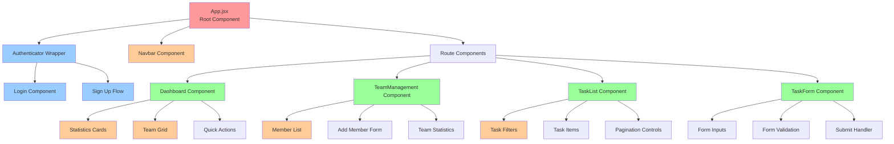

# 🎨 Task Management System - Frontend

A modern React-based frontend application built with Vite, featuring authentication, real-time GraphQL data, and a responsive design for team task management.


## 📋 Table of Contents

- [🏗️ Architecture Overview](#️-architecture-overview)
- [🧩 Component Structure](#-component-structure)
- [🔐 Authentication Flow](#-authentication-flow)
- [📡 GraphQL Integration](#-graphql-integration)
- [🎨 UI/UX Design](#-uiux-design)
- [🚀 Getting Started](#-getting-started)
- [🔧 Configuration](#-configuration)
- [🧪 Testing](#-testing)
- [📱 Responsive Design](#-responsive-design)
- [⚡ Performance](#-performance)

## 🏗️ Architecture Overview

### Frontend Architecture Diagram

```mermaid
graph TB
    subgraph "User Interface Layer"
        BROWSER[Web Browser]
        REACT[React Application]
        COMPONENTS[React Components]
        ROUTER[React Router]
    end
    
    subgraph "State Management"
        AMPLIFY[AWS Amplify]
        AUTHSTATE[Authentication State]
        GRAPHQL[GraphQL Client]
        CACHE[Apollo Cache]
    end
    
    subgraph "Authentication"
        COGNITO[Amazon Cognito]
        JWT[JWT Tokens]
        USERINFO[User Information]
    end
    
    subgraph "API Integration"
        APPSYNC[AWS AppSync]
        QUERIES[GraphQL Queries]
        MUTATIONS[GraphQL Mutations]
        SUBSCRIPTIONS[Real-time Subscriptions]
    end
    
    subgraph "Styling & Assets"
        TAILWIND[Tailwind CSS]
        ASSETS[Static Assets]
        THEMES[UI Themes]
    end
    
    BROWSER --> REACT
    REACT --> COMPONENTS
    REACT --> ROUTER
    COMPONENTS --> AMPLIFY
    AMPLIFY --> AUTHSTATE
    AMPLIFY --> GRAPHQL
    GRAPHQL --> CACHE
    AUTHSTATE --> COGNITO
    COGNITO --> JWT
    JWT --> USERINFO
    GRAPHQL --> APPSYNC
    APPSYNC --> QUERIES
    APPSYNC --> MUTATIONS
    APPSYNC --> SUBSCRIPTIONS
    COMPONENTS --> TAILWIND
    COMPONENTS --> ASSETS
    TAILWIND --> THEMES
    
    classDef ui fill:#e1f5fe
    classDef state fill:#f3e5f5
    classDef auth fill:#e8f5e8
    classDef api fill:#fff3e0
    classDef style fill:#fce4ec
    
    class BROWSER,REACT,COMPONENTS,ROUTER ui
    class AMPLIFY,AUTHSTATE,GRAPHQL,CACHE state
    class COGNITO,JWT,USERINFO auth
    class APPSYNC,QUERIES,MUTATIONS,SUBSCRIPTIONS api
    class TAILWIND,ASSETS,THEMES style
```

### Component Hierarchy



## 🧩 Component Structure

### Core Components

#### 1. App.jsx - Root Application Component
```jsx
function App() {
  return (
    <div className="min-h-screen bg-gradient-to-br from-blue-50 via-indigo-50 to-purple-50">
      <Authenticator>
        {({ signOut, user }) => (
          <AuthenticatedApp user={user} signOut={signOut} />
        )}
      </Authenticator>
    </div>
  );
}

function AuthenticatedApp({ user, signOut }) {
  const [currentUser, setCurrentUser] = useState(null);

  return (
    <div className="min-h-screen">
      <Navbar user={currentUser} signOut={signOut} />
      <main className="container mx-auto px-4 py-8">
        <Routes>
          <Route path="/" element={<Dashboard user={currentUser} />} />
          <Route path="/team/:teamId" element={<TeamManagement user={currentUser} />} />
          <Route path="/tasks/:teamId" element={<TaskList user={currentUser} />} />
          <Route path="/create-task/:teamId" element={<TaskForm user={currentUser} />} />
        </Routes>
      </main>
    </div>
  );
}
```

#### 2. Dashboard Component
```jsx
function Dashboard({ user }) {
  const [teams, setTeams] = useState([]);
  const [loading, setLoading] = useState(true);

  // GraphQL query for teams
  useEffect(() => {
    fetchTeams();
  }, [user]);

  const fetchTeams = async () => {
    try {
      const response = await client.graphql({
        query: listTeams,
        authMode: 'userPool'
      });
      setTeams(response.data.listTeams || []);
    } catch (err) {
      console.error('Fetch teams error:', err);
    } finally {
      setLoading(false);
    }
  };

  return (
    <div className="max-w-6xl mx-auto">
      <DashboardHeader user={user} />
      <StatisticsCards teams={teams} />
      <TeamsSection teams={teams} onTeamCreate={fetchTeams} />
    </div>
  );
}
```

#### 3. TeamManagement Component
```jsx
function TeamManagement({ user }) {
  const { teamId } = useParams();
  const [members, setMembers] = useState([]);
  const [showAddForm, setShowAddForm] = useState(false);

  const handleAddMember = async (email) => {
    try {
      await client.graphql({
        query: addMember,
        variables: { teamId, email },
        authMode: 'userPool'
      });
      fetchMembers();
    } catch (err) {
      console.error('Add member error:', err);
    }
  };

  return (
    <div className="max-w-4xl mx-auto">
      <TeamHeader teamId={teamId} />
      <TeamStatistics members={members} />
      <MembersList members={members} />
      <AddMemberForm 
        show={showAddForm}
        onSubmit={handleAddMember}
        onCancel={() => setShowAddForm(false)}
      />
    </div>
  );
}
```

### Component Design Patterns

#### 1. Container/Presentational Pattern
```jsx
// Container Component (Logic)
function TaskListContainer({ teamId, user }) {
  const [tasks, setTasks] = useState([]);
  const [filter, setFilter] = useState('all');
  const [loading, setLoading] = useState(true);

  const filteredTasks = useMemo(() => {
    return tasks.filter(task => {
      if (filter === 'all') return true;
      if (filter === 'my-tasks') return task.assignedTo === user?.userId;
      return task.status === filter;
    });
  }, [tasks, filter, user]);

  return (
    <TaskListPresentation
      tasks={filteredTasks}
      filter={filter}
      loading={loading}
      onFilterChange={setFilter}
      onTaskUpdate={updateTask}
    />
  );
}

// Presentational Component (UI)
function TaskListPresentation({ tasks, filter, loading, onFilterChange, onTaskUpdate }) {
  if (loading) return <LoadingSpinner />;

  return (
    <div className="space-y-6">
      <TaskFilters currentFilter={filter} onFilterChange={onFilterChange} />
      <TaskGrid tasks={tasks} onTaskUpdate={onTaskUpdate} />
    </div>
  );
}
```

#### 2. Custom Hooks Pattern
```jsx
// useTeams Hook
function useTeams(user) {
  const [teams, setTeams] = useState([]);
  const [loading, setLoading] = useState(true);
  const [error, setError] = useState(null);

  const fetchTeams = useCallback(async () => {
    if (!user) return;
    
    try {
      setLoading(true);
      const response = await client.graphql({
        query: listTeams,
        authMode: 'userPool'
      });
      setTeams(response.data.listTeams || []);
      setError(null);
    } catch (err) {
      setError(err.message);
      console.error('Fetch teams error:', err);
    } finally {
      setLoading(false);
    }
  }, [user]);

  useEffect(() => {
    fetchTeams();
  }, [fetchTeams]);

  return { teams, loading, error, refetch: fetchTeams };
}

// Usage in Component
function Dashboard({ user }) {
  const { teams, loading, error, refetch } = useTeams(user);

  if (loading) return <LoadingSpinner />;
  if (error) return <ErrorMessage message={error} />;

  return (
    <div>
      <TeamsGrid teams={teams} onTeamCreated={refetch} />
    </div>
  );
}
```

## 🔐 Authentication Flow

### Authentication State Diagram

```mermaid
stateDiagram-v2
    [*] --> CheckingAuth: App Loads
    CheckingAuth --> Unauthenticated: No Valid Token
    CheckingAuth --> Authenticated: Valid Token Found
    
    Unauthenticated --> LoginForm: User Clicks Login
    LoginForm --> Authenticating: Credentials Submitted
    Authenticating --> Authenticated: Success
    Authenticating --> LoginError: Invalid Credentials
    LoginError --> LoginForm: Retry
    
    Unauthenticated --> SignUpForm: User Clicks Sign Up
    SignUpForm --> VerifyEmail: Account Created
    VerifyEmail --> Authenticated: Email Verified