# 🎨 Task Management System - Frontend Documentation

A modern React-based frontend application built with Vite, featuring AWS Cognito authentication, real-time GraphQL data with AWS AppSync, and responsive design for collaborative team task management.


## 📋 Table of Contents

- [🏗️ Architecture Overview](#️-architecture-overview)
- [🧩 Component Structure](#-component-structure)
- [🔐 Authentication Flow](#-authentication-flow)
- [📡 GraphQL Integration](#-graphql-integration)
- [🎨 UI/UX Design System](#-uiux-design-system)
- [🚀 Getting Started](#-getting-started)
- [⚙️ Configuration](#️-configuration)
- [🧪 Testing Strategy](#-testing-strategy)
- [📱 Responsive Design](#-responsive-design)
- [⚡ Performance Optimization](#-performance-optimization)
- [🔧 Error Handling](#-error-handling)
- [🐛 Issues & Solutions](#-issues--solutions)

## 🏗️ Architecture Overview

### Frontend Architecture Diagram


### Data Flow Architecture


## 🧩 Component Structure

### Component Hierarchy

```mermaid
graph TD
    APP["🏠 App.jsx<br/><small>Root Application</small>"]
    
    APP --> LAYOUT["📐 Layout Components"]
    APP --> PAGES["📄 Page Components"]
    APP --> SHARED["🔄 Shared Components"]
    
    LAYOUT --> NAV["🧭 Navbar<br/><small>Navigation & User Menu</small>"]
    LAYOUT --> AUTH["🔐 Authenticator<br/><small>AWS Amplify UI</small>"]
    
    PAGES --> DASH["📊 Dashboard<br/><small>Teams Overview</small>"]
    PAGES --> TEAM["👥 TeamManagement<br/><small>Member Management</small>"]
    PAGES --> TASKS["📋 TaskList<br/><small>Task Display & Actions</small>"]
    PAGES --> FORM["➕ TaskForm<br/><small>Create/Edit Tasks</small>"]
    
    SHARED --> LOADING["⏳ LoadingSpinner<br/><small>Loading States</small>"]
    SHARED --> ERROR["❌ ErrorMessage<br/><small>Error Display</small>"]
    SHARED --> LOGIN["🔑 Login<br/><small>Custom Login Form</small>"]
    
    DASH --> STATS["📈 StatsCard<br/><small>Statistics Display</small>"]
    DASH --> TEAMCARD["🏷️ TeamCard<br/><small>Team Information</small>"]
    DASH --> QUICKACT["⚡ QuickActionCard<br/><small>Quick Actions</small>"]
    
    TEAM --> MEMBERLIST["📝 MembersList<br/><small>Team Members</small>"]
    TEAM --> ADDFORM["➕ AddMemberForm<br/><small>Invite Members</small>"]
    
    TASKS --> FILTERS["🔍 TaskFilters<br/><small>Filter & Search</small>"]
    TASKS --> TASKCARD["📄 TaskCard<br/><small>Individual Tasks</small>"]
    TASKS --> EMPTY["🗂️ EmptyTasksState<br/><small>Empty State UI</small>"]
    
    FORM --> INPUTS["📝 Form Inputs<br/><small>Controlled Components</small>"]
    FORM --> VALIDATION["✅ Validation<br/><small>Form Validation</small>"]
    
    classDef root fill:#ff6b6b,color:#fff,stroke:#ff6b6b,stroke-width:3px
    classDef layout fill:#4ecdc4,color:#fff,stroke:#4ecdc4,stroke-width:2px
    classDef pages fill:#45b7d1,color:#fff,stroke:#45b7d1,stroke-width:2px
    classDef shared fill:#96ceb4,color:#fff,stroke:#96ceb4,stroke-width:2px
    classDef sub fill:#ffeaa7,color:#333,stroke:#fdcb6e,stroke-width:1px
    
    class APP root
    class LAYOUT,NAV,AUTH layout
    class PAGES,DASH,TEAM,TASKS,FORM pages
    class SHARED,LOADING,ERROR,LOGIN shared
    class STATS,TEAMCARD,QUICKACT,MEMBERLIST,ADDFORM,FILTERS,TASKCARD,EMPTY,INPUTS,VALIDATION sub
```



### Core Components Deep Dive

#### 1. App.jsx - Application Root

```jsx
import { useEffect, useState, Suspense, lazy } from 'react';
import { Routes, Route, Navigate } from 'react-router-dom';
import { Authenticator } from '@aws-amplify/ui-react';
import { getCurrentUser } from 'aws-amplify/auth';

// 🔄 Lazy Loading for Performance
const TeamManagement = lazy(() => import('./components/TeamManagement'));
const TaskList = lazy(() => import('./components/TaskList'));
const TaskForm = lazy(() => import('./components/TaskForm'));

function App() {
  return (
    <div className="min-h-screen bg-gradient-to-br from-blue-50 via-indigo-50 to-purple-50">
      <Authenticator
        signUpAttributes={['email']}
        components={{
          Header() {
            return (
              <div className="text-center py-6">
                <h1 className="text-3xl font-bold text-gray-900 mb-2">
                  Task Management System
                </h1>
                <p className="text-gray-600">
                  Collaborate and manage your team tasks efficiently
                </p>
              </div>
            );
          }
        }}
      >
        {({ signOut, user }) => (
          <AuthenticatedApp user={user} signOut={signOut} />
        )}
      </Authenticator>
    </div>
  );
}

function AuthenticatedApp({ user, signOut }) {
  const [isLoading, setIsLoading] = useState(true);
  const [currentUser, setCurrentUser] = useState(null);

  // 🔄 Load User Information
  useEffect(() => {
    loadUser();
  }, [user]);

  async function loadUser() {
    try {
      setIsLoading(true);
      const userData = await getCurrentUser();
      setCurrentUser({
        ...userData,
        email: userData.signInDetails?.loginId || user?.signInDetails?.loginId || 'Unknown'
      });
    } catch (error) {
      console.error('Error loading user:', error);
    } finally {
      setIsLoading(false);
    }
  }

  if (isLoading) {
    return <LoadingSpinner />;
  }

  return (
    <div className="min-h-screen">
      <Navbar user={currentUser} signOut={signOut} />
      <main className="container mx-auto px-4 py-8">
        <Suspense fallback={<LoadingSpinner message="Loading page..." />}>
          <Routes>
            <Route path="/" element={<Dashboard user={currentUser} />} />
            <Route path="/team/:teamId" element={<TeamManagement user={currentUser} />} />
            <Route path="/tasks/:teamId" element={<TaskList user={currentUser} />} />
            <Route path="/create-task/:teamId" element={<TaskForm user={currentUser} />} />
            <Route path="*" element={<Navigate to="/" replace />} />
          </Routes>
        </Suspense>
      </main>
    </div>
  );
}
```

**Key Features:**
- ✅ **Lazy Loading**: Code splitting for better performance
- ✅ **Error Boundaries**: Graceful error handling
- ✅ **Loading States**: Better user experience
- ✅ **Route Protection**: Authenticated routes only

#### 2. Dashboard Component - Teams Overview

```jsx
function Dashboard({ user }) {
  const [teams, setTeams] = useState([]);
  const [loading, setLoading] = useState(true);
  const [creating, setCreating] = useState(false);
  const [error, setError] = useState(null);
  const [stats, setStats] = useState({
    totalTeams: 0,
    adminTeams: 0,
    memberTeams: 0
  });

  // 📊 Real-time Stats Calculation
  useEffect(() => {
    if (teams.length > 0) {
      const adminTeams = teams.filter(team => team.userRole === 'admin').length;
      const memberTeams = teams.filter(team => team.userRole === 'member').length;
      
      setStats({
        totalTeams: teams.length,
        adminTeams,
        memberTeams
      });
    }
  }, [teams]);

  // 🔄 GraphQL Data Fetching
  async function fetchTeams() {
    try {
      setLoading(true);
      setError(null);
      
      const response = await client.graphql({
        query: listTeams,
        authMode: 'userPool'
      });
      
      setTeams(response.data.listTeams || []);
    } catch (err) {
      console.error('Fetch teams error:', err);
      setError(`Failed to load teams: ${err.message || 'Unknown error'}`);
    } finally {
      setLoading(false);
    }
  }

  // ✨ Create Team Handler
  async function handleCreateTeam(e) {
    e.preventDefault();
    
    if (!teamName.trim()) {
      setError('Team name is required');
      return;
    }

    try {
      setCreating(true);
      setError(null);
      
      const response = await client.graphql({
        query: createTeam,
        variables: { name: teamName.trim() },
        authMode: 'userPool'
      });
      
      setTeamName('');
      setShowCreateForm(false);
      await fetchTeams();
      
    } catch (err) {
      console.error('Create team error:', err);
      setError(err.errors?.[0]?.message || err.message || 'Failed to create team');
    } finally {
      setCreating(false);
    }
  }

  return (
    <div className="max-w-6xl mx-auto">
      {/* 🎯 Header Section */}
      <DashboardHeader user={user} />
      
      {/* ⚠️ Error Display */}
      {error && <ErrorMessage message={error} onDismiss={() => setError(null)} />}
      
      {/* 📊 Statistics Cards */}
      <StatisticsGrid stats={stats} />
      
      {/* 🏷️ Teams Section */}
      <TeamsSection 
        teams={teams}
        onCreateTeam={handleCreateTeam}
        loading={loading}
        creating={creating}
      />
    </div>
  );
}
```

**Features:**
- 📊 **Real-time Statistics**: Dynamic calculation of team metrics
- 🔄 **Auto-refresh**: Automatic data updates after actions
- ⚠️ **Error Handling**: User-friendly error messages
- 🎨 **Responsive Grid**: Adaptive layout for all screen sizes

#### 3. TaskList Component - Advanced Task Management

```jsx
function TaskList({ user }) {
  const { teamId } = useParams();
  const [tasks, setTasks] = useState([]);
  const [filter, setFilter] = useState('all');
  const [searchTerm, setSearchTerm] = useState('');
  const [sortBy, setSortBy] = useState('created');
  const [sortOrder, setSortOrder] = useState('desc');

  // 🧮 Advanced Filtering and Sorting
  const filteredAndSortedTasks = useMemo(() => {
    let filtered = tasks.filter(task => {
      // Status-based filtering
      if (filter === 'my-tasks') {
        return task.assignedTo === user?.userId || task.assignedTo === user?.email;
      }
      if (filter !== 'all') {
        return task.status === filter;
      }
      return true;
    });

    // Multi-field sorting
    filtered.sort((a, b) => {
      let comparison = 0;
      
      switch (sortBy) {
        case 'title':
          comparison = a.title.localeCompare(b.title);
          break;
        case 'priority':
          const priorityOrder = { 'High': 3, 'Medium': 2, 'Low': 1 };
          comparison = (priorityOrder[a.priority] || 2) - (priorityOrder[b.priority] || 2);
          break;
        case 'deadline':
          const aDeadline = a.deadline ? new Date(a.deadline) : new Date('9999-12-31');
          const bDeadline = b.deadline ? new Date(b.deadline) : new Date('9999-12-31');
          comparison = aDeadline - bDeadline;
          break;
        default:
          comparison = new Date(a.createdAt) - new Date(b.createdAt);
      }
      
      return sortOrder === 'desc' ? -comparison : comparison;
    });

    return filtered;
  }, [tasks, filter, sortBy, sortOrder, user]);

  // 📊 Task Statistics
  const taskCounts = useMemo(() => {
    return {
      total: tasks.length,
      notStarted: tasks.filter(t => t.status === 'Not Started').length,
      inProgress: tasks.filter(t => t.status === 'In Progress').length,
      completed: tasks.filter(t => t.status === 'Completed').length,
      myTasks: tasks.filter(t => t.assignedTo === user?.userId || t.assignedTo === user?.email).length,
      overdue: tasks.filter(t => t.deadline && new Date(t.deadline) < new Date() && t.status !== 'Completed').length
    };
  }, [tasks, user]);

  return (
    <div className="max-w-6xl mx-auto">
      <TaskListHeader teamId={teamId} taskCounts={taskCounts} />
      <TaskFilters 
        filter={filter}
        searchTerm={searchTerm}
        sortBy={sortBy}
        sortOrder={sortOrder}
        onFilterChange={setFilter}
        onSearchChange={setSearchTerm}
        onSortChange={setSortBy}
        onSortOrderChange={setSortOrder}
      />
      <TaskGrid 
        tasks={filteredAndSortedTasks}
        user={user}
        onTaskUpdate={updateTaskStatus}
        onTaskDelete={handleDeleteTask}
      />
    </div>
  );
}
```

**Advanced Features:**
- 🔍 **Multi-field Search**: Search across title, description, assignee
- 📊 **Real-time Statistics**: Live task counts and metrics
- 🔄 **Dynamic Sorting**: Multiple sort criteria with direction
- 🎯 **Smart Filtering**: Role-based task visibility

## 🔐 Authentication Flow

### Authentication State Machine


### Authentication Implementation

```jsx
// 🔐 Amplify Configuration (main.jsx)
const amplifyConfig = {
  Auth: {
    Cognito: {
      userPoolId: import.meta.env.VITE_COGNITO_USER_POOL_ID,
      userPoolClientId: import.meta.env.VITE_COGNITO_CLIENT_ID,
      region: import.meta.env.VITE_REGION,
      signUpVerificationMethod: 'code',
      loginWith: {
        oauth: {
          domain: `${import.meta.env.VITE_COGNITO_DOMAIN}.auth.${import.meta.env.VITE_REGION}.amazoncognito.com`,
          scopes: ['email', 'openid', 'profile'],
          redirectSignIn: [window.location.origin],
          redirectSignOut: [window.location.origin],
          responseType: 'code'
        },
        username: true,
        email: true
      }
    }
  },
  API: {
    GraphQL: {
      endpoint: import.meta.env.VITE_APPSYNC_ENDPOINT,
      region: import.meta.env.VITE_REGION,
      defaultAuthMode: 'userPool'
    }
  }
};

Amplify.configure(amplifyConfig);
```

### Custom Authentication Hook

```jsx
// 🔄 useAuth Custom Hook
function useAuth() {
  const [user, setUser] = useState(null);
  const [loading, setLoading] = useState(true);
  const [error, setError] = useState(null);

  useEffect(() => {
    checkAuthState();
  }, []);

  const checkAuthState = async () => {
    try {
      const currentUser = await getCurrentUser();
      setUser(currentUser);
    } catch (err) {
      setUser(null);
    } finally {
      setLoading(false);
    }
  };

  const signOut = async () => {
    try {
      await amplifySignOut();
      setUser(null);
    } catch (err) {
      setError(err.message);
    }
  };

  return { user, loading, error, signOut, checkAuthState };
}
```

## 📡 GraphQL Integration

### GraphQL Architecture


### GraphQL Operations

#### Queries (Data Fetching)

```javascript
// 🔍 Team Queries
export const listTeams = gql`
  query ListTeams {
    listTeams {
      teamId
      name
      adminId
      createdAt
      userRole
    }
  }
`;

export const listTasks = gql`
  query ListTasks($teamId: ID!) {
    listTasks(teamId: $teamId) {
      teamId
      taskId
      title
      description
      assignedTo
      status
      priority
      deadline
      createdBy
      createdAt
      updatedAt
      updatedBy
    }
  }
`;

// 🔍 Advanced Search Query
export const searchTasks = gql`
  query SearchTasks($teamId: ID!, $searchTerm: String!) {
    searchTasks(teamId: $teamId, searchTerm: $searchTerm) {
      teamId
      taskId
      title
      description
      assignedTo
      status
      priority
      deadline
      createdBy
      createdAt
      updatedAt
      updatedBy
    }
  }
`;
```

#### Mutations (Data Modification)

```javascript
// ✏️ Team Management Mutations
export const createTeam = gql`
  mutation CreateTeam($name: String!) {
    createTeam(name: $name) {
      teamId
      name
      adminId
      createdAt
      userRole
    }
  }
`;

export const addMember = gql`
  mutation AddMember($teamId: ID!, $email: String!) {
    addMember(teamId: $teamId, email: $email) {
      teamId
      userId
      role
      joinedAt
      addedBy
    }
  }
`;

// ✏️ Task Management Mutations
export const createTask = gql`
  mutation CreateTask(
    $teamId: ID!
    $title: String!
    $description: String!
    $assignedTo: ID
    $deadline: String
    $priority: String
  ) {
    createTask(
      teamId: $teamId
      title: $title
      description: $description
      assignedTo: $assignedTo
      deadline: $deadline
      priority: $priority
    ) {
      teamId
      taskId
      title
      description
      assignedTo
      status
      priority
      deadline
      createdBy
      createdAt
    }
  }
`;

export const updateTask = gql`
  mutation UpdateTask($teamId: ID!, $taskId: ID!, $status: String!) {
    updateTask(teamId: $teamId, taskId: $taskId, status: $status) {
      teamId
      taskId
      title
      description
      assignedTo
      status
      priority
      deadline
      updatedAt
      updatedBy
    }
  }
`;
```

### GraphQL Client Usage

```jsx
import { generateClient } from 'aws-amplify/api';

const client = generateClient();

// 🔄 Data Fetching with Error Handling
async function fetchTeams() {
  try {
    setLoading(true);
    setError(null);
    
    const response = await client.graphql({
      query: listTeams,
      authMode: 'userPool'
    });
    
    console.log('Teams response:', response);
    setTeams(response.data.listTeams || []);
  } catch (err) {
    console.error('Fetch teams error:', err);
    setError(`Failed to load teams: ${err.message || 'Unknown error'}`);
  } finally {
    setLoading(false);
  }
}

// ✏️ Data Mutation with Optimistic Updates
async function handleCreateTask(taskData) {
  try {
    setCreating(true);
    setError(null);
    
    const response = await client.graphql({
      query: createTask,
      variables: {
        teamId,
        title: taskData.title.trim(),
        description: taskData.description.trim(),
        priority: taskData.priority,
        assignedTo: taskData.assignedTo || null,
        deadline: taskData.deadline || null
      },
      authMode: 'userPool'
    });
    
    // Navigate back after successful creation
    navigate(`/tasks/${teamId}`);
    
  } catch (err) {
    console.error('Create task error:', err);
    
    // Extract meaningful error message
    let errorMessage = 'Failed to create task. Please try again.';
    
    if (err.errors && err.errors.length > 0) {
      errorMessage = err.errors[0].message;
    } else if (err.message) {
      errorMessage = err.message;
    }
    
    setError(errorMessage);
  } finally {
    setCreating(false);
  }
}
```

## 🎨 UI/UX Design System

### Design Tokens & Theme

```css
/* 🎨 Custom CSS Variables */
:root {
    --amplify-colors-brand-primary-10: #3B82F6;
    --amplify-colors-brand-primary-80: #1E40AF;
    --amplify-colors-brand-primary-90: #1E3A8A;
    --amplify-colors-brand-primary-100: #1E3A8A;
}

/* 🎭 Smooth Transitions */
* {
    transition-property: color, background-color, border-color, text-decoration-color, fill, stroke, opacity, box-shadow, transform, filter, backdrop-filter;
    transition-timing-function: cubic-bezier(0.4, 0, 0.2, 1);
    transition-duration: 150ms;
}

/* 📱 Custom Scrollbar */
::-webkit-scrollbar {
    width: 6px;
}

::-webkit-scrollbar-track {
    background: #f1f5f9;
}

::-webkit-scrollbar-thumb {
    background: #cbd5e1;
    border-radius: 3px;
}

::-webkit-scrollbar-thumb:hover {
    background: #94a3b8;
}

/* 🎯 Focus Styles */
input:focus,
textarea:focus,
select:focus {
    outline: 2px solid #3B82F6;
    outline-offset: 2px;
}

/* ✨ Button Animations */
button:hover {
    transform: translateY(-1px);
}

button:active {
    transform: translateY(0);
}

/* 🏷️ Card Hover Effects */
.card-hover:hover {
    box-shadow: 0 10px 15px -3px rgb(0 0 0 / 0.1), 0 4px 6px -4px rgb(0 0 0 / 0.1);
    transform: translateY(-2px);
}
```

### Color Palette & Status Indicators

```jsx
// 🎨 Status Color System
const statusColors = {
  'Not Started': 'bg-gray-100 text-gray-800',
  'In Progress': 'bg-blue-100 text-blue-800', 
  'Completed': 'bg-green-100 text-green-800'
};

const priorityColors = {
  'Low': 'bg-green-100 text-green-800',
  'Medium': 'bg-yellow-100 text-yellow-800',
  'High': 'bg-red-100 text-red-800'
};

// 🎯 Role Badge System
const roleConfig = {
  admin: {
    badge: '👑 Admin',
    badgeColor: 'bg-red-100 text-red-800',
    description: 'You can manage this team'
  },
  member: {
    badge: '👤 Member', 
    badgeColor: 'bg-blue-100 text-blue-800',
    description: 'You are a team member'
  }
};
```

### Component Design Patterns

#### 1. Reusable Card Components

```jsx
// 🏷️ Flexible Stats Card Component
function StatsCard({ title, value, icon, color, isActive, onClick, danger = false }) {
  const colorClasses = {
    blue: 'bg-blue-100 text-blue-600',
    green: 'bg-green-100 text-green-600', 
    purple: 'bg-purple-100 text-purple-600',
    red: 'bg-red-100 text-red-600'
  };

  return (
    <button
      onClick={onClick}
      className={`p-4 rounded-lg border transition-all text-left focus:outline-none focus:ring-2 focus:ring-blue-500 focus:ring-offset-2 ${
        isActive 
          ? 'border-blue-300 bg-blue-50' 
          : danger && value > 0
          ? 'border-red-200 bg-red-50 hover:border-red-300'
          : 'border-gray-200 hover:border-gray-300 hover:shadow-sm'
      }`}
    >
      <div className="flex items-center justify-between">
        <div>
          <p className={`text-xs font-medium ${isActive ? 'text-blue-600' : danger && value > 0 ? 'text-red-600' : 'text-gray-600'}`}>
            {title}
          </p>
          <p className={`text-lg font-bold ${isActive ? 'text-blue-900' : danger && value > 0 ? 'text-red-900' : 'text-gray-900'}`}>
            {value}
          </p>
        </div>
        <span className="text-lg">{icon}</span>
      </div>
    </button>
  );
}
```

#### 2. Advanced Error Message Component

```jsx
// ⚠️ Multi-type Error Message System
function ErrorMessage({ message, onDismiss, type = 'error' }) {
  const typeConfig = {
    error: {
      bgColor: 'bg-red-50',
      borderColor: 'border-red-200',
      textColor: 'text-red-800',
      iconColor: 'text-red-400',
      icon: (
        <svg className="w-5 h-5" fill="none" stroke="currentColor" viewBox="0 0 24 24">
          <path strokeLinecap="round" strokeLinejoin="round" strokeWidth={2} d="M12 8v4m0 4h.01M21 12a9 9 0 11-18 0 9 9 0 0118 0z" />
        </svg>
      )
    },
    warning: {
      bgColor: 'bg-yellow-50',
      borderColor: 'border-yellow-200', 
      textColor: 'text-yellow-800',
      iconColor: 'text-yellow-400',
      icon: (
        <svg className="w-5 h-5" fill="none" stroke="currentColor" viewBox="0 0 24 24">
          <path strokeLinecap="round" strokeLinejoin="round" strokeWidth={2} d="M12 9v2m0 4h.01m-6.938 4h13.856c1.54 0 2.502-1.667 1.732-2.5L13.732 4c-.77-.833-1.732-.833-2.502 0L4.232 19.5c-.77.833.192 2.5 1.732 2.5z" />
        </svg>
      )
    },
    success: {
      bgColor: 'bg-green-50',
      borderColor: 'border-green-200',
      textColor: 'text-green-800', 
      iconColor: 'text-green-400',
      icon: (
        <svg className="w-5 h-5" fill="none" stroke="currentColor" viewBox="0 0 24 24">
          <path strokeLinecap="round" strokeLinejoin="round" strokeWidth={2} d="M5 13l4 4L19 7" />
        </svg>
      )
    }
  };

  const config = typeConfig[type] || typeConfig.error;

  return (
    <div className={`${config.bgColor} ${config.borderColor} border rounded-lg p-4`}>
      <div className="flex items-start">
        <div className={`${config.iconColor} mr-3 mt-0.5`}>
          {config.icon}
        </div>
        <div className="flex-1">
          <p className={`${config.textColor} text-sm font-medium`}>
            {message}
          </p>
        </div>
        {onDismiss && (
          <button
            onClick={onDismiss}
            className={`${config.iconColor} hover:${config.textColor} ml-3 flex-shrink-0`}
          >
            <svg className="w-4 h-4" fill="none" stroke="currentColor" viewBox="0 0 24 24">
              <path strokeLinecap="round" strokeLinejoin="round" strokeWidth={2} d="M6 18L18 6M6 6l12 12" />
            </svg>
          </button>
        )}
      </div>
    </div>
  );
}
```

#### 3. Loading Spinner with Context

```jsx
// ⏳ Contextual Loading Component
function LoadingSpinner({ message = "Loading...", size = "medium" }) {
  const sizeClasses = {
    small: "h-8 w-8 border-2",
    medium: "h-12 w-12 border-4", 
    large: "h-16 w-16 border-4"
  };

  return (
    <div className="min-h-screen flex items-center justify-center bg-gradient-to-br from-blue-50 via-indigo-50 to-purple-50">
      <div className="text-center">
        <div className={`inline-block animate-spin rounded-full ${sizeClasses[size]} border-blue-500 border-t-transparent mb-4`}></div>
        <p className="text-gray-600 font-medium">{message}</p>
      </div>
    </div>
  );
}
```

## 🚀 Getting Started

### Prerequisites

```bash
# 📋 Required Software
Node.js >= 18.0.0
npm >= 9.0.0 or yarn >= 1.22.0
Git >= 2.0.0
```

### Installation Steps

```bash
# 📥 Clone Repository
git clone <repository-url>
cd task-management-frontend

# 📦 Install Dependencies
npm install
# or
yarn install

# ⚙️ Environment Setup
cp .env.example .env.local

# Edit .env.local with your AWS configuration:
VITE_COGNITO_USER_POOL_ID=eu-west-1_xxxxxxxxx
VITE_COGNITO_CLIENT_ID=xxxxxxxxxxxxxxxxxxxxxxxxxx
VITE_COGNITO_DOMAIN=task-mgmt-xxxxxxxx
VITE_APPSYNC_ENDPOINT=https://xxxxxxxxxxxxxxxxxxxxxxxxxx.appsync-api.eu-west-1.amazonaws.com/graphql
VITE_REGION=eu-west-1

# 🚀 Start Development Server
npm run dev
# or  
yarn dev

# 🌐 Open Browser
# Navigate to http://localhost:5173
```

### Project Structure

```
frontend/
├── 📁 public/                    # Static assets
│   ├── vite.svg                 # App icon
│   └── index.html              # HTML template
├── 📁 src/                      # Source code
│   ├── 📁 components/          # React components
│   │   ├── Dashboard.jsx       # Teams overview
│   │   ├── TaskList.jsx        # Task management
│   │   ├── TaskForm.jsx        # Task creation/editing
│   │   ├── TeamManagement.jsx  # Team member management
│   │   ├── Navbar.jsx          # Navigation component
│   │   ├── ErrorMessage.jsx    # Error display
│   │   ├── LoadingSpinner.jsx  # Loading states
│   │   └── Login.jsx           # Custom login
│   ├── 📁 graphql/             # GraphQL operations
│   │   ├── queries.js          # Data fetching queries
│   │   └── mutations.js        # Data modification
│   ├── App.jsx                 # Root component
│   ├── main.jsx               # Application entry point
│   └── index.css              # Global styles
├── 📄 package.json             # Dependencies & scripts
├── 📄 vite.config.js          # Vite configuration
├── 📄 tailwind.config.js      # Tailwind CSS config
└── 📄 README.md               # Documentation
```

## ⚙️ Configuration

### Environment Variables

```bash
# 🔐 Authentication Configuration
VITE_COGNITO_USER_POOL_ID=eu-west-1_xxxxxxxxx    # Cognito User Pool ID
VITE_COGNITO_CLIENT_ID=xxxxxxxxxxxxxxxxxxxxxxxxxx # Cognito App Client ID
VITE_COGNITO_DOMAIN=task-mgmt-xxxxxxxx           # Cognito Domain Prefix
VITE_REGION=eu-west-1                            # AWS Region

# 📡 API Configuration  
VITE_APPSYNC_ENDPOINT=https://xxxxxxxxxxxxxxxxxxxxxxxxxx.appsync-api.eu-west-1.amazonaws.com/graphql
```

### Vite Configuration

```javascript
// vite.config.js
import { defineConfig } from 'vite'
import react from '@vitejs/plugin-react'

export default defineConfig({
  plugins: [react()],
  server: {
    port: 5173,
    host: true
  },
  build: {
    outDir: 'dist',
    sourcemap: true,
    rollupOptions: {
      output: {
        manualChunks: {
          vendor: ['react', 'react-dom', 'react-router-dom'],
          aws: ['aws-amplify', '@aws-amplify/ui-react']
        }
      }
    }
  },
  define: {
    global: 'globalThis',
  }
})
```

### Tailwind Configuration

```javascript
// tailwind.config.js
/** @type {import('tailwindcss').Config} */
export default {
  content: [
    "./index.html",
    "./src/**/*.{js,ts,jsx,tsx}",
  ],
  theme: {
    extend: {
      animation: {
        'spin': 'spin 1s linear infinite',
        'pulse': 'pulse 2s cubic-bezier(0.4, 0, 0.6, 1) infinite',
      },
      gradients: {
        'app-bg': 'linear-gradient(135deg, #667eea 0%, #764ba2 100%)',
      },
      fontFamily: {
        sans: ['Inter', 'system-ui', 'sans-serif'],
      }
    },
  },
  plugins: [],
}
```

## 🧪 Testing Strategy

### Testing Pyramid

```mermaid
graph TD
    subgraph "Testing Levels"
        E2E[🌐 End-to-End Tests<br/><small>User Journeys</small>]
        INTEGRATION[🔗 Integration Tests<br/><small>Component Interaction</small>]  
        UNIT[🧪 Unit Tests<br/><small>Individual Components</small>]
    end
    
    subgraph "Testing Tools"
        CYPRESS[Cypress<br/>E2E Testing]
        RTL[React Testing Library<br/>Component Testing]
        JEST[Jest<br/>Unit Testing]
        MSW[MSW<br/>API Mocking]
    end
    
    E2E --> CYPRESS
    INTEGRATION --> RTL
    INTEGRATION --> MSW
    UNIT --> JEST
    UNIT --> RTL
    
    classDef e2e fill:#ff6b6b,color:#fff
    classDef integration fill:#4ecdc4,color:#fff  
    classDef unit fill:#45b7d1,color:#fff
    classDef tools fill:#96ceb4,color:#fff
    
    class E2E e2e
    class INTEGRATION integration
    class UNIT unit
    class CYPRESS,RTL,JEST,MSW tools
```



### Unit Testing Examples

```javascript
// 🧪 Dashboard Component Tests
import { render, screen, waitFor } from '@testing-library/react';
import { BrowserRouter } from 'react-router-dom';
import Dashboard from '../components/Dashboard';

// Mock AWS Amplify
jest.mock('aws-amplify/api', () => ({
  generateClient: () => ({
    graphql: jest.fn()
  })
}));

describe('Dashboard Component', () => {
  const mockUser = {
    userId: 'test@example.com',
    email: 'test@example.com',
    username: 'testuser'
  };

  const renderDashboard = () => {
    return render(
      <BrowserRouter>
        <Dashboard user={mockUser} />
      </BrowserRouter>
    );
  };

  test('renders welcome message with user name', () => {
    renderDashboard();
    expect(screen.getByText(/Welcome back, testuser!/)).toBeInTheDocument();
  });

  test('displays loading spinner initially', () => {
    renderDashboard();
    expect(screen.getByText(/Loading your teams.../)).toBeInTheDocument();
  });

  test('shows create team button', async () => {
    renderDashboard();
    await waitFor(() => {
      expect(screen.getByText('Create Team')).toBeInTheDocument();
    });
  });
});
```

### Integration Testing

```javascript
// 🔗 Task Creation Flow Test
import { render, screen, fireEvent, waitFor } from '@testing-library/react';
import userEvent from '@testing-library/user-event';
import TaskForm from '../components/TaskForm';

describe('Task Creation Integration', () => {
  test('creates task with all fields', async () => {
    const user = userEvent.setup();
    const mockNavigate = jest.fn();
    
    render(<TaskForm user={mockUser} />);
    
    // Fill form fields
    await user.type(screen.getByLabelText(/Task Title/), 'Test Task');
    await user.type(screen.getByLabelText(/Description/), 'Test Description');
    await user.selectOptions(screen.getByLabelText(/Priority/), 'High');
    
    // Submit form
    await user.click(screen.getByText('Create Task'));
    
    await waitFor(() => {
      expect(mockNavigate).toHaveBeenCalledWith('/tasks/test-team-id');
    });
  });
});
```

## 📱 Responsive Design

### Breakpoint System

```css
/* 📱 Mobile-First Responsive Design */
.container {
  @apply px-4 mx-auto;
}

/* 📱 Small screens (phones) */
@media (min-width: 640px) {
  .container { @apply px-6; }
}

/* 💻 Medium screens (tablets) */  
@media (min-width: 768px) {
  .container { @apply px-8; }
}

/* 🖥️ Large screens (desktop) */
@media (min-width: 1024px) {
  .container { @apply px-12; }
}

/* 🖥️ Extra large screens */
@media (min-width: 1280px) {
  .container { @apply px-16; }
}
```

### Responsive Grid System

```jsx
// 📊 Adaptive Grid Layout
function ResponsiveGrid({ children, className = "" }) {
  return (
    <div className={`
      grid 
      grid-cols-1 
      md:grid-cols-2 
      lg:grid-cols-3 
      xl:grid-cols-4 
      gap-4 
      md:gap-6 
      ${className}
    `}>
      {children}
    </div>
  );
}

// 🏷️ Responsive Stats Cards
function StatsSection({ stats }) {
  return (
    <div className="grid grid-cols-2 md:grid-cols-6 gap-4 mb-8">
      <StatsCard title="Total" value={stats.total} icon="📋" />
      <StatsCard title="My Tasks" value={stats.myTasks} icon="👤" />
      <StatsCard title="Not Started" value={stats.notStarted} icon="⚪" />
      <StatsCard title="In Progress" value={stats.inProgress} icon="🔵" />
      <StatsCard title="Completed" value={stats.completed} icon="✅" />
      <StatsCard title="Overdue" value={stats.overdue} icon="⚠️" danger />
    </div>
  );
}
```

### Mobile Navigation

```jsx
// 📱 Mobile-Responsive Navbar
function Navbar({ user, signOut }) {
  const [isMenuOpen, setIsMenuOpen] = useState(false);

  return (
    <nav className="bg-white shadow-lg border-b border-gray-200">
      <div className="container mx-auto px-4">
        <div className="flex justify-between items-center py-4">
          {/* Logo */}
          <Logo />

          {/* Desktop Navigation */}
          <div className="hidden md:flex items-center space-x-8">
            <NavigationLinks />
          </div>

          {/* User Menu */}
          <div className="flex items-center space-x-4">
            <UserProfile user={user} />
            <SignOutButton signOut={signOut} />
            
            {/* Mobile menu button */}
            <button
              onClick={() => setIsMenuOpen(!isMenuOpen)}
              className="md:hidden p-2 rounded-md text-gray-700 hover:text-gray-900 hover:bg-gray-100"
            >
              <MenuIcon />
            </button>
          </div>
        </div>

        {/* Mobile Navigation */}
        <MobileMenu isOpen={isMenuOpen} onClose={() => setIsMenuOpen(false)} />
      </div>
    </nav>
  );
}
```

## ⚡ Performance Optimization

### Code Splitting Strategy


### Lazy Loading Implementation

```jsx
// 🔄 Route-based Code Splitting
import { lazy, Suspense } from 'react';

// Lazy load components
const TeamManagement = lazy(() => import('./components/TeamManagement'));
const TaskList = lazy(() => import('./components/TaskList'));
const TaskForm = lazy(() => import('./components/TaskForm'));

function App() {
  return (
    <div className="min-h-screen">
      <Suspense fallback={<LoadingSpinner message="Loading page..." />}>
        <Routes>
          <Route path="/" element={<Dashboard user={currentUser} />} />
          <Route path="/team/:teamId" element={<TeamManagement user={currentUser} />} />
          <Route path="/tasks/:teamId" element={<TaskList user={currentUser} />} />
          <Route path="/create-task/:teamId" element={<TaskForm user={currentUser} />} />
        </Routes>
      </Suspense>
    </div>
  );
}
```

### Performance Hooks

```jsx
// 🚀 Performance Optimization Hooks
import { useMemo, useCallback, memo } from 'react';

// Memoized task filtering and sorting
const filteredAndSortedTasks = useMemo(() => {
  let filtered = tasks.filter(task => {
    if (filter === 'my-tasks') {
      return task.assignedTo === user?.userId || task.assignedTo === user?.email;
    }
    if (filter !== 'all') {
      return task.status === filter;
    }
    return true;
  });

  filtered.sort((a, b) => {
    let comparison = 0;
    switch (sortBy) {
      case 'title':
        comparison = a.title.localeCompare(b.title);
        break;
      case 'priority':
        const priorityOrder = { 'High': 3, 'Medium': 2, 'Low': 1 };
        comparison = (priorityOrder[a.priority] || 2) - (priorityOrder[b.priority] || 2);
        break;
      default:
        comparison = new Date(a.createdAt) - new Date(b.createdAt);
    }
    return sortOrder === 'desc' ? -comparison : comparison;
  });

  return filtered;
}, [tasks, filter, sortBy, sortOrder, user]);

// Memoized callback for task updates
const handleTaskUpdate = useCallback(async (taskId, status) => {
  try {
    setUpdating(prev => ({ ...prev, [taskId]: true }));
    await client.graphql({
      query: updateTask,
      variables: { teamId, taskId, status },
      authMode: 'userPool'
    });
    await fetchTasks();
  } catch (err) {
    setError(`Failed to update task: ${err.message}`);
  } finally {
    setUpdating(prev => ({ ...prev, [taskId]: false }));
  }
}, [teamId, client]);

// Memoized component to prevent unnecessary re-renders
const TaskCard = memo(({ task, onUpdate, updating }) => {
  return (
    <div className="task-card">
      {/* Task content */}
    </div>
  );
});
```

### Bundle Analysis

```bash
# 📊 Analyze Bundle Size
npm run build
npm install -g serve
serve -s dist

# Use webpack-bundle-analyzer for detailed analysis
npm install --save-dev webpack-bundle-analyzer
npm run build -- --analyze
```

## 🔧 Error Handling

### Error Boundary Implementation

```jsx
// 🛡️ Global Error Boundary
class ErrorBoundary extends React.Component {
  constructor(props) {
    super(props);
    this.state = { hasError: false, error: null, errorInfo: null };
  }

  static getDerivedStateFromError(error) {
    return { hasError: true };
  }

  componentDidCatch(error, errorInfo) {
    this.setState({
      error: error,
      errorInfo: errorInfo
    });

    // Log error to monitoring service
    console.error('Error Boundary caught an error:', error, errorInfo);
  }

  render() {
    if (this.state.hasError) {
      return (
        <div className="min-h-screen flex items-center justify-center bg-gray-50">
          <div className="max-w-md w-full bg-white rounded-lg shadow-lg p-6">
            <div className="flex items-center space-x-3 mb-4">
              <div className="w-12 h-12 bg-red-100 rounded-full flex items-center justify-center">
                <svg className="w-6 h-6 text-red-600" fill="none" stroke="currentColor" viewBox="0 0 24 24">
                  <path strokeLinecap="round" strokeLinejoin="round" strokeWidth={2} d="M12 8v4m0 4h.01M21 12a9 9 0 11-18 0 9 9 0 0118 0z" />
                </svg>
              </div>
              <div>
                <h2 className="text-lg font-semibold text-gray-900">Something went wrong</h2>
                <p className="text-sm text-gray-600">An unexpected error occurred</p>
              </div>
            </div>
            
            <div className="space-y-3">
              <button
                onClick={() => window.location.reload()}
                className="w-full bg-blue-600 hover:bg-blue-700 text-white px-4 py-2 rounded-lg font-medium transition-colors"
              >
                Reload Page
              </button>
              
              <button
                onClick={() => this.setState({ hasError: false, error: null, errorInfo: null })}
                className="w-full bg-gray-100 hover:bg-gray-200 text-gray-700 px-4 py-2 rounded-lg font-medium transition-colors"
              >
                Try Again
              </button>
            </div>
            
            {process.env.NODE_ENV === 'development' && (
              <details className="mt-4">
                <summary className="text-sm text-gray-500 cursor-pointer">Error Details</summary>
                <pre className="text-xs text-red-600 mt-2 p-2 bg-red-50 rounded overflow-auto">
                  {this.state.error && this.state.error.toString()}
                  <br />
                  {this.state.errorInfo.componentStack}
                </pre>
              </details>
            )}
          </div>
        </div>
      );
    }

    return this.props.children;
  }
}
```

### Network Error Handling

```jsx
// 🌐 Robust Network Error Handling
async function fetchWithRetry(fetchFn, maxRetries = 3, delay = 1000) {
  for (let i = 0; i < maxRetries; i++) {
    try {
      return await fetchFn();
    } catch (error) {
      console.warn(`Attempt ${i + 1} failed:`, error.message);
      
      if (i === maxRetries - 1) {
        throw error;
      }
      
      // Exponential backoff
      await new Promise(resolve => setTimeout(resolve, delay * Math.pow(2, i)));
    }
  }
}

// Usage in components
async function fetchTeams() {
  try {
    setLoading(true);
    setError(null);
    
    const response = await fetchWithRetry(async () => {
      return await client.graphql({
        query: listTeams,
        authMode: 'userPool'
      });
    });
    
    setTeams(response.data.listTeams || []);
  } catch (err) {
    console.error('Fetch teams error:', err);
    
    // Handle different error types
    if (err.name === 'NetworkError') {
      setError('Network connection failed. Please check your internet connection.');
    } else if (err.errors?.[0]?.errorType === 'UnauthorizedException') {
      setError('Session expired. Please log in again.');
    } else {
      setError(`Failed to load teams: ${err.message || 'Unknown error'}`);
    }
  } finally {
    setLoading(false);
  }
}
```

### Form Validation System

```jsx
// ✅ Comprehensive Form Validation
function useFormValidation(initialValues, validationRules) {
  const [values, setValues] = useState(initialValues);
  const [errors, setErrors] = useState({});
  const [touched, setTouched] = useState({});

  const validateField = useCallback((name, value) => {
    const rules = validationRules[name];
    if (!rules) return null;

    for (const rule of rules) {
      const error = rule(value, values);
      if (error) return error;
    }
    return null;
  }, [validationRules, values]);

  const validateForm = useCallback(() => {
    const newErrors = {};
    let isValid = true;

    Object.keys(validationRules).forEach(name => {
      const error = validateField(name, values[name]);
      if (error) {
        newErrors[name] = error;
        isValid = false;
      }
    });

    setErrors(newErrors);
    return isValid;
  }, [values, validateField, validationRules]);

  const handleChange = useCallback((name, value) => {
    setValues(prev => ({ ...prev, [name]: value }));
    
    // Clear error when user starts typing
    if (errors[name]) {
      setErrors(prev => ({ ...prev, [name]: null }));
    }
  }, [errors]);

  const handleBlur = useCallback((name) => {
    setTouched(prev => ({ ...prev, [name]: true }));
    const error = validateField(name, values[name]);
    if (error) {
      setErrors(prev => ({ ...prev, [name]: error }));
    }
  }, [validateField, values]);

  return {
    values,
    errors,
    touched,
    handleChange,
    handleBlur,
    validateForm,
    isValid: Object.keys(errors).length === 0
  };
}

// Validation rules example
const taskValidationRules = {
  title: [
    (value) => !value?.trim() ? 'Task title is required' : null,
    (value) => value?.length > 200 ? 'Title cannot exceed 200 characters' : null
  ],
  description: [
    (value) => !value?.trim() ? 'Description is required' : null,
    (value) => value?.length > 1000 ? 'Description cannot exceed 1000 characters' : null
  ],
  deadline: [
    (value) => {
      if (!value) return null;
      const date = new Date(value);
      return date < new Date() ? 'Deadline cannot be in the past' : null;
    }
  ]
};
```

## 🐛 Issues & Solutions

### Critical Issues Identified & Resolved

#### 1. GraphQL Schema Validation Error

**❌ Problem:**
```
Validation error of type FieldUndefined: Field 'createdAt' in type 'Team' is undefined @ 'createTeam/createdAt'
```

**✅ Solution:**
```graphql
# backend/terraform/schema.graphql - Fixed Schema
type Team {
  teamId: ID!
  name: String!
  adminId: ID!
  createdAt: String!  # ✅ Made required and properly defined
  userRole: String    # ✅ Added for frontend role display
}

type Mutation {
  createTeam(name: String!): Team  # ✅ Returns complete Team object
}
```

**🔧 Backend Lambda Fix:**
```javascript
// backend/lambda/task_handler.js - Enhanced createTeam
async function createTeam(args, userId, userGroups) {
  validateRequired(args?.name, 'Team name');
  validateLength(args.name, 'Team name', 1, 100);
  
  const teamId = uuidv4();
  const timestamp = new Date().toISOString();
  
  const team = {
    teamId,
    name: args.name.trim(),
    adminId: userId,
    createdAt: timestamp  // ✅ Always include createdAt
  };
  
  // ... transaction logic
  
  // ✅ Return team with user role for frontend
  return {
    ...team,
    userRole: 'admin'
  };
}
```

#### 2. Missing GraphQL Resolvers

**❌ Problem:**
Missing resolvers for `searchTasks`, `updateTaskDetails`, and `deleteTask`

**✅ Solution:**
```hcl
# backend/terraform/main.tf - Added Missing Resolvers
resource "aws_appsync_resolver" "search_tasks" {
  api_id      = aws_appsync_graphql_api.api.id
  field       = "searchTasks"
  type        = "Query"
  data_source = aws_appsync_datasource.lambda.name
}

resource "aws_appsync_resolver" "update_task_details" {
  api_id      = aws_appsync_graphql_api.api.id
  field       = "updateTaskDetails"
  type        = "Mutation"
  data_source = aws_appsync_datasource.lambda.name
}

resource "aws_appsync_resolver" "delete_task" {
  api_id      = aws_appsync_graphql_api.api.id
  field       = "deleteTask"
  type        = "Mutation"
  data_source = aws_appsync_datasource.lambda.name
}
```

#### 3. Authentication State Management

**❌ Problem:**
User state not properly synchronized between Amplify and components

**✅ Solution:**
```jsx
// Enhanced user loading in App.jsx
function AuthenticatedApp({ user, signOut }) {
  const [isLoading, setIsLoading] = useState(true);
  const [currentUser, setCurrentUser] = useState(null);

  useEffect(() => {
    loadUser();
  }, [user]);

  async function loadUser() {
    try {
      setIsLoading(true);
      const userData = await getCurrentUser();
      
      // ✅ Enhanced user object with proper email extraction
      setCurrentUser({
        ...userData,
        userId: userData.userId || userData.username,
        email: userData.signInDetails?.loginId || 
               user?.signInDetails?.loginId || 
               userData.attributes?.email || 
               'Unknown',
        username: userData.username || userData.attributes?.preferred_username
      });
    } catch (error) {
      console.error('Error loading user:', error);
      // ✅ Fallback user object
      setCurrentUser({
        userId: user?.userId || user?.username || 'unknown',
        email: user?.signInDetails?.loginId || 'unknown',
        username: user?.username || 'User'
      });
    } finally {
      setIsLoading(false);
    }
  }

  // ✅ Proper loading state handling
  if (isLoading) {
    return <LoadingSpinner message="Loading user profile..." />;
  }

  return (
    <div className="min-h-screen">
      <Navbar user={currentUser} signOut={signOut} />
      <main className="container mx-auto px-4 py-8">
        <Suspense fallback={<LoadingSpinner message="Loading page..." />}>
          <Routes>
            <Route path="/" element={<Dashboard user={currentUser} />} />
            <Route path="/team/:teamId" element={<TeamManagement user={currentUser} />} />
            <Route path="/tasks/:teamId" element={<TaskList user={currentUser} />} />
            <Route path="/create-task/:teamId" element={<TaskForm user={currentUser} />} />
            <Route path="*" element={<Navigate to="/" replace />} />
          </Routes>
        </Suspense>
      </main>
    </div>
  );
}
```

#### 4. Task Assignment Logic

**❌ Problem:**
Task visibility and assignment logic inconsistent between frontend and backend

**✅ Solution:**
```jsx
// Enhanced TaskList component with proper role-based filtering
const filteredAndSortedTasks = useMemo(() => {
  let filtered = tasks.filter(task => {
    // ✅ Enhanced filtering logic
    if (filter === 'my-tasks') {
      return task.assignedTo === user?.userId || 
             task.assignedTo === user?.email ||
             task.assignedTo === user?.username;
    }
    
    // ✅ Admin users see all tasks, members see assigned + unassigned
    if (user?.role !== 'admin') {
      return task.assignedTo === user?.userId || 
             task.assignedTo === user?.email ||
             task.assignedTo === user?.username ||
             !task.assignedTo;
    }
    
    if (filter !== 'all') {
      return task.status === filter;
    }
    return true;
  });

  // ✅ Enhanced sorting with priority handling
  filtered.sort((a, b) => {
    let comparison = 0;
    
    switch (sortBy) {
      case 'priority':
        const priorityOrder = { 'High': 3, 'Medium': 2, 'Low': 1 };
        comparison = (priorityOrder[b.priority] || 2) - (priorityOrder[a.priority] || 2);
        break;
      case 'deadline':
        const aDeadline = a.deadline ? new Date(a.deadline) : new Date('9999-12-31');
        const bDeadline = b.deadline ? new Date(b.deadline) : new Date('9999-12-31');
        comparison = aDeadline - bDeadline;
        break;
      case 'title':
        comparison = a.title.localeCompare(b.title);
        break;
      case 'status':
        const statusOrder = { 'Not Started': 1, 'In Progress': 2, 'Completed': 3 };
        comparison = (statusOrder[a.status] || 1) - (statusOrder[b.status] || 1);
        break;
      default: // created
        comparison = new Date(b.createdAt) - new Date(a.createdAt);
    }
    
    return sortOrder === 'desc' ? comparison : -comparison;
  });

  return filtered;
}, [tasks, filter, sortBy, sortOrder, user]);
```

#### 5. Form Validation & Error Handling

**❌ Problem:**
Inconsistent form validation and poor error user experience

**✅ Solution:**
```jsx
// Enhanced TaskForm with comprehensive validation
function TaskForm({ user }) {
  const { teamId } = useParams();
  const [formData, setFormData] = useState({
    title: '',
    description: '',
    assignedTo: '',
    deadline: '',
    priority: 'Medium'
  });
  const [validationErrors, setValidationErrors] = useState({});

  // ✅ Real-time validation
  const validateForm = () => {
    const errors = {};

    // Title validation
    if (!formData.title.trim()) {
      errors.title = 'Task title is required';
    } else if (formData.title.trim().length > 200) {
      errors.title = 'Task title cannot exceed 200 characters';
    }

    // Description validation
    if (!formData.description.trim()) {
      errors.description = 'Task description is required';
    } else if (formData.description.trim().length > 1000) {
      errors.description = 'Task description cannot exceed 1000 characters';
    }

    // Deadline validation
    if (formData.deadline) {
      const deadlineDate = new Date(formData.deadline);
      const today = new Date();
      today.setHours(0, 0, 0, 0);
      
      if (deadlineDate < today) {
        errors.deadline = 'Deadline cannot be in the past';
      }
    }

    // Assignment validation
    if (formData.assignedTo && members.length > 0) {
      const isValidMember = members.some(member => member.userId === formData.assignedTo);
      if (!isValidMember) {
        errors.assignedTo = 'Selected user is not a team member';
      }
    }

    return errors;
  };

  const handleInputChange = (e) => {
    const { name, value } = e.target;
    setFormData(prev => ({ ...prev, [name]: value }));
    
    // ✅ Clear validation error when user starts typing
    if (validationErrors[name]) {
      setValidationErrors(prev => ({ ...prev, [name]: null }));
    }
  };

  const handleSubmit = async (e) => {
    e.preventDefault();
    
    // ✅ Validate before submission
    const errors = validateForm();
    if (Object.keys(errors).length > 0) {
      setValidationErrors(errors);
      setError('Please fix the validation errors above');
      return;
    }

    try {
      setCreating(true);
      setError(null);
      setValidationErrors({});
      
      const variables = {
        teamId,
        title: formData.title.trim(),
        description: formData.description.trim(),
        priority: formData.priority
      };

      // ✅ Add optional fields only if they have values
      if (formData.assignedTo) {
        variables.assignedTo = formData.assignedTo;
      }
      if (formData.deadline) {
        variables.deadline = formData.deadline;
      }

      const response = await client.graphql({
        query: createTask,
        variables,
        authMode: 'userPool'
      });

      console.log('Create task response:', response);
      navigate(`/tasks/${teamId}`);
      
    } catch (err) {
      console.error('Create task error:', err);
      
      // ✅ Enhanced error message extraction
      let errorMessage = 'Failed to create task. Please try again.';
      
      if (err.errors && err.errors.length > 0) {
        errorMessage = err.errors[0].message;
      } else if (err.message) {
        errorMessage = err.message;
      }
      
      setError(errorMessage);
    } finally {
      setCreating(false);
    }
  };

  return (
    <div className="max-w-4xl mx-auto">
      {/* ✅ Enhanced form with validation display */}
      <form onSubmit={handleSubmit} className="p-6 space-y-6">
        <div>
          <label htmlFor="title" className="block text-sm font-medium text-gray-700 mb-2">
            Task Title *
          </label>
          <input
            type="text"
            id="title"
            name="title"
            value={formData.title}
            onChange={handleInputChange}
            className={`w-full px-4 py-3 border rounded-lg focus:ring-2 focus:ring-blue-500 focus:border-transparent transition-colors ${
              validationErrors.title ? 'border-red-300' : 'border-gray-300'
            }`}
            maxLength={200}
            required
          />
          <div className="flex justify-between items-center mt-1">
            {validationErrors.title && (
              <p className="text-red-600 text-xs">{validationErrors.title}</p>
            )}
            <p className="text-xs text-gray-500 ml-auto">
              {formData.title.length}/200 characters
            </p>
          </div>
        </div>
        
        {/* Similar enhanced validation for other fields */}
      </form>
    </div>
  );
}
```

### Performance Optimizations Implemented

#### 1. React.memo for Task Cards

```jsx
// ✅ Memoized TaskCard to prevent unnecessary re-renders
const TaskCard = memo(({ task, user, updating, deleting, onUpdateStatus, onDelete }) => {
  const isAssigned = task.assignedTo === user?.userId || 
                     task.assignedTo === user?.email ||
                     task.assignedTo === user?.username;
  const isOverdue = task.deadline && 
                    new Date(task.deadline) < new Date() && 
                    task.status !== 'Completed';
  
  return (
    <div className={`p-6 hover:bg-gray-50 transition-colors ${isOverdue ? 'border-l-4 border-red-400' : ''}`}>
      {/* Task content with optimized renders */}
    </div>
  );
}, (prevProps, nextProps) => {
  // ✅ Custom comparison function for optimal re-rendering
  return (
    prevProps.task.taskId === nextProps.task.taskId &&
    prevProps.task.status === nextProps.task.status &&
    prevProps.task.updatedAt === nextProps.task.updatedAt &&
    prevProps.updating === nextProps.updating &&
    prevProps.deleting === nextProps.deleting
  );
});
```

#### 2. Debounced Search

```jsx
// ✅ Debounced search implementation
import { useMemo, useCallback } from 'react';
import { debounce } from 'lodash';

function useDebounce(callback, delay) {
  const debouncedCallback = useMemo(
    () => debounce(callback, delay),
    [callback, delay]
  );

  return debouncedCallback;
}

// Usage in TaskList
function TaskList({ user }) {
  const [searchTerm, setSearchTerm] = useState('');
  const [debouncedSearchTerm, setDebouncedSearchTerm] = useState('');

  const debouncedSearch = useDebounce((term) => {
    setDebouncedSearchTerm(term);
    if (term.trim()) {
      performSearch(term.trim());
    } else {
      fetchTasks();
    }
  }, 300);

  const handleSearchChange = (e) => {
    const value = e.target.value;
    setSearchTerm(value);
    debouncedSearch(value);
  };

  return (
    <div>
      <input
        type="text"
        placeholder="Search tasks..."
        value={searchTerm}
        onChange={handleSearchChange}
        className="w-full px-4 py-3 border border-gray-300 rounded-lg"
      />
    </div>
  );
}
```

## 🚀 Deployment & Production

### Build Configuration

```javascript
// vite.config.js - Production optimizations
import { defineConfig } from 'vite'
import react from '@vitejs/plugin-react'

export default defineConfig({
  plugins: [react()],
  build: {
    outDir: 'dist',
    sourcemap: process.env.NODE_ENV !== 'production',
    rollupOptions: {
      output: {
        manualChunks: {
          // ✅ Optimized chunk splitting
          vendor: ['react', 'react-dom'],
          router: ['react-router-dom'],
          aws: ['aws-amplify', '@aws-amplify/ui-react'],
          utils: ['lodash', 'uuid']
        }
      }
    },
    minify: 'terser',
    terserOptions: {
      compress: {
        drop_console: process.env.NODE_ENV === 'production',
        drop_debugger: true
      }
    }
  },
  server: {
    port: 5173,
    host: true
  }
})
```

### Environment-Specific Builds

```bash
# 🏗️ Production Build
npm run build

# 📊 Bundle Analysis
npm run build -- --analyze

# 🧪 Preview Production Build
npm run preview

# 🚀 Deploy to S3 (via CI/CD)
aws s3 sync dist/ s3://your-bucket-name --delete
```

### Deployment Checklist

- ✅ Environment variables configured
- ✅ AWS resources deployed (Cognito, AppSync, Lambda)
- ✅ CORS settings configured
- ✅ Build optimization enabled
- ✅ Error monitoring setup
- ✅ Performance monitoring enabled
- ✅ Security headers configured
- ✅ Content compression enabled

## 📚 Best Practices & Patterns

### Component Best Practices

```jsx
// ✅ Component structure best practices
function MyComponent({ 
  // Props with default values
  title = 'Default Title',
  onAction = () => {},
  loading = false,
  data = []
}) {
  // ✅ Hooks at the top
  const [localState, setLocalState] = useState(null);
  const navigate = useNavigate();
  
  // ✅ Derived state
  const derivedValue = useMemo(() => {
    return data.filter(item => item.active);
  }, [data]);
  
  // ✅ Event handlers
  const handleClick = useCallback((id) => {
    onAction(id);
  }, [onAction]);
  
  // ✅ Effects
  useEffect(() => {
    // Side effects
  }, []);
  
  // ✅ Early returns for loading/error states
  if (loading) return <LoadingSpinner />;
  if (!data.length) return <EmptyState />;
  
  // ✅ Main render
  return (
    <div className="component-wrapper">
      {/* Component content */}
    </div>
  );
}

// ✅ PropTypes for development
MyComponent.propTypes = {
  title: PropTypes.string,
  onAction: PropTypes.func,
  loading: PropTypes.bool,
  data: PropTypes.array
};
```

### State Management Patterns

```jsx
// ✅ Custom hooks for complex state logic
function useTeamManagement(teamId) {
  const [teams, setTeams] = useState([]);
  const [members, setMembers] = useState([]);
  const [loading, setLoading] = useState(false);
  const [error, setError] = useState(null);

  const fetchTeamData = useCallback(async () => {
    try {
      setLoading(true);
      setError(null);
      
      const [teamsResponse, membersResponse] = await Promise.all([
        client.graphql({ query: listTeams, authMode: 'userPool' }),
        client.graphql({ query: listMembers, variables: { teamId }, authMode: 'userPool' })
      ]);
      
      setTeams(teamsResponse.data.listTeams || []);
      setMembers(membersResponse.data.listMembers || []);
    } catch (err) {
      setError(err.message);
    } finally {
      setLoading(false);
    }
  }, [teamId]);

  const addMember = useCallback(async (email) => {
    try {
      await client.graphql({
        query: addMemberMutation,
        variables: { teamId, email },
        authMode: 'userPool'
      });
      
      // Refresh data
      await fetchTeamData();
    } catch (err) {
      throw new Error(`Failed to add member: ${err.message}`);
    }
  }, [teamId, fetchTeamData]);

  return {
    teams,
    members,
    loading,
    error,
    fetchTeamData,
    addMember
  };
}
```

---

## 📖 Summary

This comprehensive frontend documentation covers all aspects of the Task Management System's React application, from architecture and component design to performance optimization and error handling. The system features:

- **🏗️ Modern React Architecture** with hooks, context, and advanced patterns
- **🔐 Secure Authentication** using AWS Cognito and Amplify
- **📡 Real-time GraphQL Integration** with AWS AppSync
- **🎨 Responsive Design System** built with Tailwind CSS
- **⚡ Performance Optimizations** including code splitting and memoization
- **🔧 Robust Error Handling** with boundaries and fallbacks
- **🧪 Comprehensive Testing Strategy** for reliability

The frontend seamlessly integrates with the AWS serverless backend to provide a complete task management solution for teams, with features like role-based access control, real-time updates, and mobile-responsive design.

---

**🔙 [Back to Main Project Documentation](../README.md)**